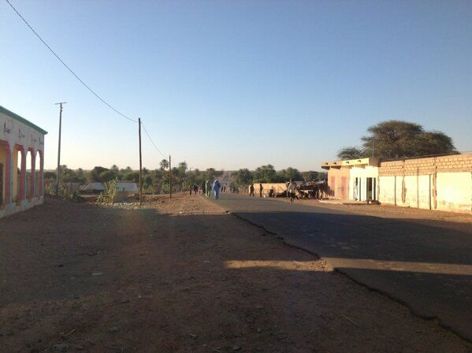
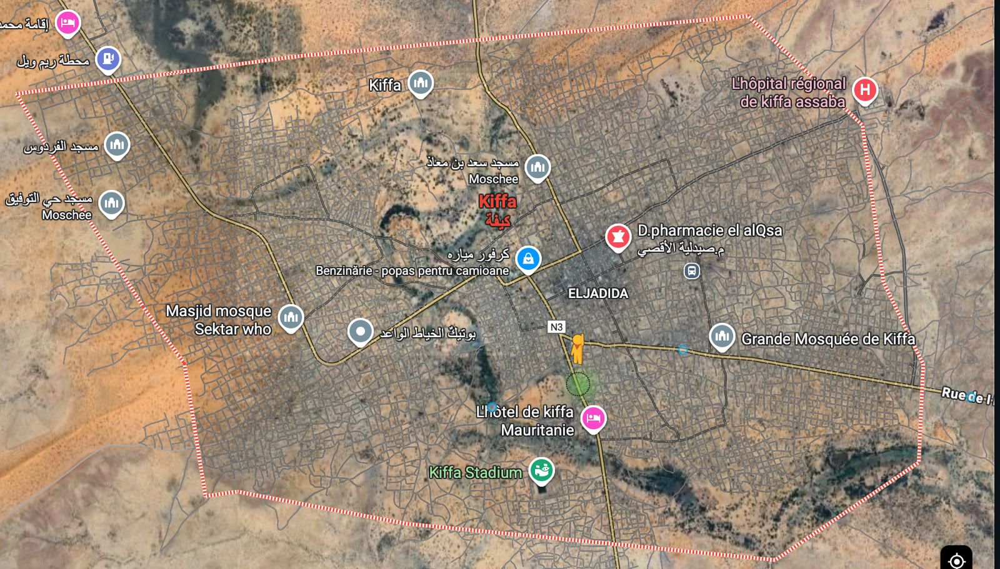
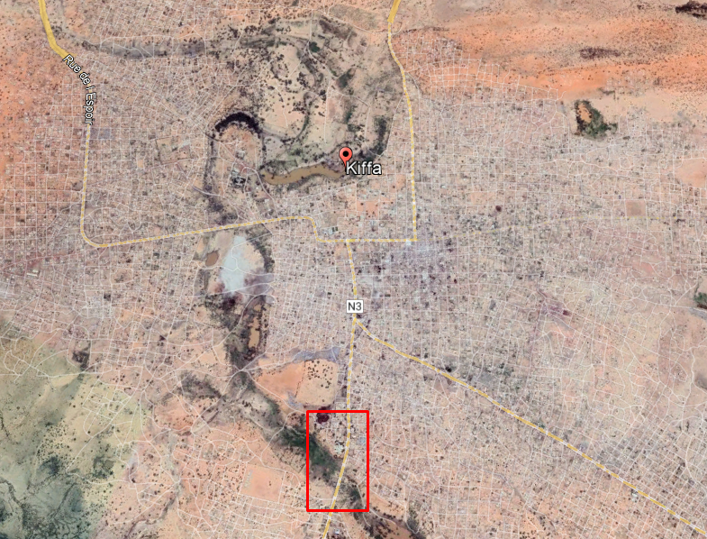
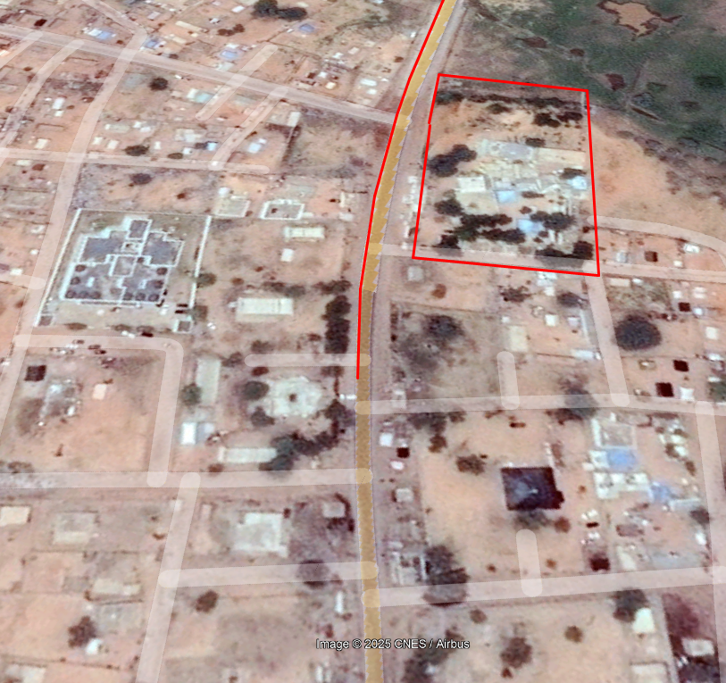
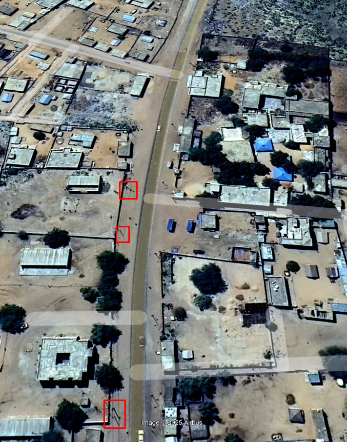
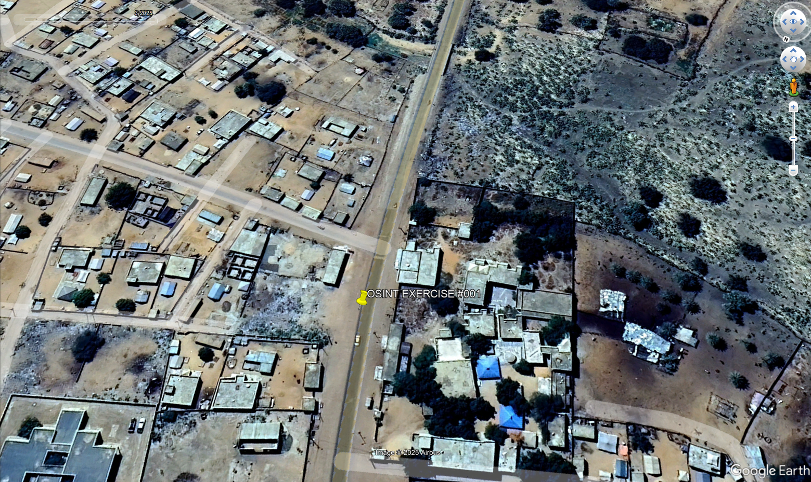

In acest exercitiu ni se da un screenshot de pe Twitter ce contine o poza. Ni se mai spune si ca poza contine suficiente informatii cat sa o geolocalizam exact. Suntem rugati sa gasim exact locatia de unde poza a fost facuta.

# Rezolvare:

## Partea 1. Indicii si ganduri initiale:

a. Numele orasului este mentionat in tweet: Kifa. Un search rapid pe [Google Maps](https://www.google.com/maps/place/Kiffa,+Mauritania/@16.6201938,-11.4283135,14z/data=!3m1!4b1!4m6!3m5!1s0xe8b1f14d26e8c71:0x7799d6879ffe8fc4!8m2!3d16.6258353!4d-11.4055282!16zL20vMGIxeGdr?entry=ttu) si observam ca este un oras din Mauritiana.

b. Observatii din poza: se poate vedea un drum care duce in afara orasului. De ce in afara? Pentru ca casele se opresc brusc pe ambele parti ale strazii iar in departare se vede foarte mult spatiu verde. O sa imi fie de ajutor cand o sa verific in modul terrain pe Google Maps.

c. Strada clar nu este o autostrada. Cum lumea merge pe strada si drumul este foarte prost, par mai mult a fi o strada dintr-un sat.

d. Se mai observa in partea stanga a pozei si stalpi. Acestia ar putea fi de mare folos pentru ca din satelit ar trebui sa le vedem umbrele.

## Partea 2. Investigare folosind Google Maps:

Cum se poate observa si in poza de mai jos, pentru Google Street View sunt doar 3 puncte fixe in care putem verifica indiciile adunate, iar in aceste 3 puncte putem verifica doar imprejurimile ci nu sa mergem mai departe de acestea.

Din moment ce Google Maps nu este de foarte mare ajutor, o alternativa mai buna ar fi Google Earth.

## Partea 3. Investigare folosing Google Earth:

In imgainea de mai jos, am incadrat intr-un dreptunghi rosu o parte de drum care este inconjurata de copaci si spatiu verde cum se poate observa in poza initiala. Inca un aspect important pe care l-am realizat cand cautam o zona potentiala a fost modul in care drumul coboara putin, iar apoi este o curba vizibila spre partea dreapta

Totusi, sa analizam dintr-un unghi mai potrivit:

### Partea 4. Concluzie:
Din imaginile de mai sus putem sa vedem ca toate informatiile adunate pe parcursul rezolvarii coincid: drumul este curbat la dreapta, copacii se pot observa in aria rosie, iar in patratele din ultima poza sunt stalpii pe care ii putem observa in poza data de exercitiu. 

Astfel coordonatele sunt:  **16°36'32.92"N  11°23'51.85"W**.

---
