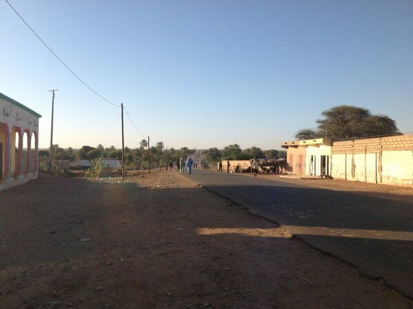
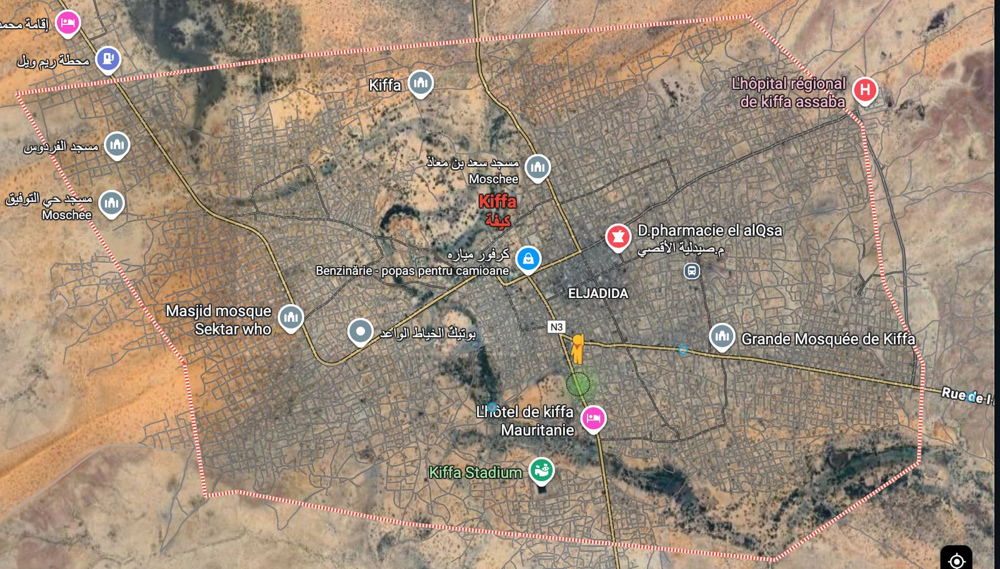
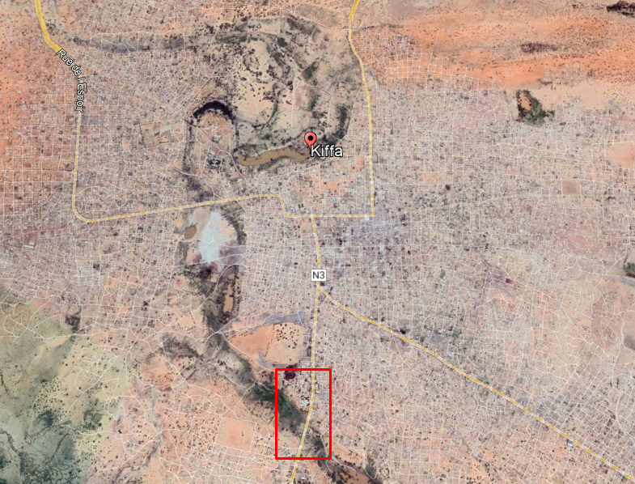
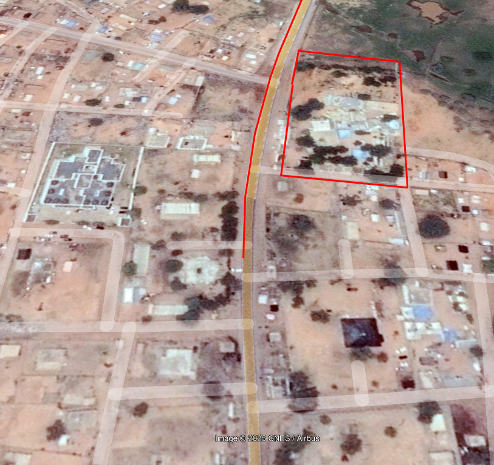
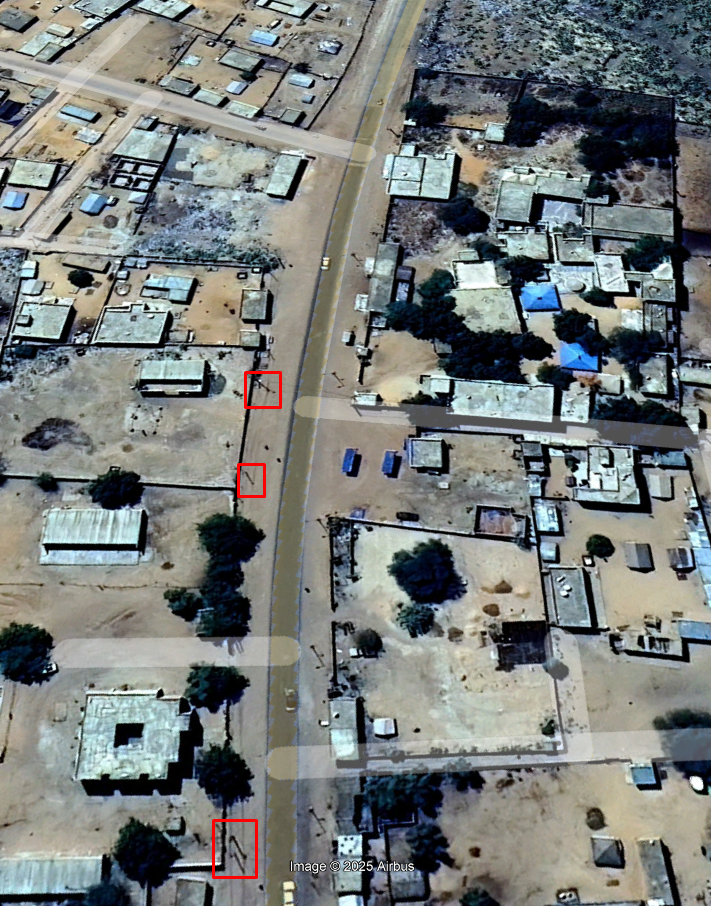
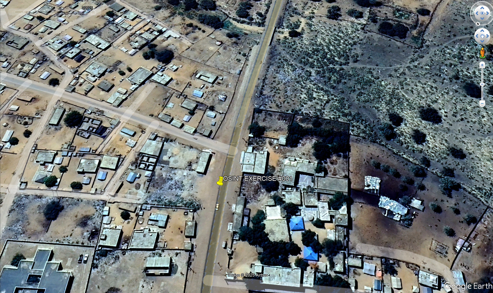

[‹ Back to all exercises](../README.md) · [Versiunea în limba română →](README.ro.md)

---

# Exercise #001

In this exercise we are given a screenshot from Twitter containing a photo. We are also told that the photo contains enough information to geolocate it exactly. We are asked to find the precise location where the photo was taken.

# Solution:

## Part 1. Clues and initial thoughts:

a. The name of the city is mentioned in the tweet: Kifa. A quick search on [Google Maps](https://www.google.com/maps/place/Kiffa,+Mauritania/@16.6201938,-11.4283135,14z/data=!3m1!4b1!4m6!3m5!1s0xe8b1f14d26e8c71:0x7799d6879ffe8fc4!8m2!3d16.6258353!4d-11.4055282!16zL20vMGIxeGdr?entry=ttu) shows that it is a city in Mauritania.

b. Observations from the photo: you can see a road leading out of the city. Why out of it? Because the houses stop abruptly on both sides of the street and in the distance you can see a lot of green space. This will help me when I check terrain mode on Google Maps.

c. The street is clearly not a highway. Since people are walking on the road and the road is in very poor condition, it looks more like a village street.

d. On the left side of the photo you can also see poles. These could be very useful because from the satellite view we should be able to see their shadows.

## Part 2. Investigation using Google Maps:

As you can see in the photo below, for Google Street View there are only 3 fixed points where we can check the clues gathered, and at these 3 points we can only check the surroundings, not go beyond them.

Since Google Maps is not very helpful, a better alternative would be Google Earth.

## Part 3. Investigation using Google Earth:

In the image below, I have boxed in red a stretch of road that is surrounded by trees and green space, as can be seen in the original photo. Another important aspect I realized while looking for a potential area was the way the road dips slightly and then there is a visible curve to the right.

Still, let's analyze from a more suitable angle:

### Part 4. Conclusion:
From the images above we can see that all the information gathered throughout the solution matches: the road curves to the right, the trees can be seen in the red area, and in the squares in the last photo are the poles we can observe in the photo given by the exercise. 

Thus the coordinates are:  **16°36'32.92"N  11°23'51.85"W**.

---
