## Execitiul #002

In acest exercitiu, primim o imagine dintr-o statie de de tren si trebuie sa raspundem la 2 intrebari. 

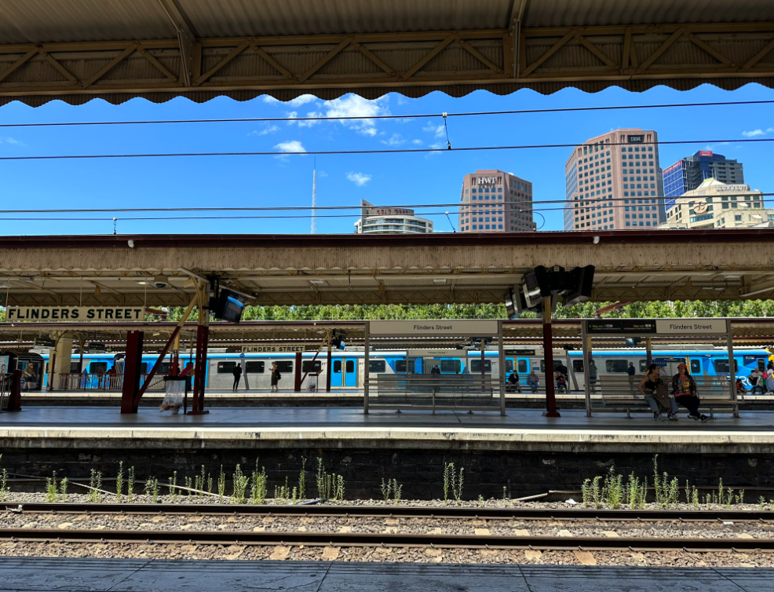

a) Care este numele statiei de tren din poza?

 

b) Care este numele si inaltimea celei mai inalte structuri vazute in poza?

## Rezolvare

Prima data am observat ca numele statiei se observa in poza pe trei plancarde, asadar nu am stat pe ganduri si am incercat sa gasesc statia direct in Google Maps.

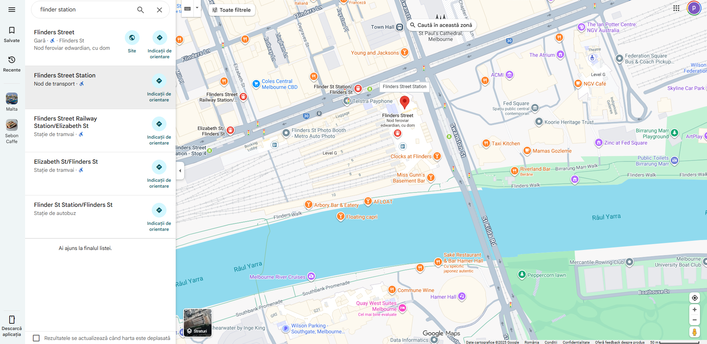

La un singur search putem observa ca vedem o statie de tren si pentru a confirma m-am gandit sa verific si numele unei cladiri din spate pentru a vedea daca asta este zona corecta si nu doar o coincidenta.

Am ales sa verific cladirea din spate IBM.
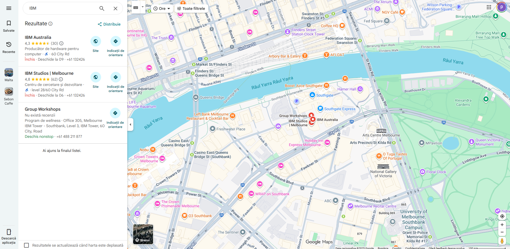

Am reusit sa gasesc si cladirea si din cate putem observa nu este foarte departe de statie. Am ales sa imi dau seama exact si de unde a fost facuta poza, asadar m-am intors in statie si am ales un punct din care pot observa si cladirea.

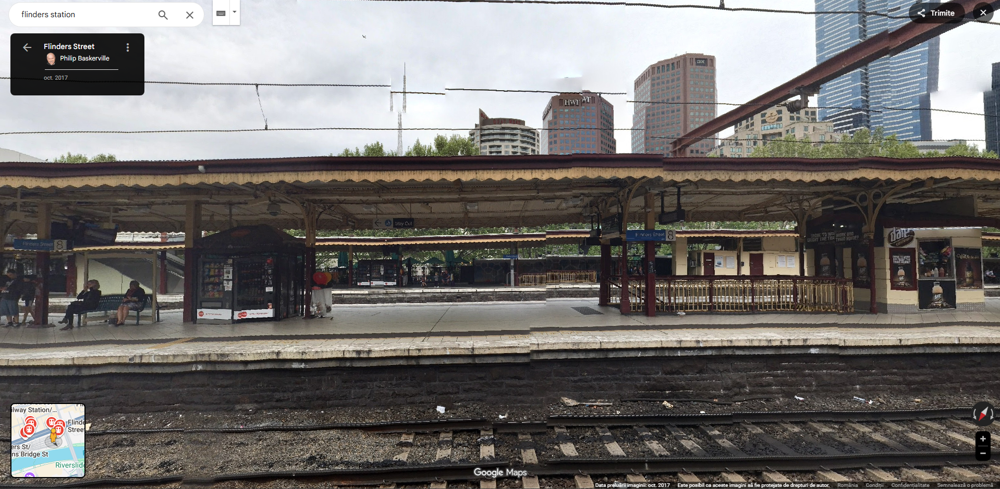
Asadar cum zona este buna, am gasit raspunsul la intrebarea **a)** care este **Flinders Street Railway Station**

Imi mai ramane intrebare **b)** si pentru a raspunde trebuie sa ma intorc la poza initiala unde se vad 6 structuri. Luand fiecare structura in parte ar ramane 3 candidati: turnul din stanga, cladirea IBM si cladirea din dreapta.

### I. Turnul

Pentru a gasi inaltimea turnului trebuie mai intai sa il gasim pe Google Maps pentru a avea un nume pentru ca ulterior sa ii cautam inaltimea. Intorcandu-ne pe Google Maps stim zona in care s-ar afla, deci daca ne-am uita cu modul "Satelit" ar trebui sa il observam destul de usor.

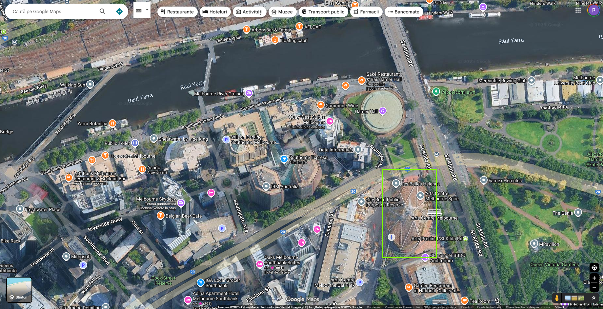

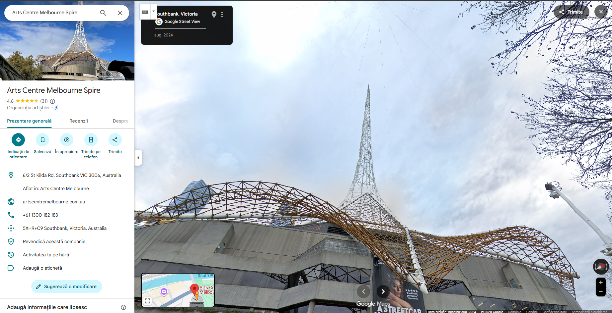

Acum ca stim si numele exact al turnului ii putem cauta inaltimea.

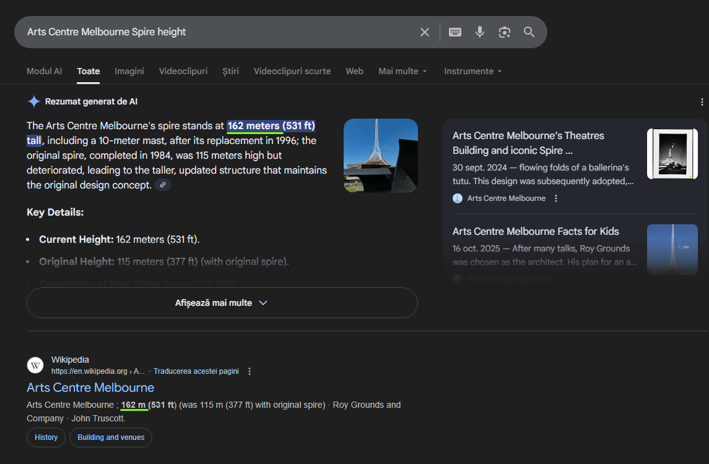

Un raspuns la una din cele 3 structuri il avem. Turnul are inaltimea de **162 metri**.

### II. Cladirea IBM

Numele il stim deja, este cladirea IBM Australia din Melbourne. La un search distanta ii gasim inaltimea. 
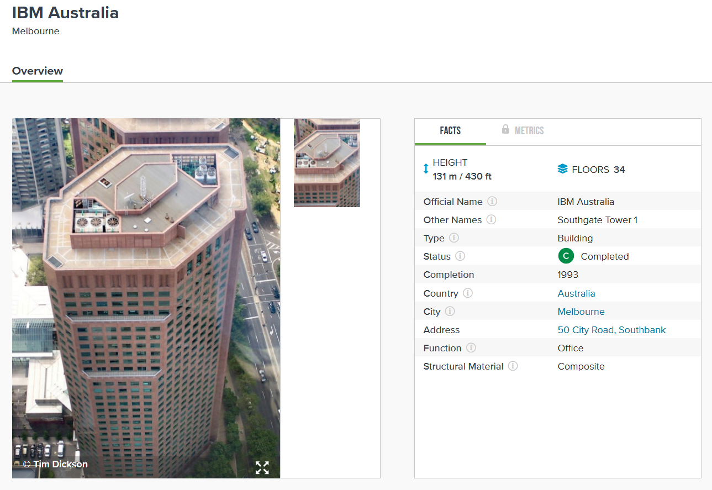

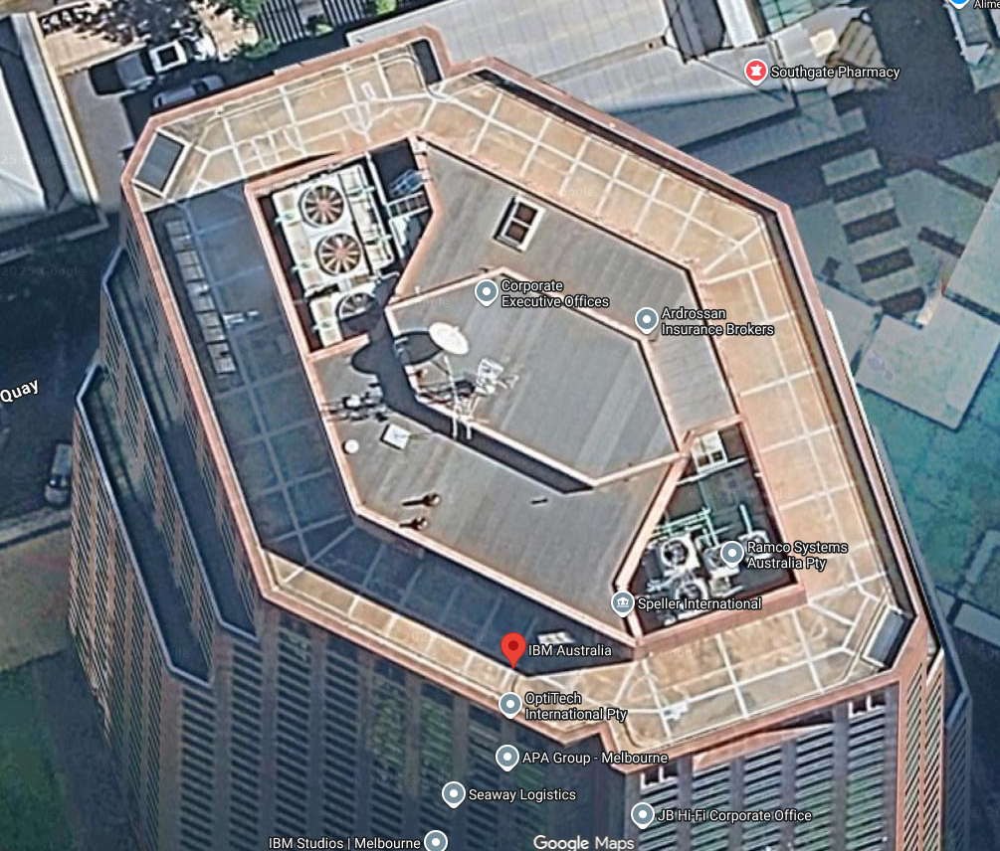

Din cate putem observa si acoperisul coincide, deci inaltimea stim acum ca este de **131 metri**.

### III. Cladirea din dreapta

Cum caldirea ar trebui sa fie in spatele IBM Australia, m-am gandit sa verific in Google Earth si am observat asta:

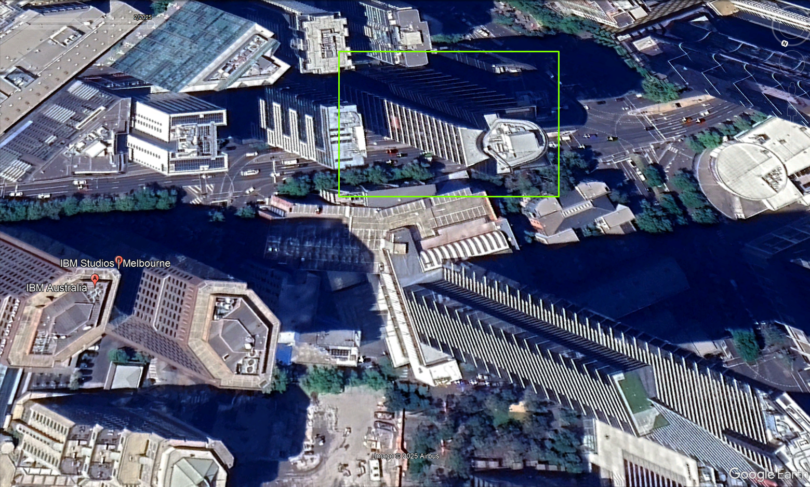

Daca ne intoarcem la poza originala data in exercitiu, putem observa faptul ca arhitectura cladirii este aceeasi, deci prin urmare am gasit cladirea din poza initiala.

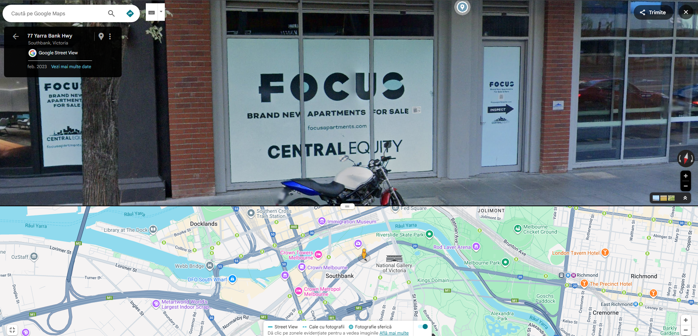

Verificand zona, am reusit sa ajung si la cladirea gasita. Vedem totusi pe usa de la intrare numele cladirii "Focus" si un site sub [focusapartments.com](https://focusapartments.com).

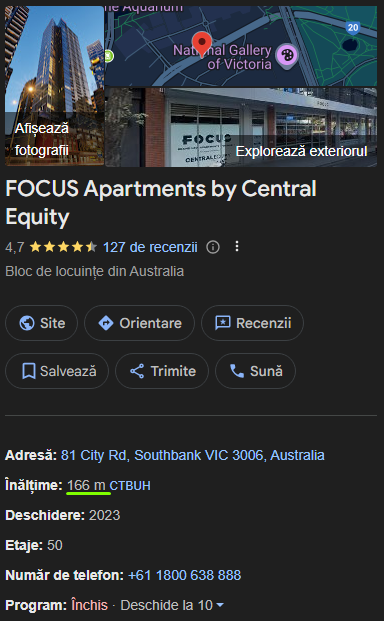

Pozele si locatia coincid si observam ca este specificata si intaltimea de **166 metri**.

---

Astfel raspunsul de la intrebarea **b)** este **FOCUS Apartments by Central Equity** cu intaltimea de **166 metri**.
