[‹ Back to all exercises](../README.md) · [Versiunea în limba română →](README.ro.md)

---

## Exercise #002

In this exercise, we receive an image from a train station and have to answer 2 questions. 

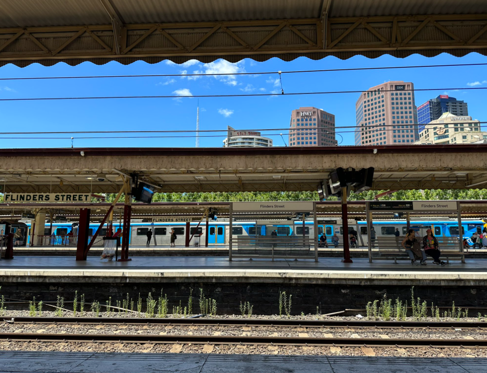

a) What is the name of the train station in the photo?

 

b) What is the name and height of the tallest structure seen in the photo?

## Solution

First I noticed that the name of the station appears in the photo on three signs, so I didn't hesitate and tried to find the station directly on Google Maps.

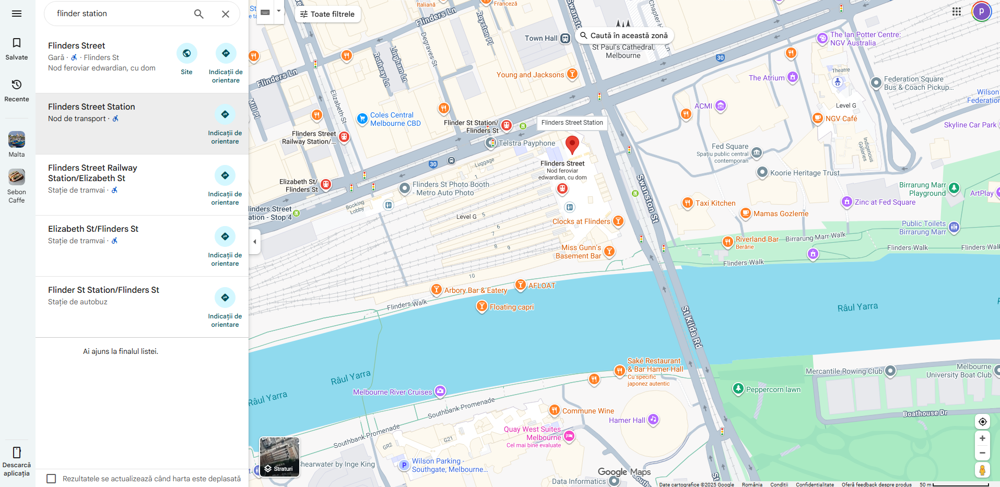

With a single search we can see a train station, and to confirm it I thought I'd also check the name of a building in the background to see whether this is the right area and not just a coincidence.

I chose to check the IBM building in the background.
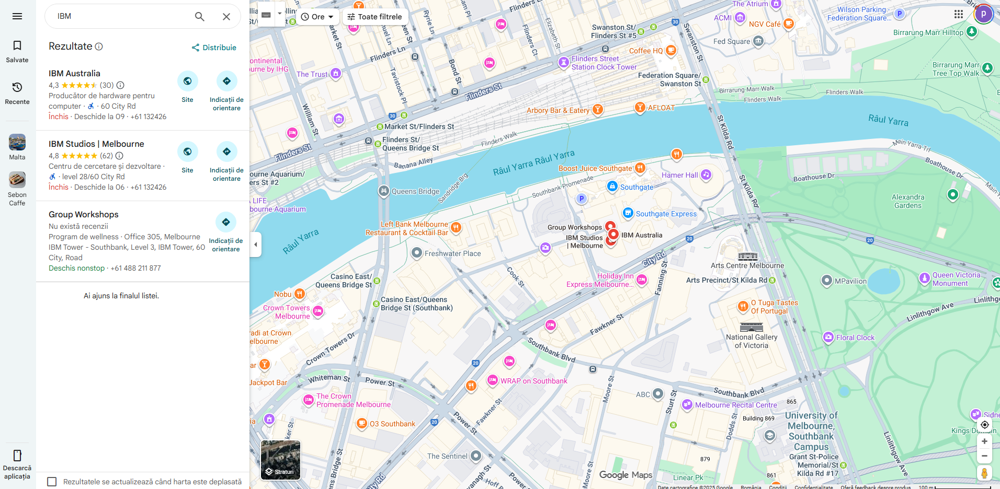

I managed to find the building too, and as we can see it is not very far from the station. I chose to also figure out exactly where the photo was taken from, so I went back into the station and picked a point from which I could also see the building.

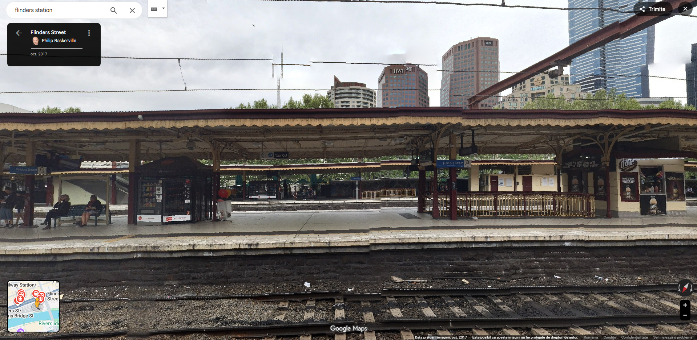
So, since the area checks out, I found the answer to question **a)**, which is **Flinders Street Railway Station**.

That leaves question **b)**, and to answer it I have to go back to the original photo where 6 structures are visible. Taking each structure in turn, 3 candidates remain: the tower on the left, the IBM building, and the building on the right.

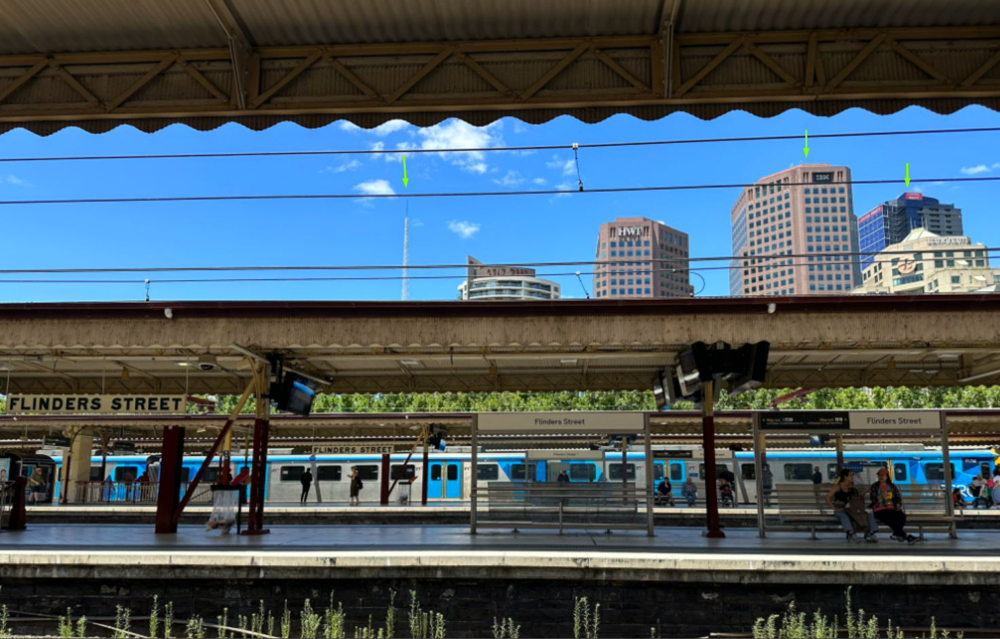

### I. The Tower

To find the height of the tower we first have to find it on Google Maps so we have a name, in order to later look up its height. Going back to Google Maps we know the area where it would be, so if we look in "Satellite" mode we should spot it fairly easily.

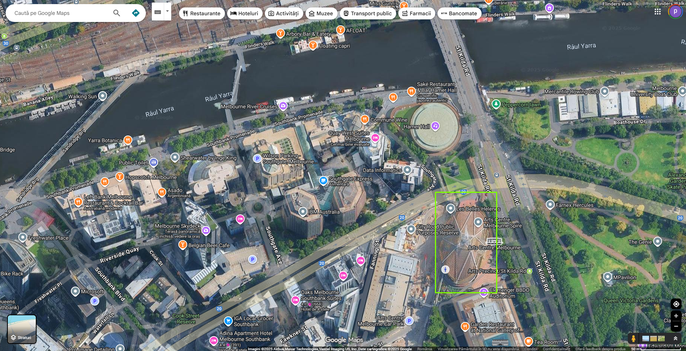

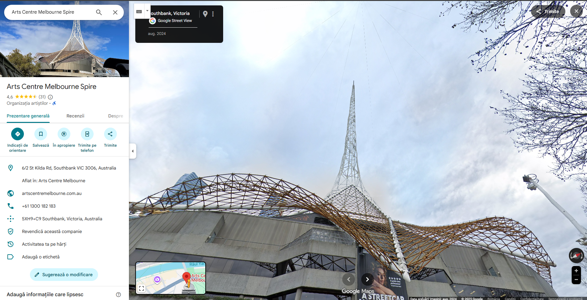

Now that we also know the exact name of the tower we can look up its height.

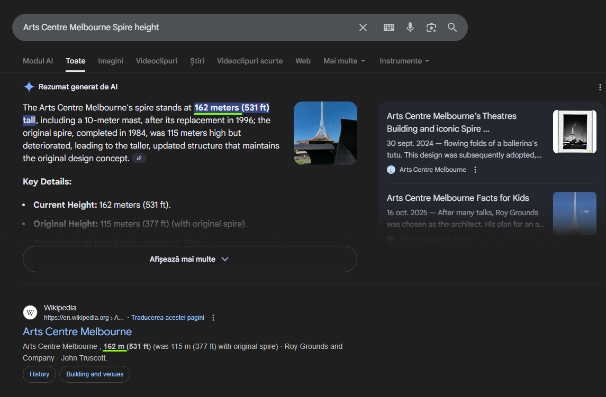

We have an answer for one of the 3 structures. The tower has a height of **162 metres**.

### II. The IBM Building

We already know the name, it is the IBM Australia building in Melbourne. A search away we find its height. 
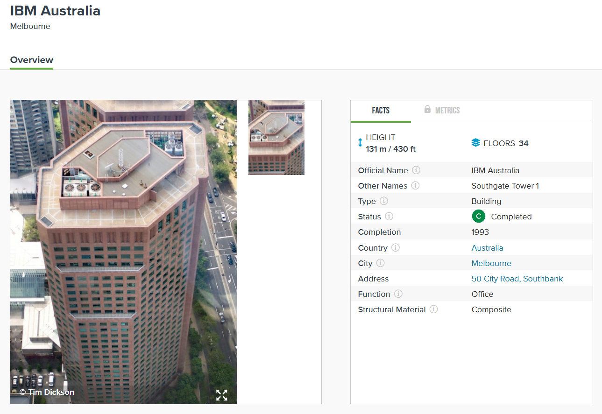

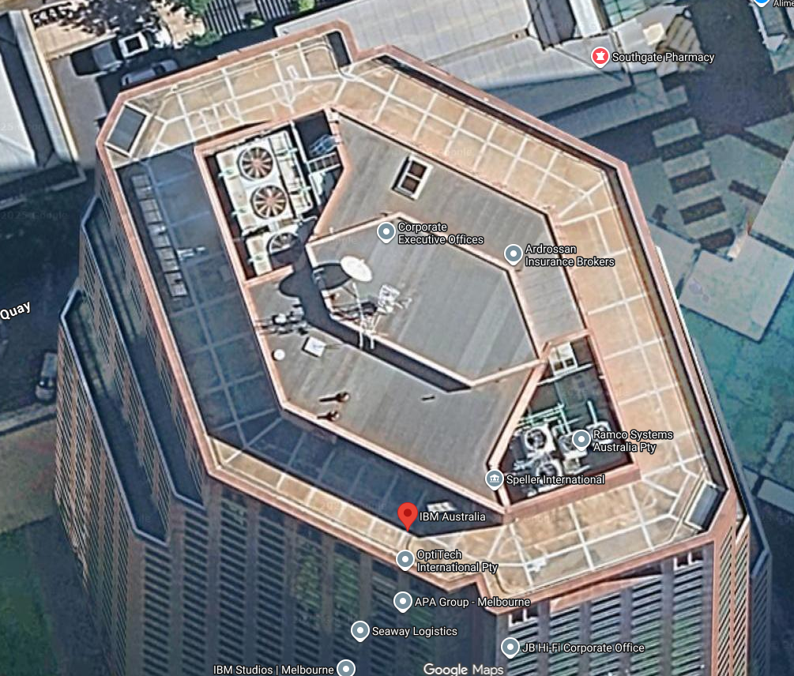

As we can see, the roof matches too, so we now know the height is **131 metres**.

### III. The building on the right

Since the building should be behind IBM Australia, I thought I'd check in Google Earth and I noticed this:

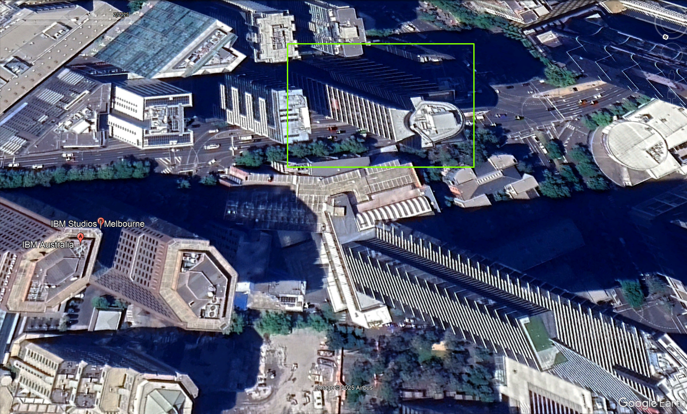

If we go back to the original photo given in the exercise, we can see that the building's architecture is the same, so we have therefore found the building from the original photo.

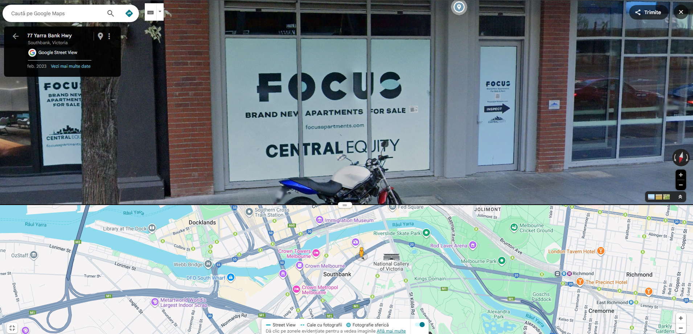

Checking the area, I managed to reach the building I found. On the entrance door, however, we see the building's name "Focus" and a website below it, [focusapartments.com](https://focusapartments.com).

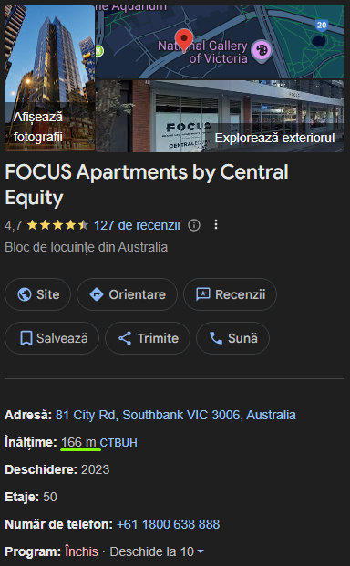

The photos and the location match, and we notice that the height of **166 metres** is also specified.

---

Thus the answer to question **b)** is **FOCUS Apartments by Central Equity**, with a height of **166 metres**.
