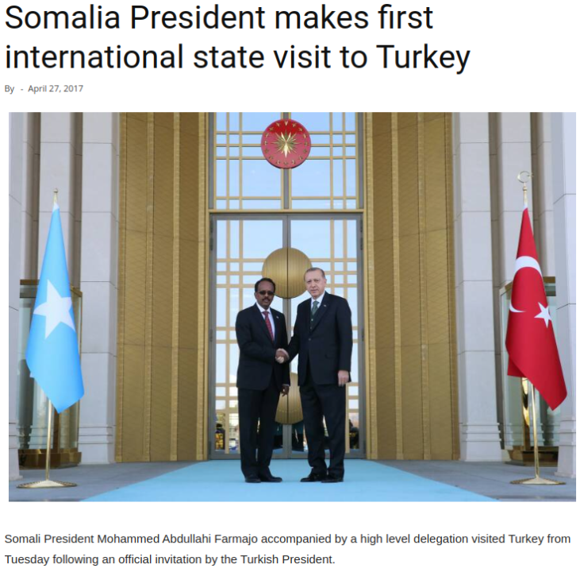
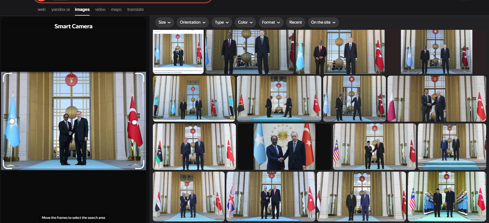
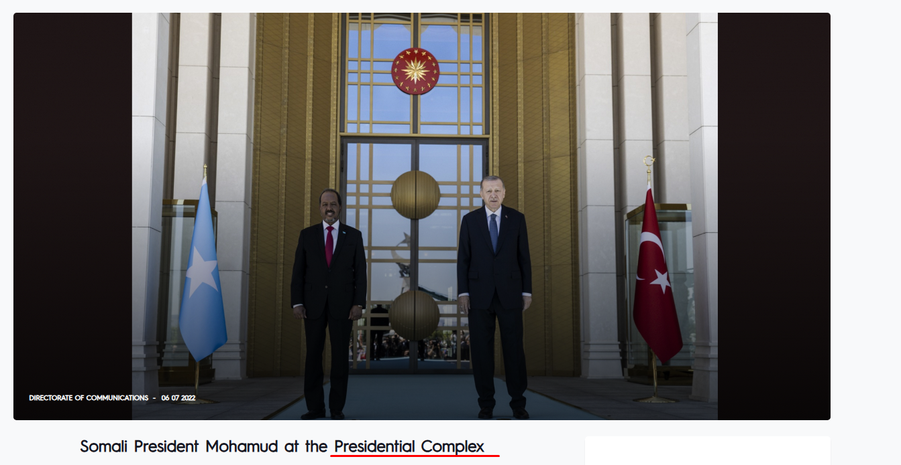
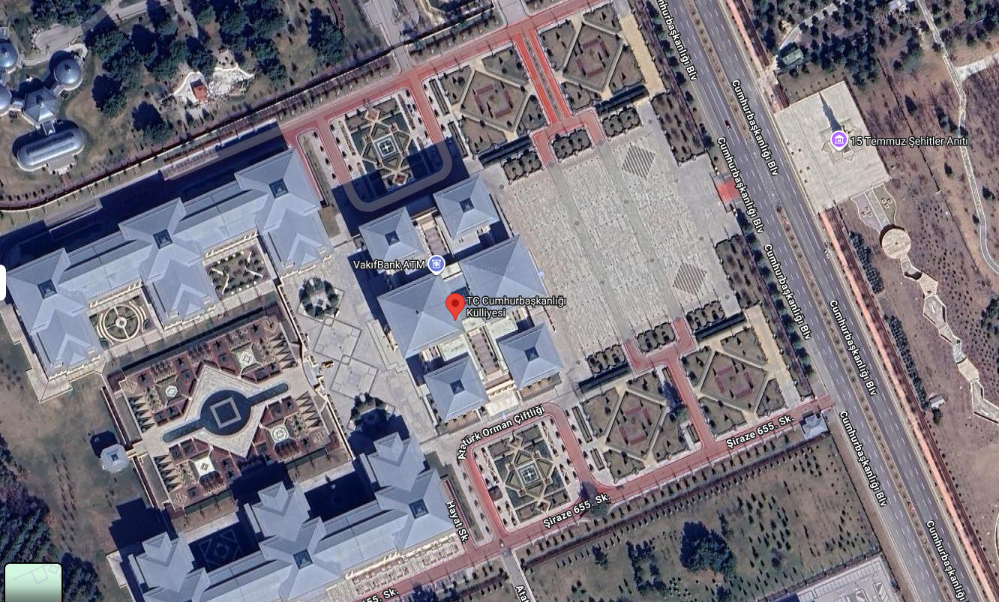
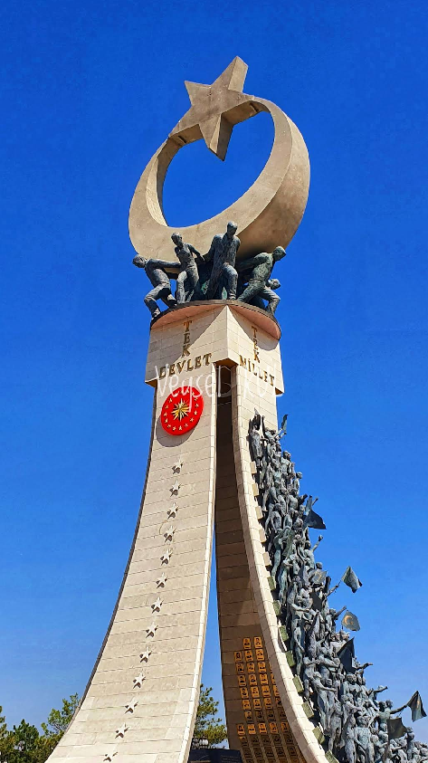

## Execitiul #002

In acest exercitiu, primim o imagine in care presedintele Somaliei a facut prima vizita internationala in Turcia in anul 2017.

## Rezolvare

Intuitiv, ca prim pas doar am dat un Reverse Image search pe diferite motoare de cautare. Pe Yandex in schimb, am gasit poze cu presedintele Turciei alaturi de alti presedinti, in aceeasi locatie.

Toate site-urile duceau catre Ankara si "Presidential Complex". Asadar, doar am dat un search pe Google Maps cu keyword-urile gasite si m-au condus spre:

Care este chiar locatia. Totusi pentru a confirma, in imaginea de mai sus ci si in imaginea de mai jos, se poate observa ceva in reflexia din spatele celor 2 presedinti.

Se poate observa o statuie ce are in varf o stea, iar alaturi cladirii prezidentiale se afla chiar "July 15 Martyrs' Memorial", care arata exact asa:

Astfel, numele cladirii prezidentiale este **"T.C. Cumhurbaşkanlığı Külliyesi"**, iar coordonatele sunt: **39°55'51.2"N 32°47'56.8"E**.

---