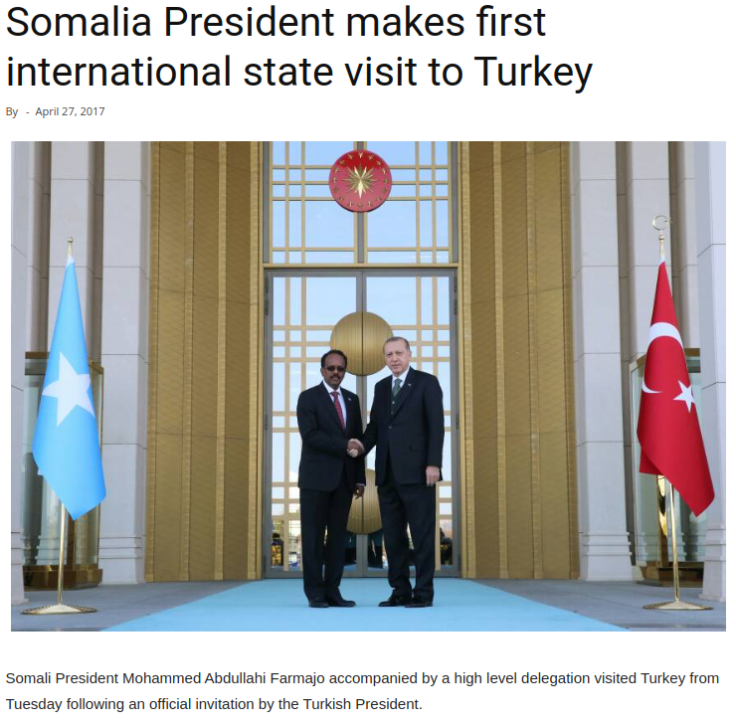
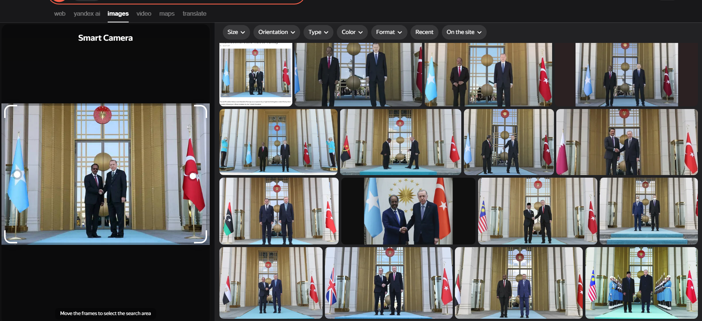
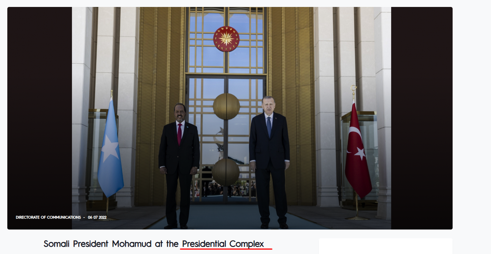
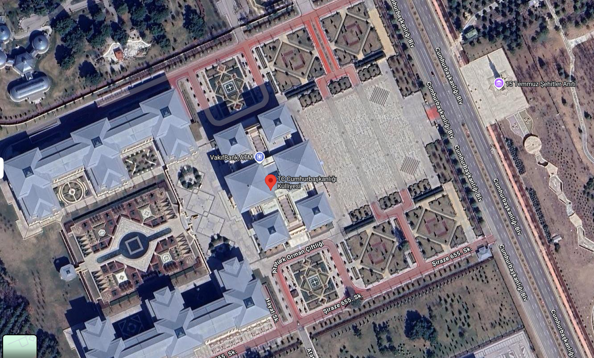
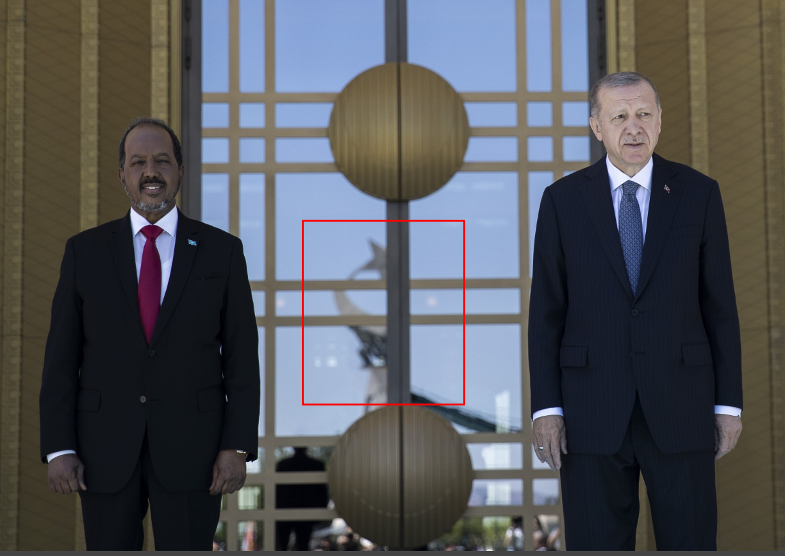
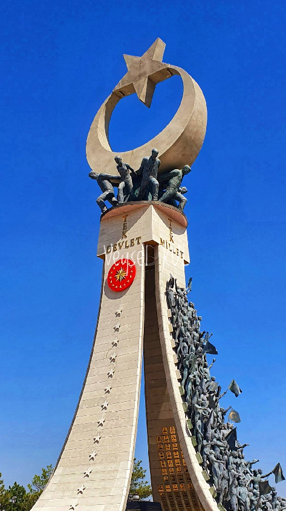

[‹ Back to all exercises](../README.md) · [Versiunea în limba română →](README.ro.md)

---

## Exercise #003

In this exercise, we receive an image in which the president of Somalia made his first international visit to Turkey in 2017.

## Solution

Intuitively, as a first step I just ran a Reverse Image search on various search engines. On Yandex, however, I found photos of the president of Turkey alongside other presidents, in the same location.

All the sites led to Ankara and the "Presidential Complex". So I just ran a search on Google Maps with the keywords found and it led me to:

Which is exactly the location. Still, to confirm — in the image above as well as in the image below, you can see something in the reflection behind the 2 presidents.

You can see a statue with a star on top, and next to the presidential building is the "July 15 Martyrs' Memorial", which looks exactly like this:

Thus, the name of the presidential building is **"T.C. Cumhurbaşkanlığı Külliyesi"**, and the coordinates are: **39°55'51.2"N 32°47'56.8"E**.

---
