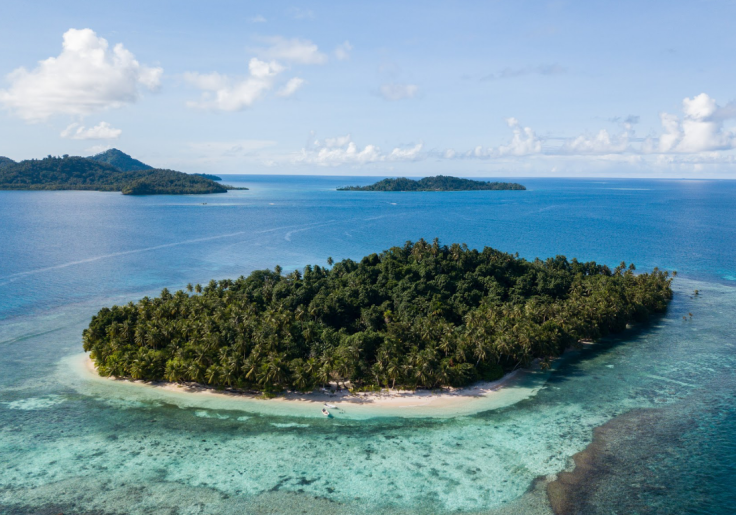
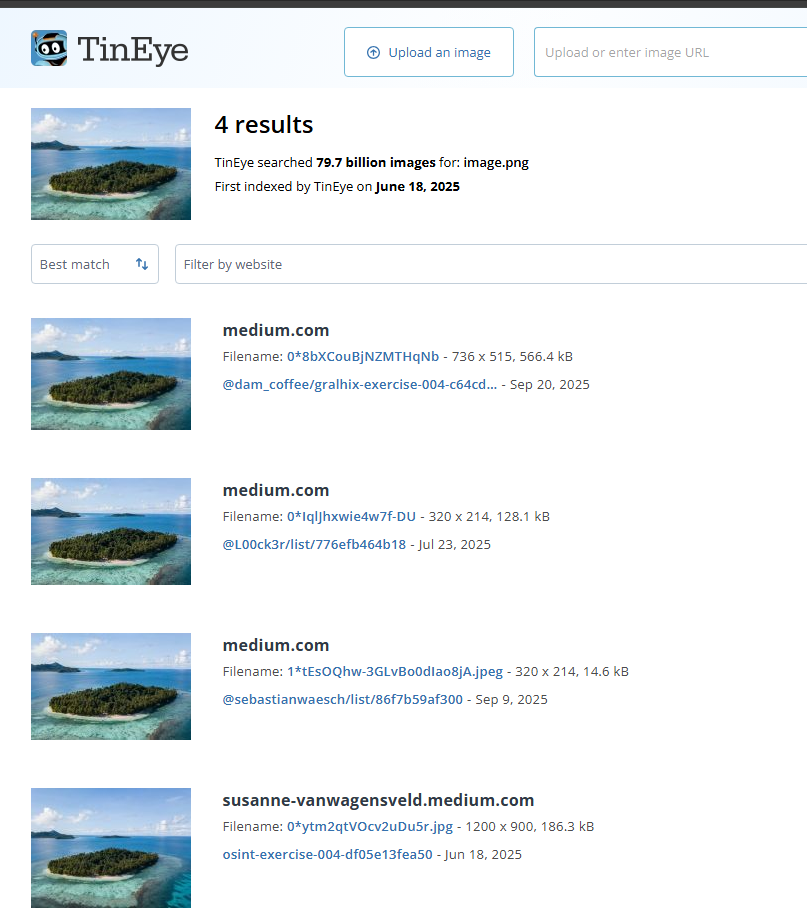
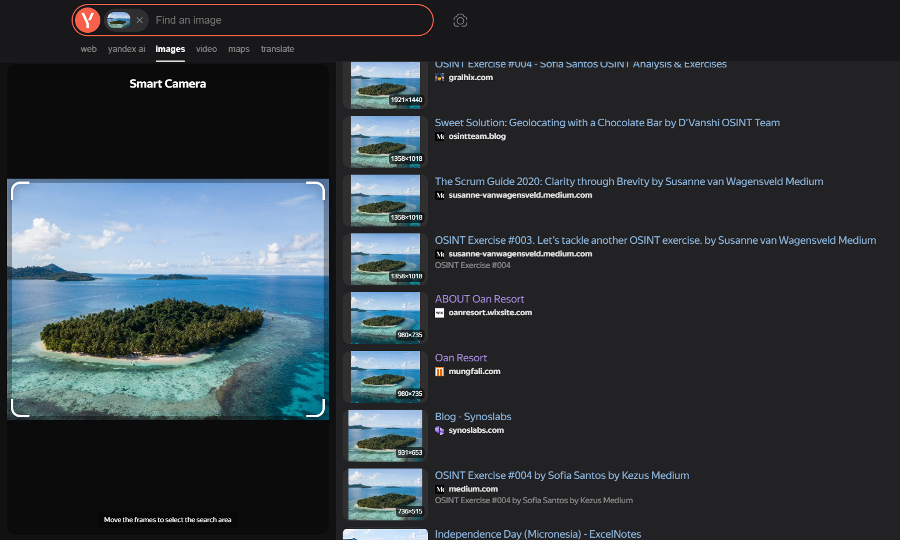
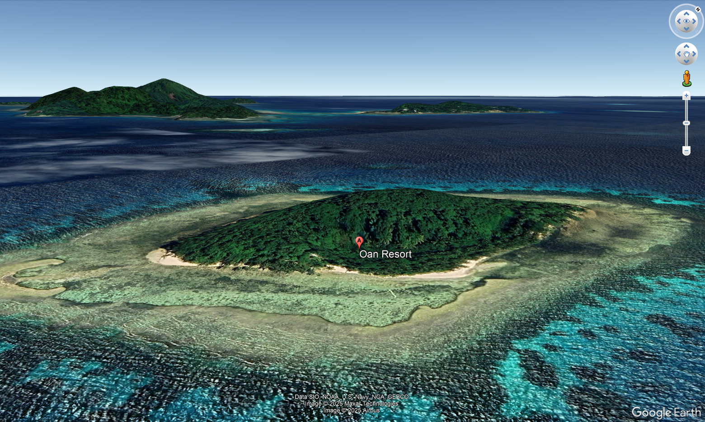

## Execitiul #004

In acest exercitiu, primim o imagine cu un resort localizat pe o insula si trebuie sa raspundem la 3 intrebari. 

a) Care este numele resortului?

b) Care sunt coordonatele insulei?

c) In ce directie cardinala era camera cand poza a fost facuta?

## Rezolvare

Primul gand avand doar o imagine este de a da Reverse Image Search pe toate motoarele de cautare pana gasim numele insulei sau orice alt indiciu.

#### TinEye

Pe TinEye gasim imagine in diferite blog-uri de medium.com, care sunt cel mai writeup-uri la acest exercitiu, deci prin urmare nimic folositor.

#### Yandex

Pe Yandex am avut mai mult noroc si am gasit 2 search-uri diferite cu numele resort-ului **Oan Resort**.

Astfel putem raspunde la intrebarea **a)**, raspunsul fiind **Oan Resort**.

---

Pentru raspunsul la intrebarea **b)**, la search-ul pe Yandex putem observa ca unul dintre cele doua search-uri ce contineau numele resortului este chiar site-ul resortului: [oanresort.wixsite.com](https://oanresort.wixsite.com/chuuk). Accesand site-ul vedem un buton de **About**, pe care daca il apasam putem observa chiar poza care ne-a fost data de exercitiu, iar mai jos un video cu titlul *"Wondering where Oan Resort is located?"* unde ne este aratata locatia exacta a resortului.

Am ales sa verific totusi personal si in Google Earth pentru a obtine coordonatele exacte: **7.362563211890621, 151.7563295252573**.
Astfel am ajuns si la raspunsul de la intrebarea **b)** rapid.

----

Tot incercand diferite unghiuri am ajuns la acesta. Mi s-a parut ca arata asemanator cu poza initiala asa ca am ajuns la concluzia ca raspunsul este in coltul din dreapta sus, unde se poate observa camera care este directionata in directia **Nord-Vest**.

Astfel raspunsul final pentru intrebarea **c)** este **Nord-Vest**.

---