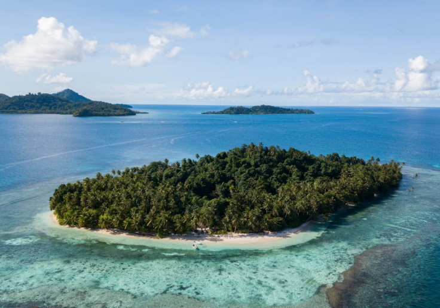
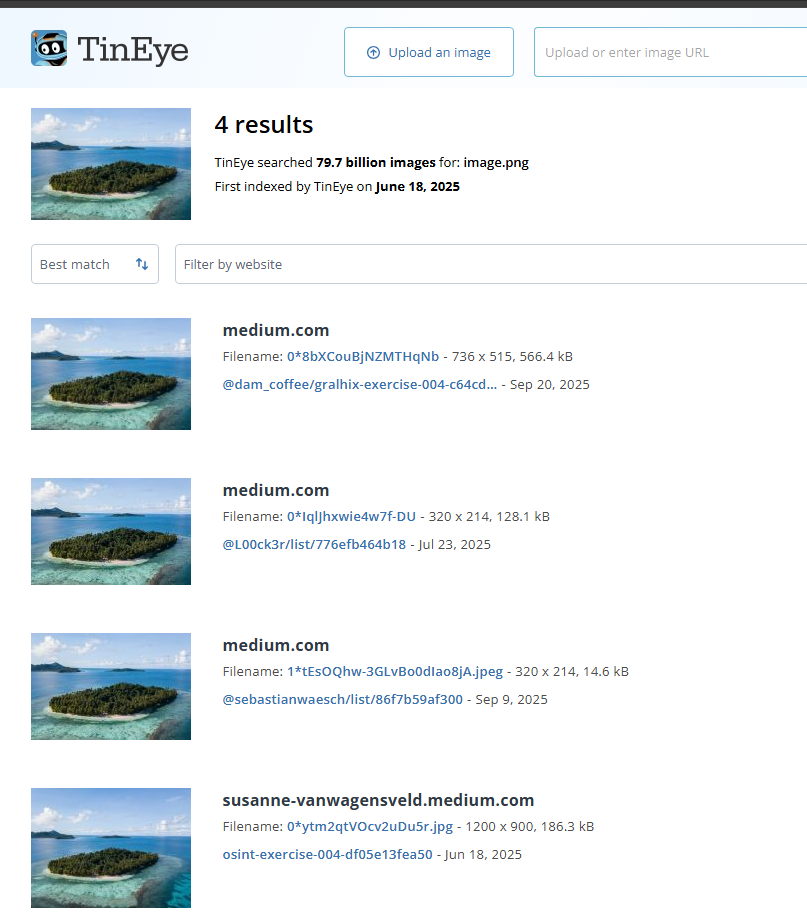
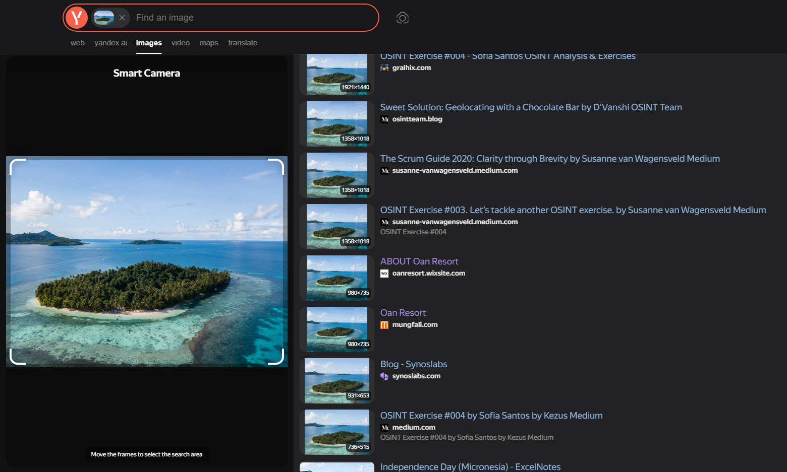
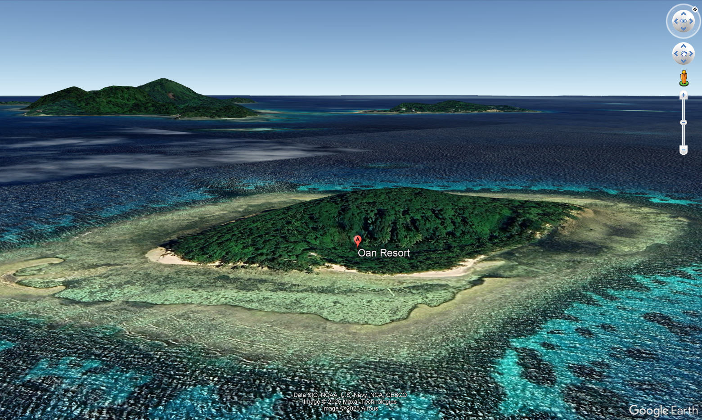

[‹ Back to all exercises](../README.md) · [Versiunea în limba română →](README.ro.md)

---

## Exercise #004

In this exercise, we receive an image of a resort located on an island and have to answer 3 questions. 

a) What is the name of the resort?

b) What are the coordinates of the island?

c) In which cardinal direction was the camera facing when the photo was taken?

## Solution

The first thought, having only an image, is to run a Reverse Image Search on all search engines until we find the name of the island or any other clue.

#### TinEye

On TinEye we find the image on various medium.com blogs, where there are many writeups for this exercise, so nothing useful.

#### Yandex

On Yandex I had more luck and found 2 different searches with the name of the resort, **Oan Resort**.

So we can answer question **a)**, the answer being **Oan Resort**.

---

For the answer to question **b)**, in the Yandex search we can see that one of the two results containing the name of the resort is the resort's own website: [oanresort.wixsite.com](https://oanresort.wixsite.com/chuuk). Accessing the site we see an **About** button, which, if we press it, shows us the very photo we were given in the exercise, and below it a video titled *"Wondering where Oan Resort is located?"* where the exact location of the resort is shown to us.

I chose to verify it myself in Google Earth as well, to obtain the exact coordinates: **7.362563211890621, 151.7563295252573**.
So I reached the answer to question **b)** quickly.

----

Trying different angles I arrived at this one. It looked similar to the original photo, so I concluded that the answer is in the top right corner, where you can see the camera pointing in the **North-West** direction.

Thus the final answer for question **c)** is **North-West**.

---
