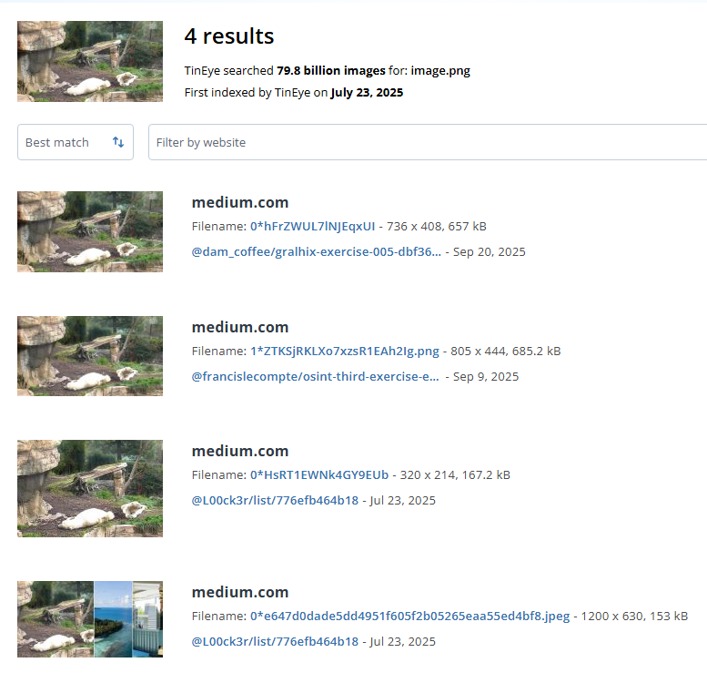
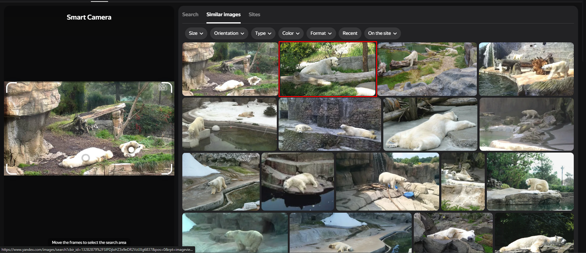
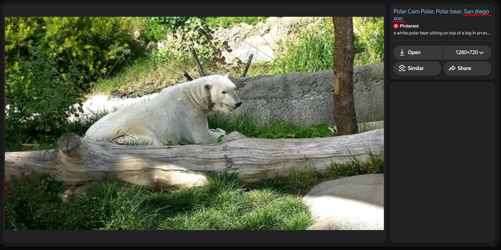
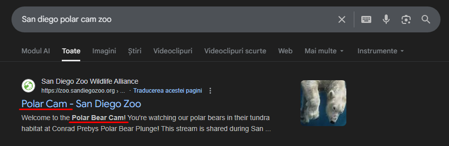
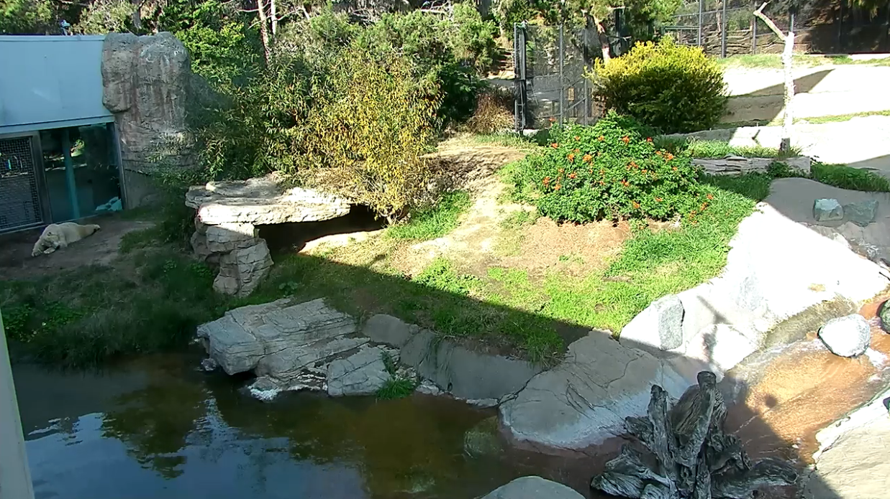
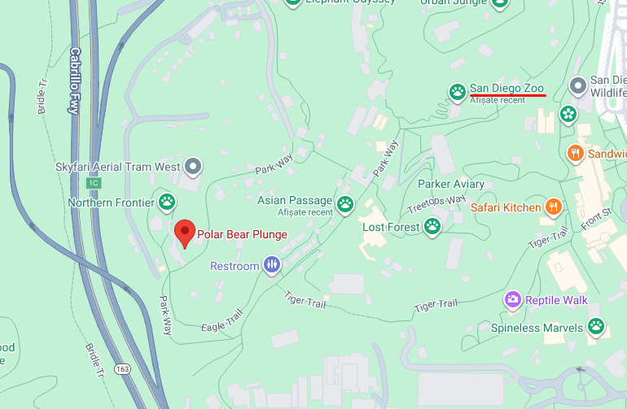
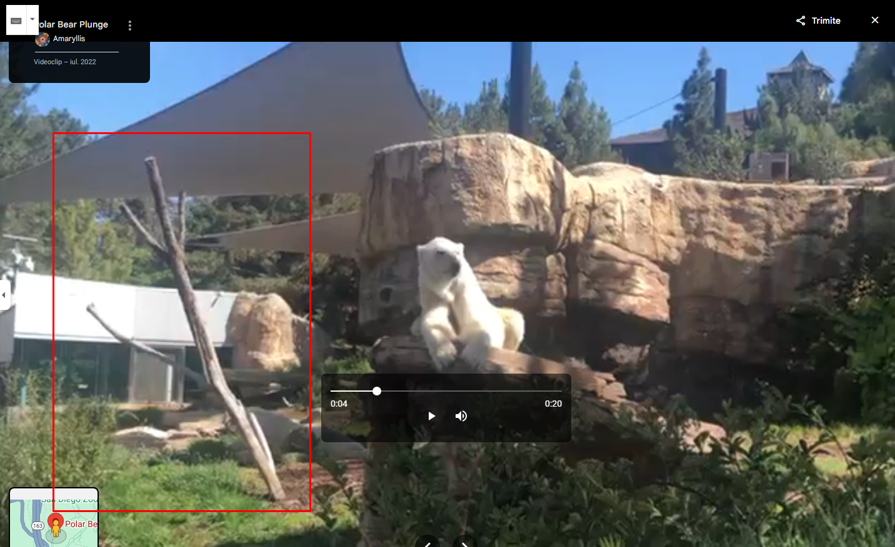
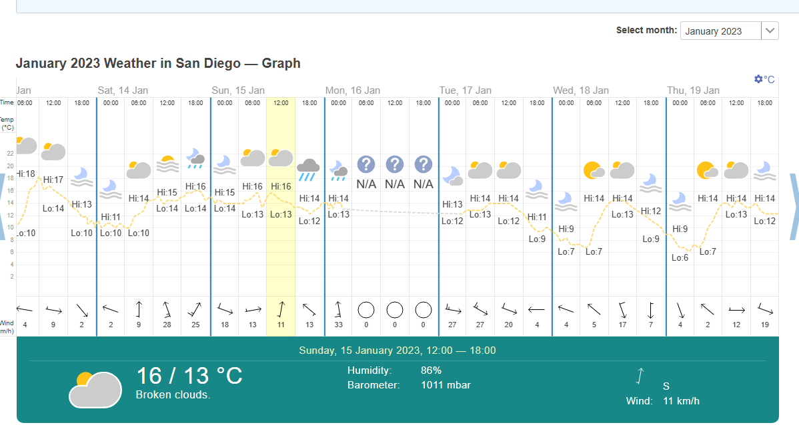
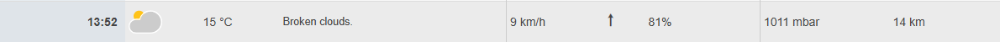
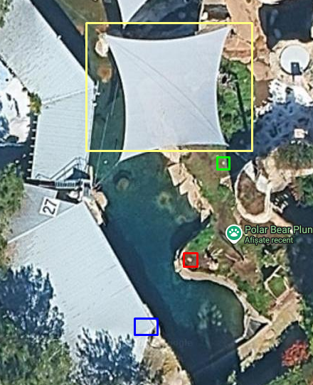

# Execitiul #021

In acest exercitiu ne este dat un screenshot de pe o camera live dintr-un zoo. Ni se mai adauga si faptul ca poza a fost facuta pe 15 Ianuarie 2023 in jurul orei 2 PM. Trebuie sa raspundem la urmatoarele intrebari:

a) In ce zoo se afla ursii polari?

b) Care era temperatura cand poza a fost facuta?

c) Care sunt coordonatele exacte de unde ursii polari stateau intinsi pe jos?

# Rezolvare

Pentru inceput am incercat ca de fiecare data sa dau un Reverse Search la imaginea data.

### TinEye

- 4 rezultate de la alte writeup-uri, deci irelevant.

---

### Yandex

- Pe Yandex am avut ceva mai mult noroc. Intuitiv doar am verificat a doua imagine am descoperit o informatie foarte importanta.

---

Aceasta informatie totusi trebuie verificata, deci nu am stat pe ganduri si am trecut la urmatorul pas.

Sincer sa fiu, nu ma convinge deloc. Cand am intrat pe site ma asteptam sa vad exact unghiul din care a fost facuta poza data, dar am vazut cu totul alt cadru. Pentru a ne convinge ar trebui sa cautam Zoo-ul pe Google Maps si sa vedem daca putem identifica locul de unde a fost facuta poza.

Totusi am ales sa ma uit si prin poze si video-uri din locatie in speranta ca poate pot gasi ceva la care sa ma intorc cand voi ajunge sa rezolv **c)** si am dat de un videoclip, ce m-a ajutat sa estimez un raspuns pentru al treilea task.

De ce este important? Pentru ca daca suntem atenti la screenshot-ul facut din video putem observa un copac, ce apare chiar in spatele ursilor din poza data, dar ramane sa ne intoarcem mai tarziu la acest detaliu pentru ca am gasit momentan raspunsul pentru **a)** care este **San Diego Zoo** si trebuie sa trecem la task-ul **b)**.

---
Aici nu ar trebui sa fie cine stie ce bataie de cap, deoarce stim deja si data in care este facuta poza, cat si locatia si ora exacta.

Deci pe 15 Ianuarie 2023 in jurul orei 2 PM au fost **b) 15 grade celsius**.

---

Pentru **c)** raspunsul este aproape dat, tot ce mi-a mai ramas de facut este sa-mi dau seama de unde a fost facuta filmarea. Pentru a face asta incerc sa imi gasesc niste locuri/obiecte pe care as putea poate sa le observ din Google Satellite.

Spre exemplu, o sa iau fiecare incadrare in dreptunghi/patrat pentru a explica cum am gandit.

- Dreptunghiul albastru: cel mai probabil de aici a fost facuta filmarea din care am facut screenshot-ul de mai sus.
- Patratul rosu: aici era ursul polar din filmare, deoarece se observa ca sta pe o stanca, iar in spatele lui se afla ce este incadrat in dreptunghiul galben.
- Patratul verde: Fiind si un punct alb, imi vine a crede ca cel mai probabil fix aici stateau ursii din poza initiala.

Concluzionand, raspunsul pentru intrebarea **c)** este **32°44'04.2"N 117°09'16.5"W**.

---