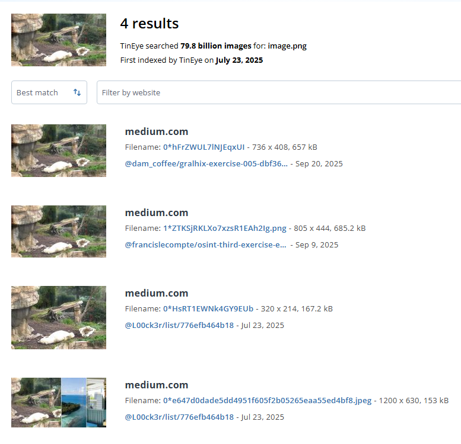
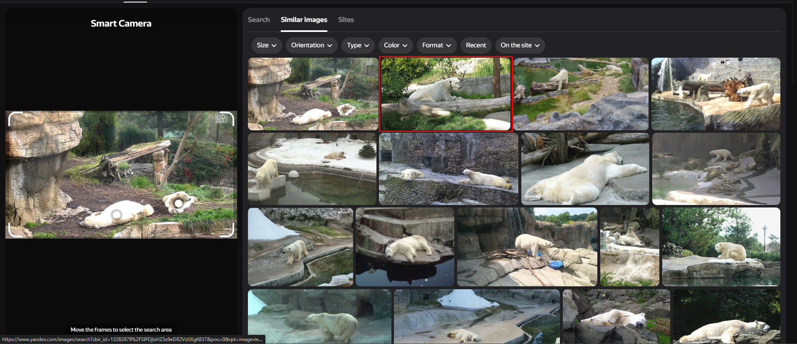
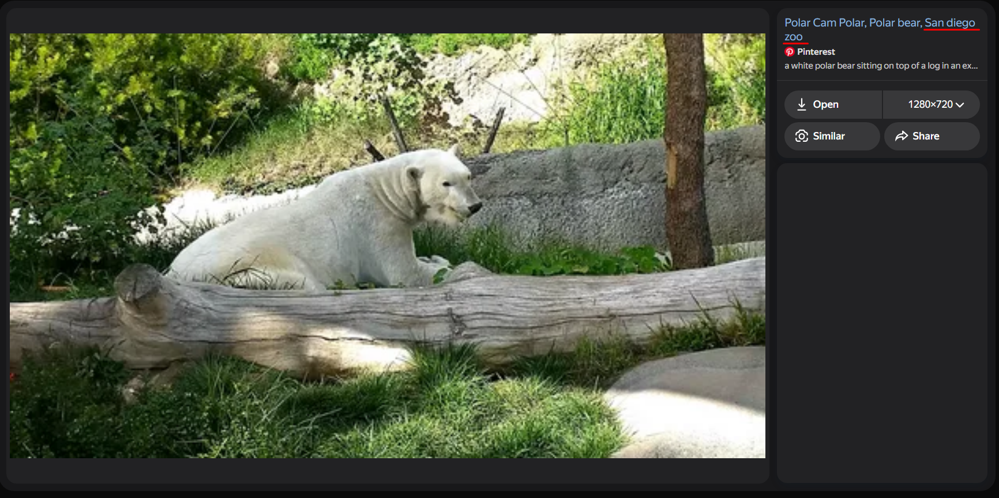
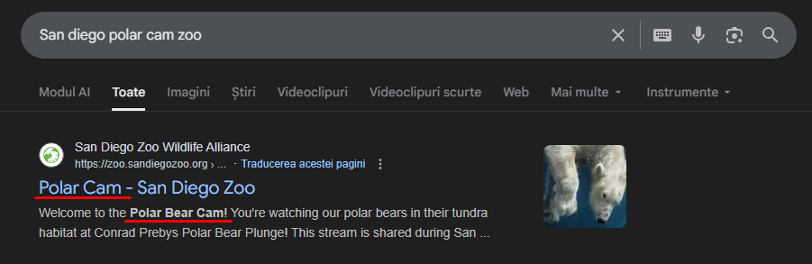
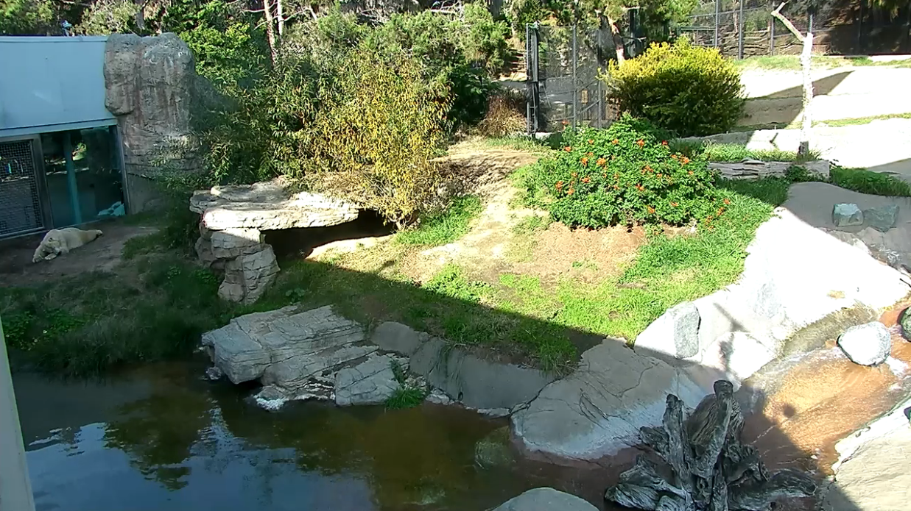
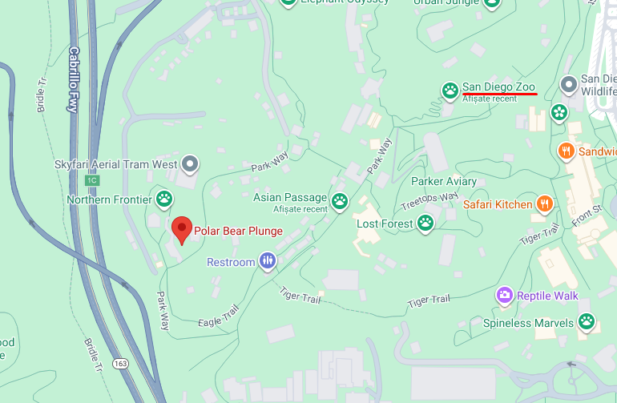
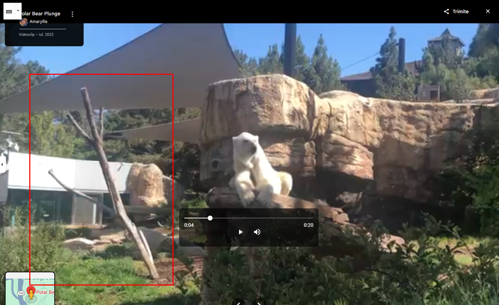
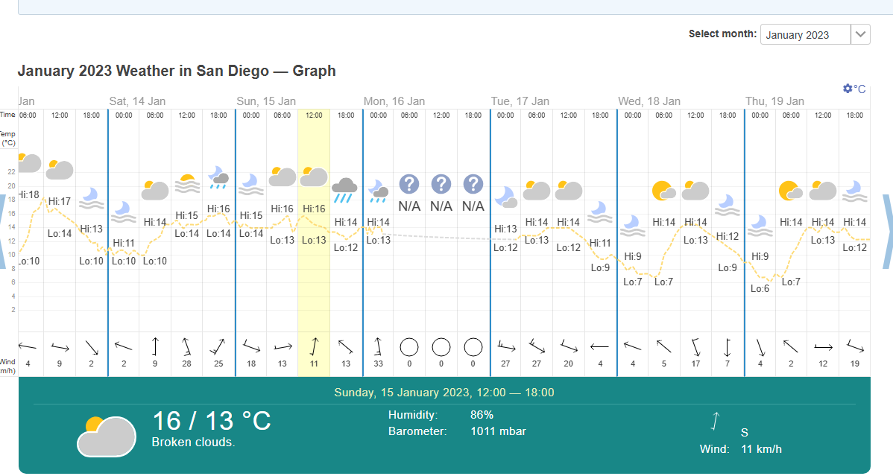
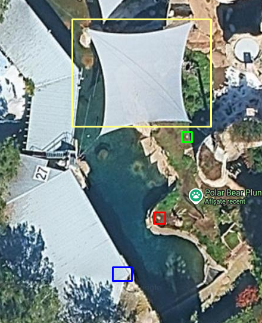

[‹ Back to all exercises](../README.md) · [Versiunea în limba română →](README.ro.md)

---

# Exercise #005

In this exercise we are given a screenshot from a live camera at a zoo. We are also told that the photo was taken on January 15, 2023, around 2 PM. We have to answer the following questions:

a) In which zoo are the polar bears located?

b) What was the temperature when the photo was taken?

c) What are the exact coordinates of where the polar bears were lying on the ground?

# Solution

To begin with, as always, I tried to run a Reverse Search on the given image.

### TinEye

- 4 results from other writeups, so irrelevant.

---

### Yandex

- On Yandex I had a bit more luck. Intuitively I just checked the second image, where I discovered a very important piece of information.

---

This information still has to be verified, so I didn't hesitate and moved on to the next step.

Honestly, it doesn't convince me at all. When I went to the site I expected to see exactly the angle from which the given photo was taken, but I saw a completely different frame. To be sure, we should look up the zoo on Google Maps and see whether we can identify the spot where the photo was taken.

Still, I chose to also look through photos and videos from the location, hoping I might find something to come back to when I get to solving **c)**, and I came across a video that helped me estimate an answer for the third task.

Why is it important? Because if we pay attention to the screenshot taken from the video, we can see a tree that appears right behind the bears in the given photo — but let's come back to this detail later, because for now I found the answer for **a)**, which is **San Diego Zoo**, and we need to move on to task **b)**.

---
Here there shouldn't be much of a headache, since we already know the date the photo was taken, as well as the exact location and time.

So on January 15, 2023, around 2 PM it was **b) 15 degrees Celsius**.

---

For **c)** the answer is almost given; all I have left to do is figure out where the footage was taken from. To do this I try to find some places/objects that I might be able to spot from Google Satellite.

For example, I'll take each rectangle/square in turn to explain my reasoning.

- The blue rectangle: most likely this is where the footage I screenshotted above was taken from.
- The red square: this is where the polar bear from the footage was, because you can see it sitting on a rock, and behind it is what is boxed in the yellow rectangle.
- The green square: being a white spot too, I'm inclined to believe that this is most likely exactly where the bears from the original photo were lying.

In conclusion, the answer for question **c)** is **32°44'04.2"N 117°09'16.5"W**.

---
