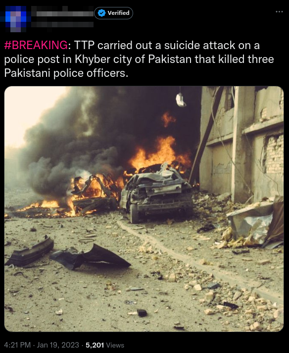
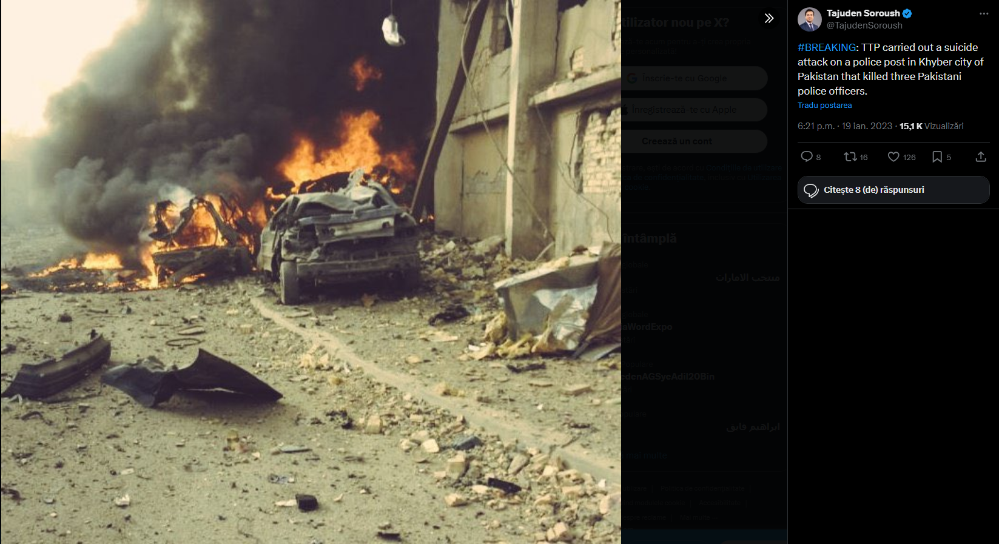
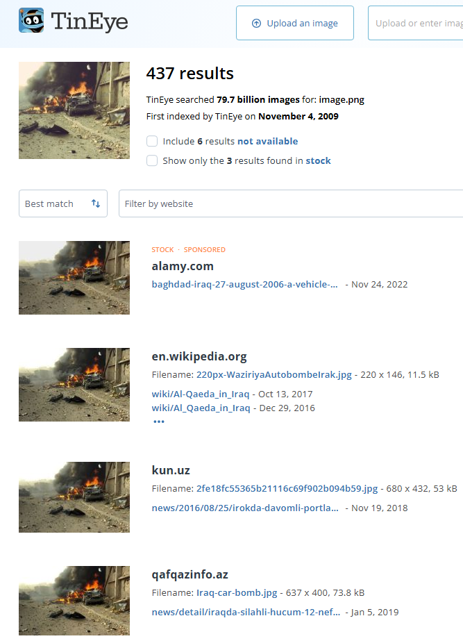
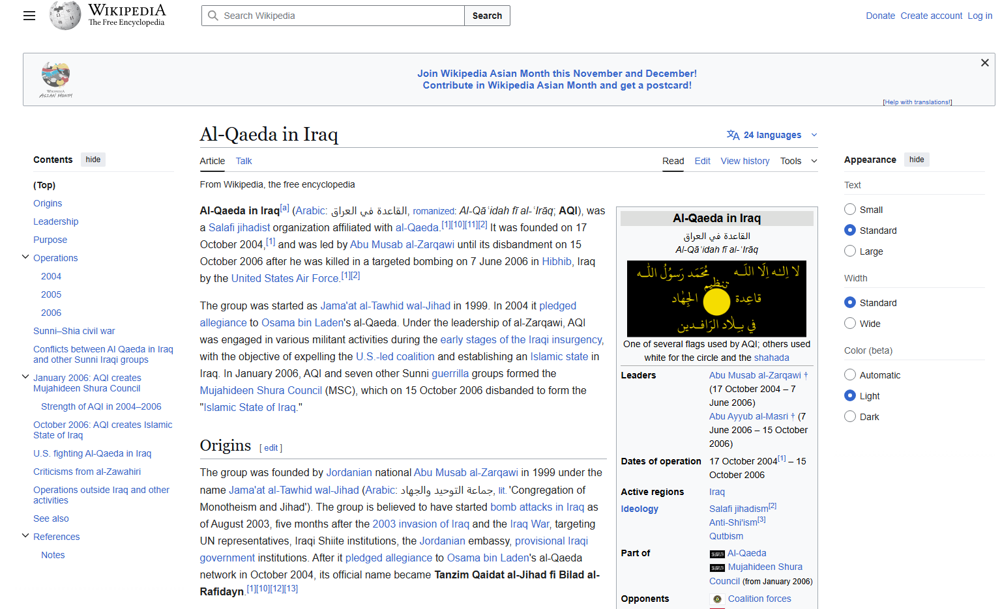
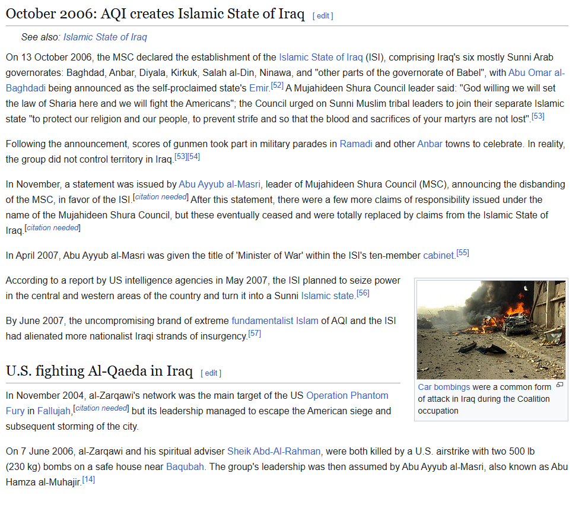
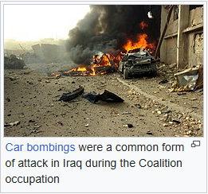

## Execitiul #006

In acest exercitiu, primim o imagine cu o stire si trebuie sa verificam daca aceasta este adevarata sau falsa.

## Rezolvare

Primul gand a fost sa gasesc acest tweet pentru a gasi imaginea si a ii da Reverse Image Search. Am cautat titlul tweet-ului si am gasit aceasta postare:

Dupa un Reverse Image Search pe TinEye am ajuns la urmatoarele site-uri:

Am vazut ca al doilea site este Wikipedia, asa ca am intrat pentru a vedea unde este folosita poza intr-o pagina de Wikipedia.

Pagina este strict despre "Al-Qaeda in Iraq", nimic despre Pakitstan cum se sustinea in stirea initiala. Totusi, cum am spus si mai sus, trebuie sa gasim unde este folosita poza.

Dupa cum putem observa imaginea este folosita pentru a reprezenta bombardarea masinilor din Irak, nicidecum un attac suicidal din Pakistan. 

Conform detaliilor gasite, stirea este **falsa**.

---

