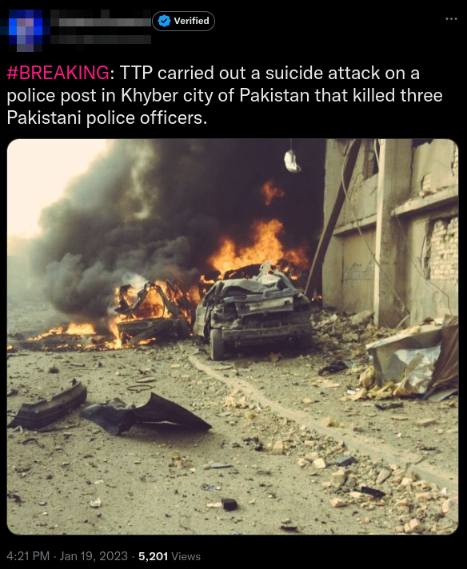
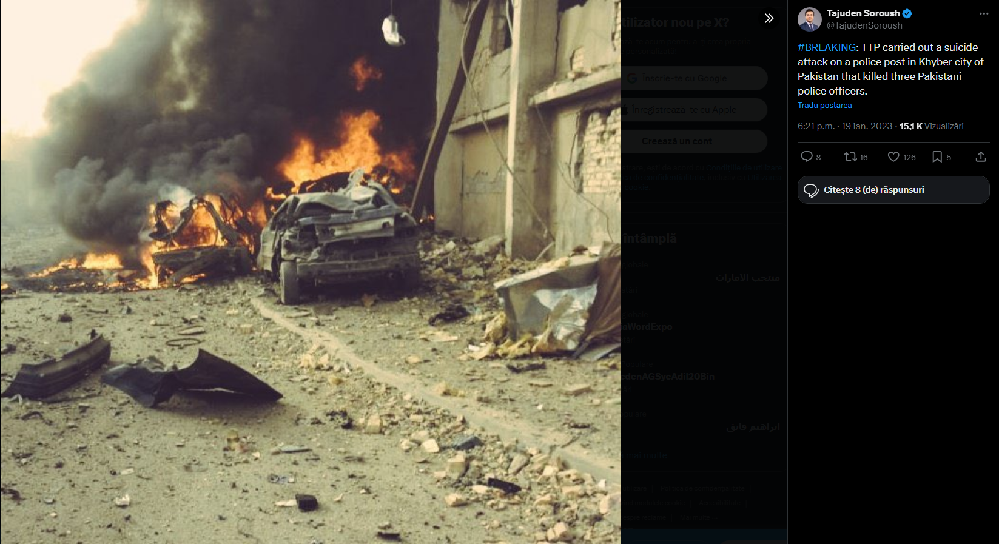
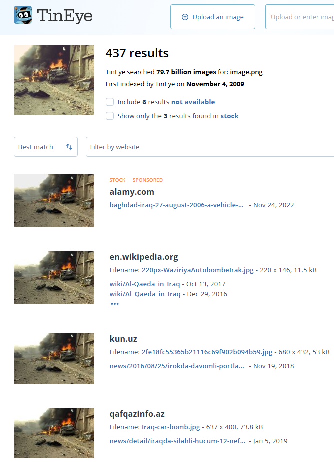
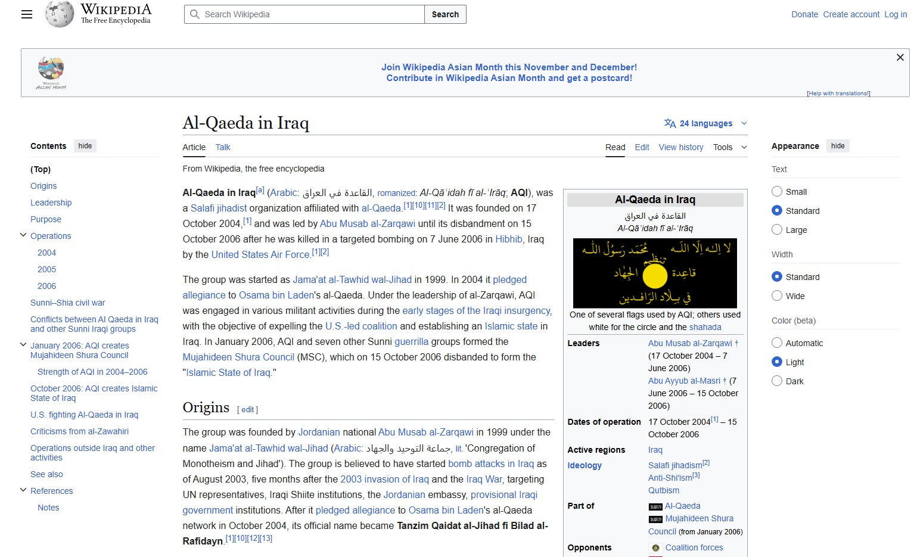
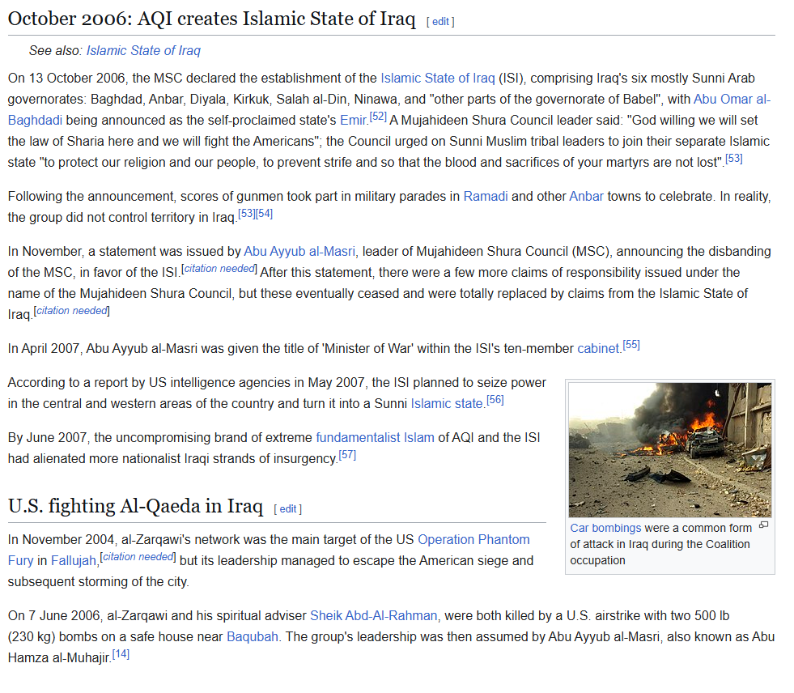
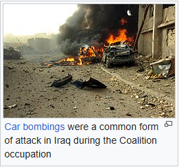

[‹ Back to all exercises](../README.md) · [Versiunea în limba română →](README.ro.md)

---

## Exercise #006

In this exercise, we receive an image of a news item and have to verify whether it is true or false.

## Solution

My first thought was to find this tweet in order to obtain the image and run a Reverse Image Search on it. I searched for the tweet's title and found this post:

After a Reverse Image Search on TinEye I arrived at the following sites:

I saw that the second site was Wikipedia, so I went in to see where the photo is used on a Wikipedia page.

The page is strictly about "Al-Qaeda in Iraq", nothing about Pakistan as claimed in the original news item. Still, as I said above, we have to find where the photo is used.

As we can see, the image is used to represent the bombing of cars in Iraq, by no means a suicide attack in Pakistan. 

Based on the details found, the news item is **false**.

---
