## Execitiul #007

In acest exercitiu, primim o imagine facuta acum cativa ani si trebuie sa raspundem la urmatoarele intrebari:

a) Unde a fost poza facuta?

b) In ce an a fost facuta poza?

c) Posterul mare din dreapta spate continea un link. Care era link-ul?

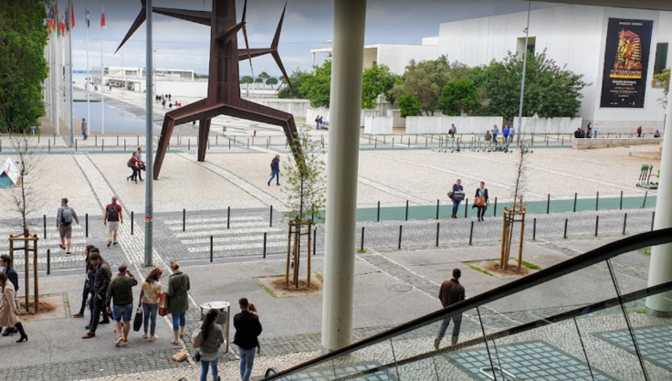

## Rezolvare

Pentru inceput m-am gandit sa fac screenshot doar la structura ce se poate observa in poza si sa folosesc Reverse Image Search cu Yandex. Acestea au fost rezultatele:

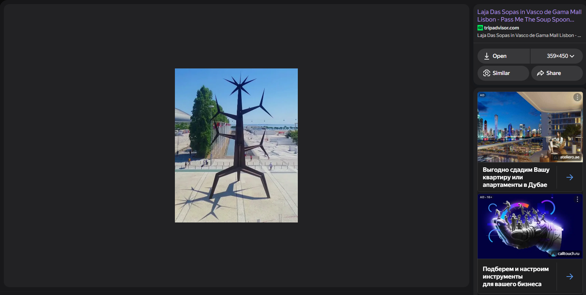

Dand click pe link-ul de langa ajungem pe pagina aceasta:

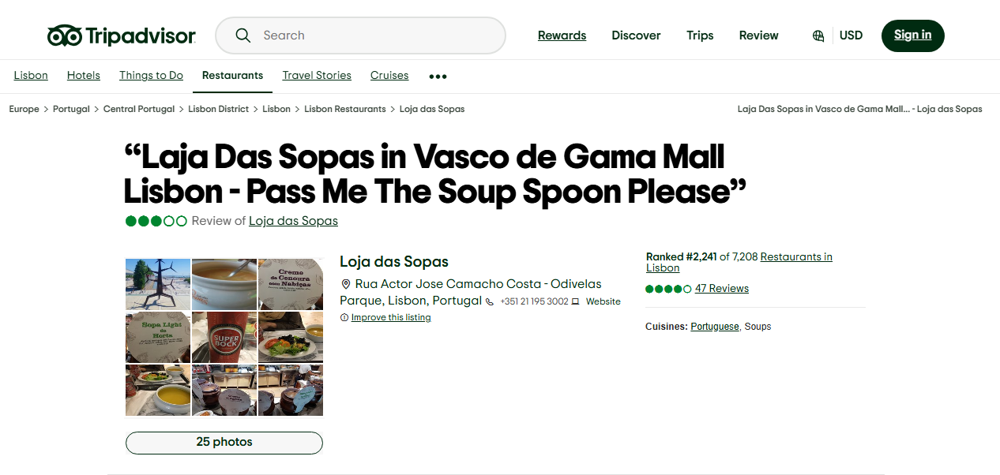

Cautand "Vasco de Gamma Mall Lisbon" pe Google Maps observam aceasta zona:

Dreptunghiul verde reprezinta zona cu copaci care se observa in imaginea initiala in partea stanga, iar nu departe de copaci putem observa si structura pe care am incadrat-o intr-un patrat rosu. Totusi ca sa ma asigur ca aceasta este zona cautata am ales sa reproduc imaginea in Google Maps.

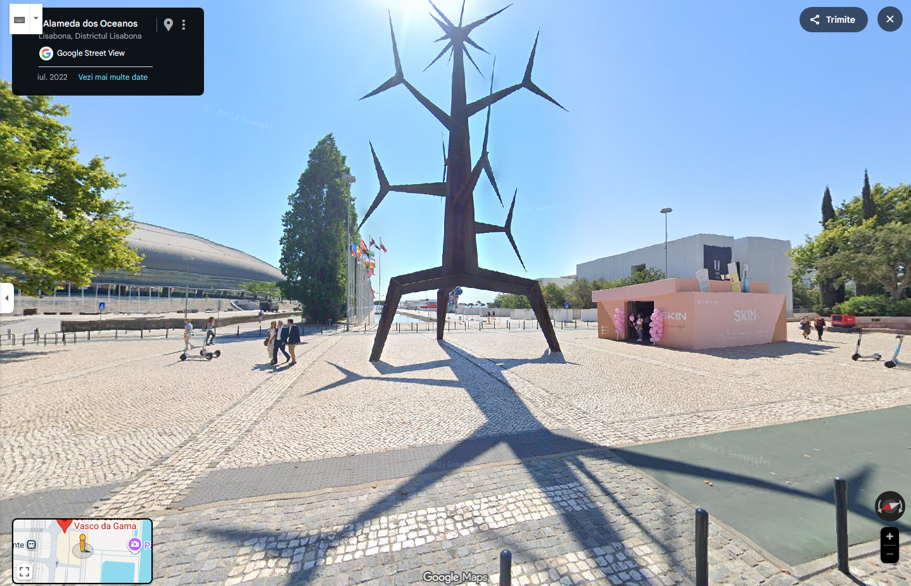

Cred ca asemanarile sunt evidente. Asdar, raspunsul pentru intrebarea **a)** este **Centrul Comercial Vasco de Gama**

---

Pentru a raspunde la a doua intrebare, am stat sa ma gandesc putin cum as putea sa imi dau seama. Totusi ceva ce observasem deja anuntul din partea dreapta a imaginii mele difera de cel din poza. In poza mea se observa un anunt cu fundal negru, iar in poza originala un anunt cu Tutankhamon. Asadar, m-am intors pe Google Maps si am inceput sa verific diversi ani.

### Anul 2022:
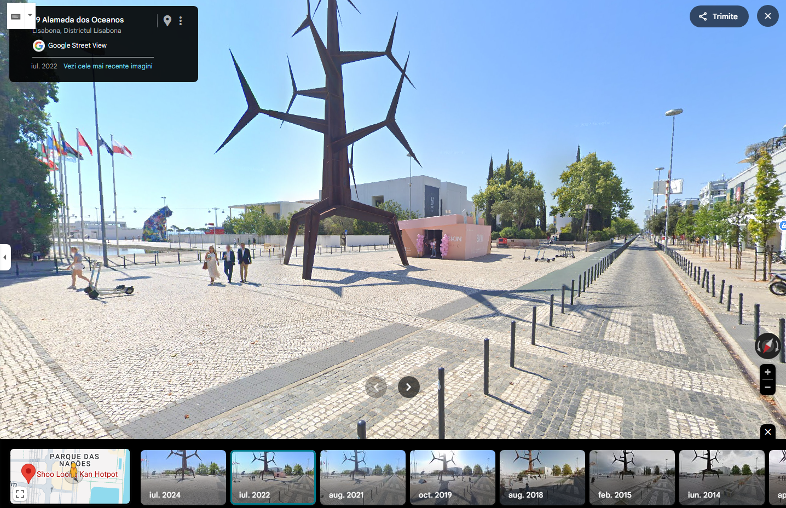

### Anul 2021:

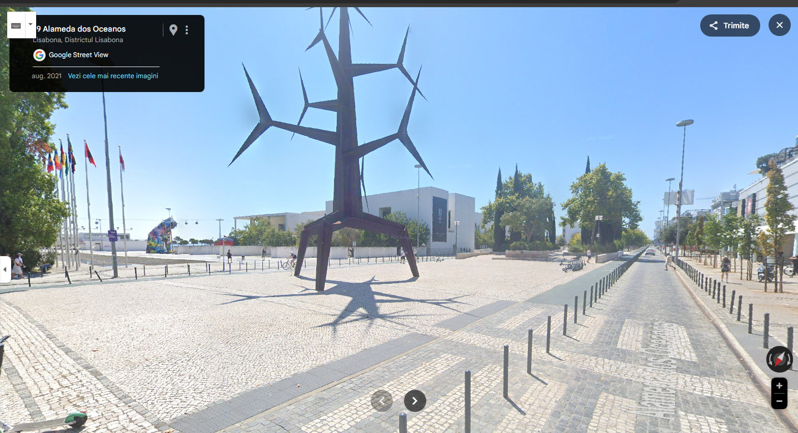

### Anul 2019:

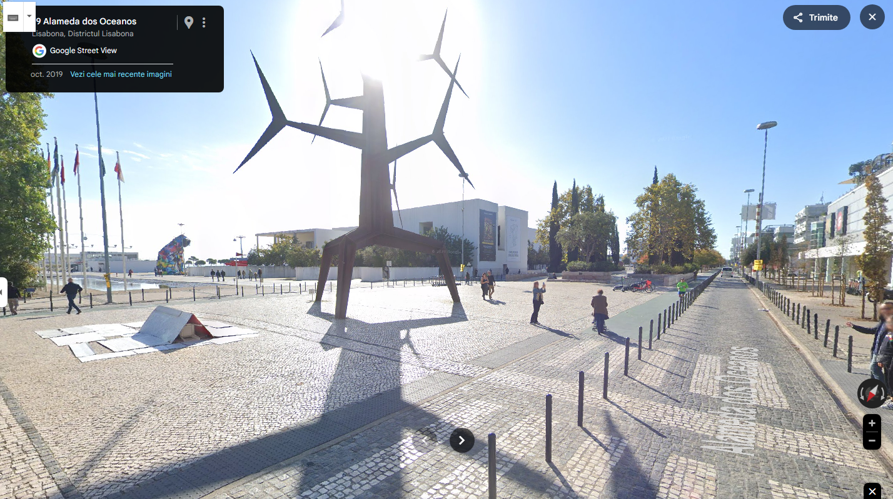

### Anul 2018:

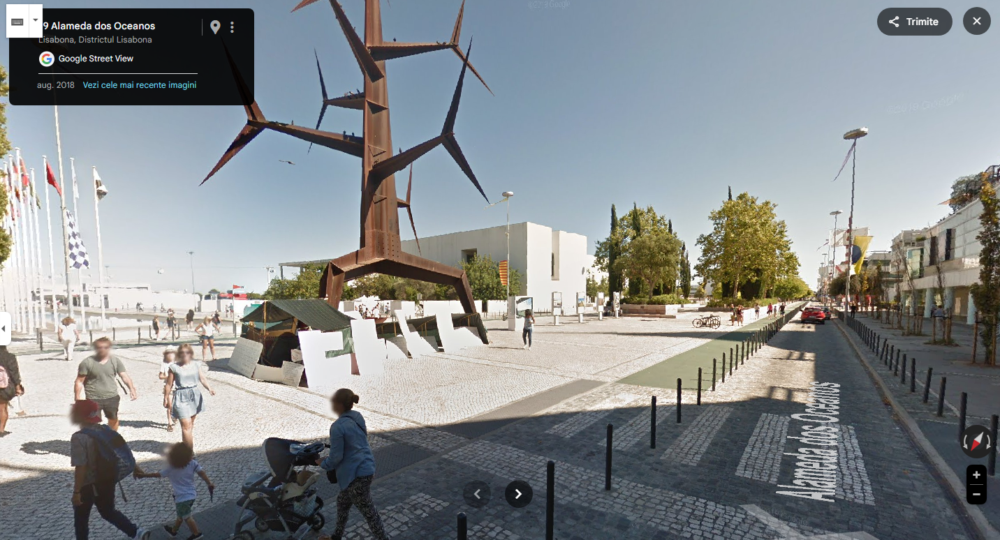

Astfel, concluzia la care am ajuns pentru intrebarea **b)** este ca fotografia a fost facuta in **anul 2019**.

---

Pentru a treia intrebare, m-am gandit doar ca o sa ma duc foarte aproape de afis in Google Maps si voi putea vedea clar link-ul din afis.

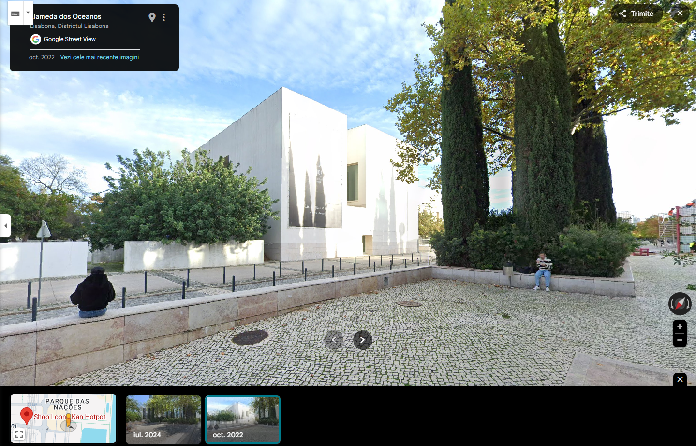

Gresit. Anii in care puteam verifica erau doar 2024 si 2021. A doua incercare a fost sa dau un search cu "tutankhamon" urmat de "lisbon" locul unde gasisem anuntul. Cu aceasta metoda, am ajuns la un videoclip pe Youtube unde se observa si pe parcursul videoclip-ului si in thumbnail link-ul.

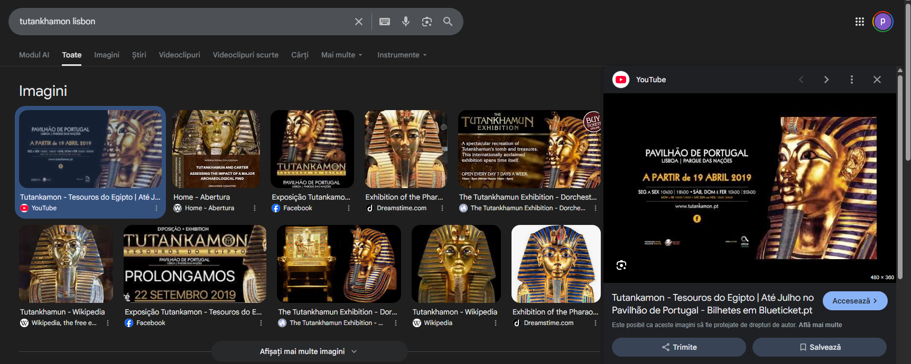

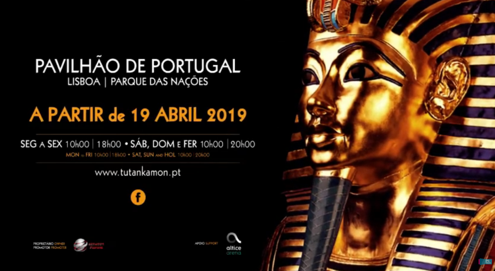

Asadar, raspunsul pentru intrebarea **c)** este **www.tutankamon.pt**.

---
