[‹ Back to all exercises](../README.md) · [Versiunea în limba română →](README.ro.md)

---

## Exercise #007

In this exercise, we receive a photo taken a few years ago and have to answer the following questions:

a) Where was the photo taken?

b) In what year was the photo taken?

c) The large poster in the back right contained a link. What was the link?

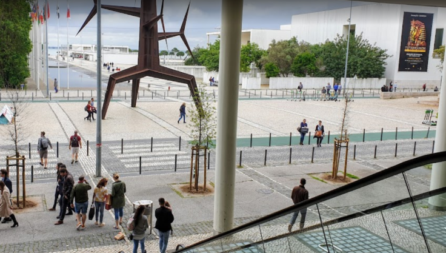

## Solution

To begin with, I thought I'd take a screenshot of just the structure visible in the photo and use Reverse Image Search with Yandex. These were the results:

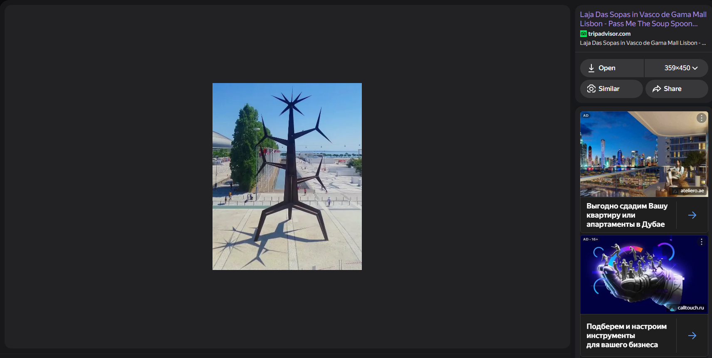

Clicking the link next to it, we reach this page:

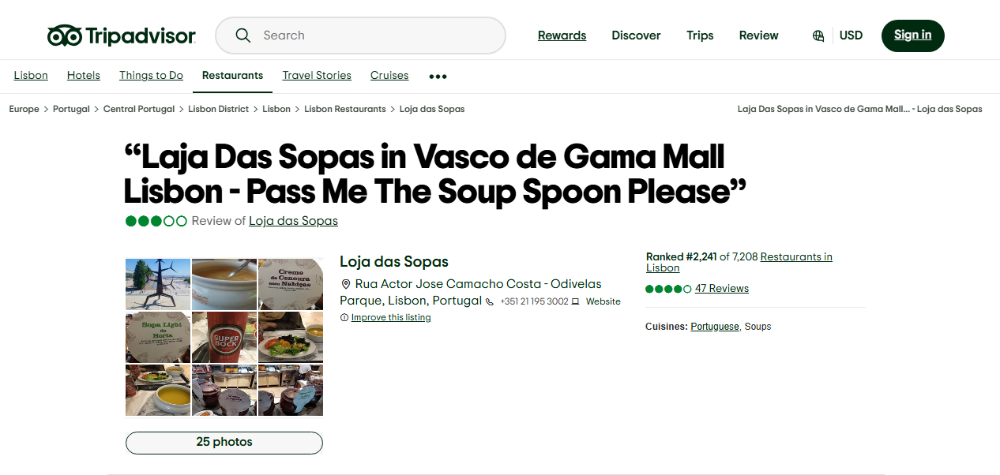

Searching "Vasco de Gamma Mall Lisbon" on Google Maps, we notice this area:

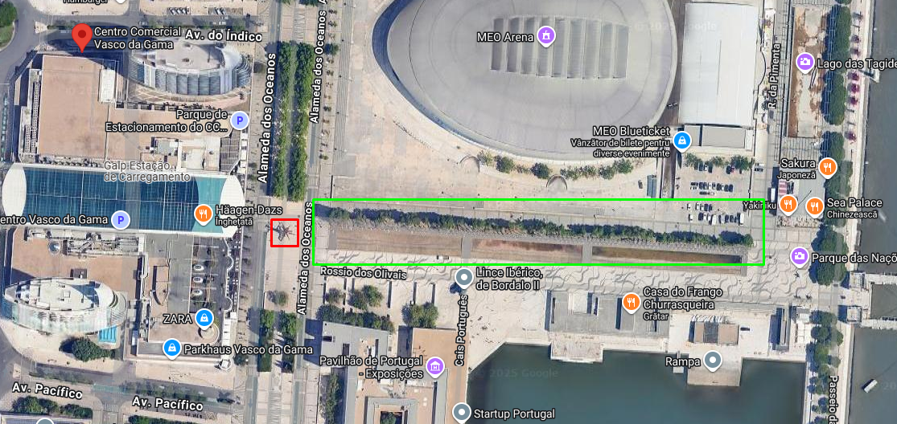

The green rectangle represents the area with trees seen on the left side of the original image, and not far from the trees we can also see the structure I boxed in a red square. Still, to make sure this is the area I was looking for, I chose to reproduce the image in Google Maps.

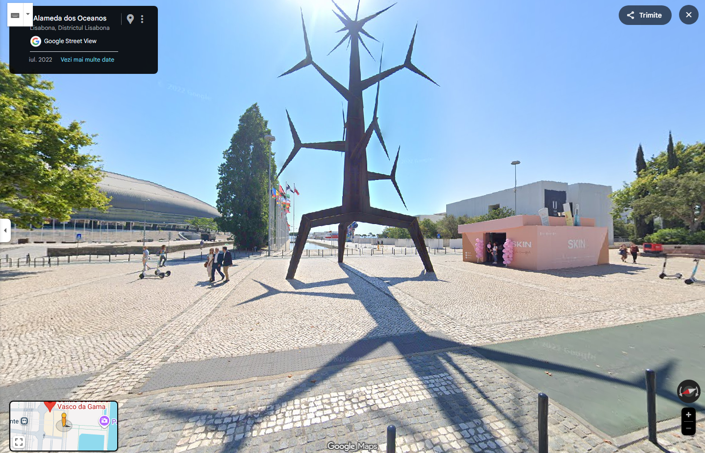

I think the similarities are obvious. So, the answer for question **a)** is the **Vasco da Gama Shopping Centre**.

---

To answer the second question, I sat and thought a bit about how I could figure it out. Something I had already noticed, though, was that the advertisement on the right side of my image differs from the one in the photo. In my photo you can see an ad with a black background, while in the original photo an ad with Tutankhamun. So I went back to Google Maps and started checking various years.

### Year 2022:
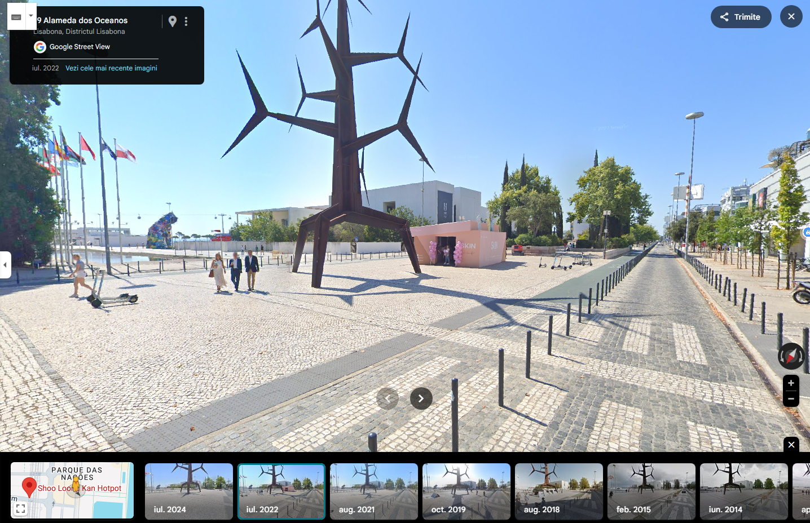

### Year 2021:

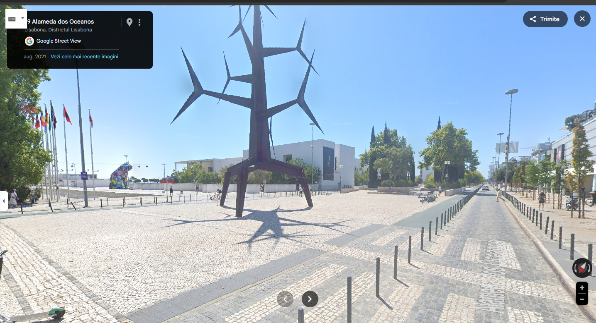

### Year 2019:

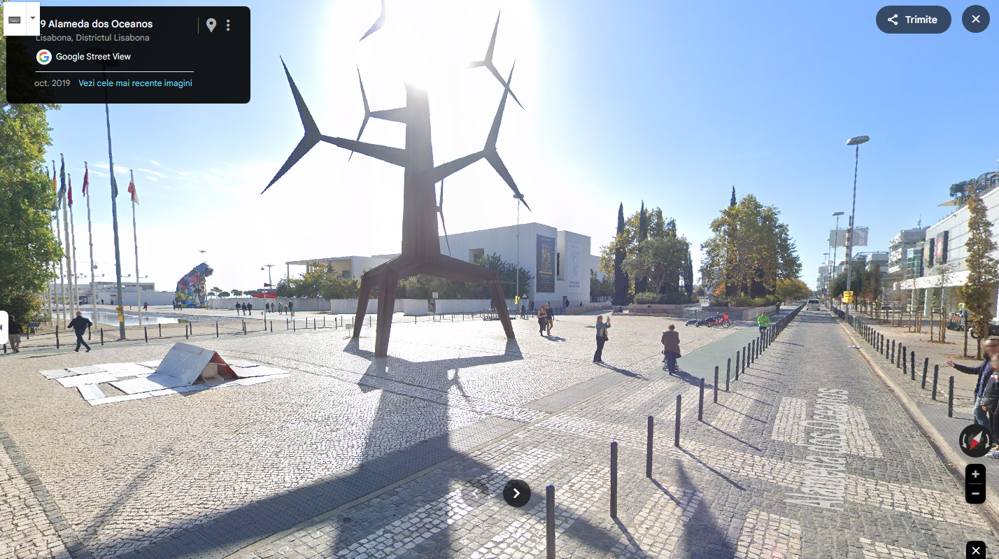

### Year 2018:

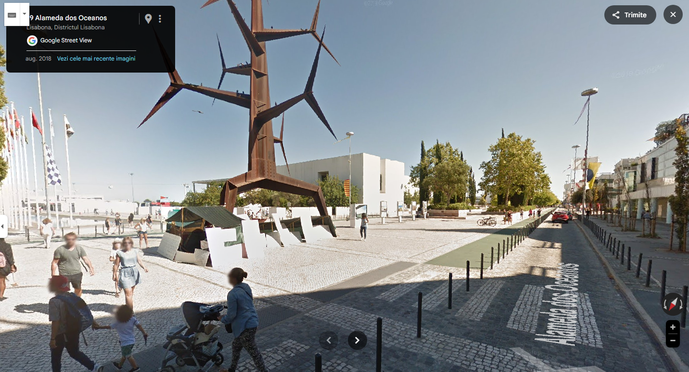

Thus, the conclusion I reached for question **b)** is that the photo was taken in **2019**.

---

For the third question, I just thought I'd go very close to the poster in Google Maps and be able to clearly see the link on it.

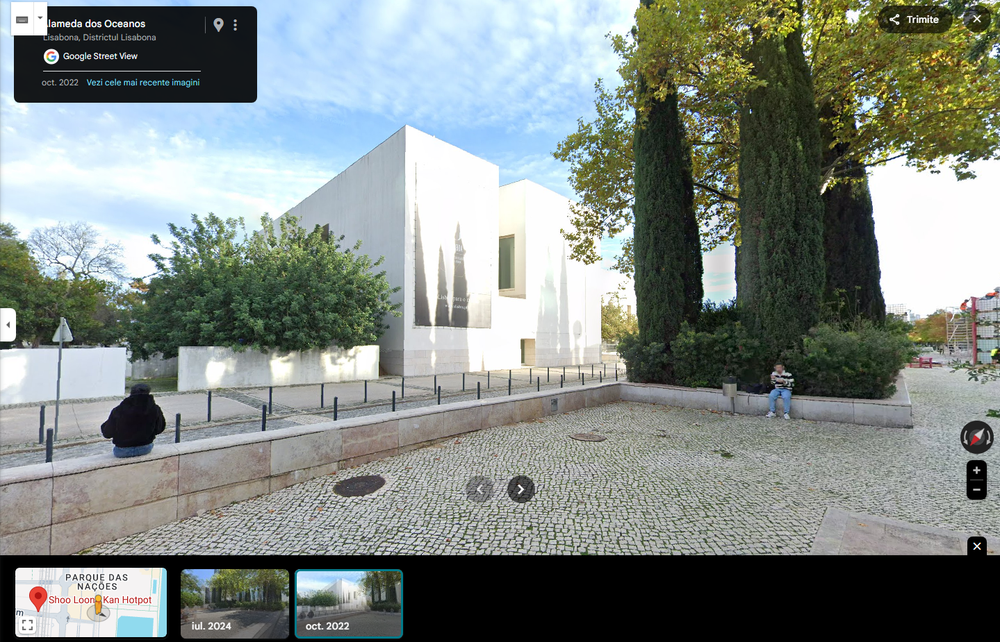

Wrong. The only years I could check were 2024 and 2021. My second attempt was to run a search with "tutankhamon" followed by "lisbon", the place where I had found the ad. With this method, I reached a YouTube video where the link is visible both throughout the video and in the thumbnail.

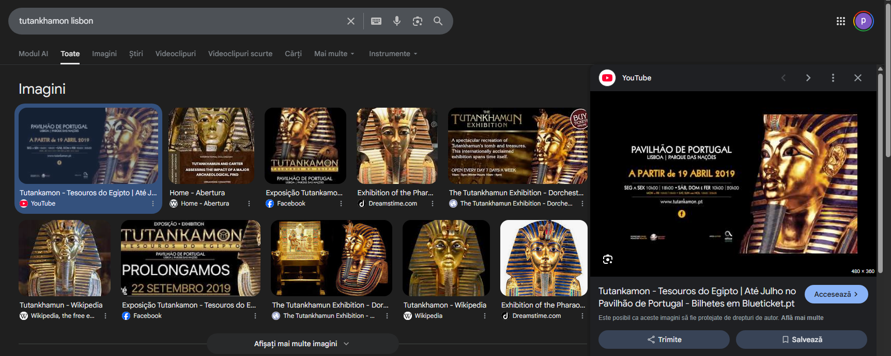

So, the answer for question **c)** is **www.tutankamon.pt**.

---
