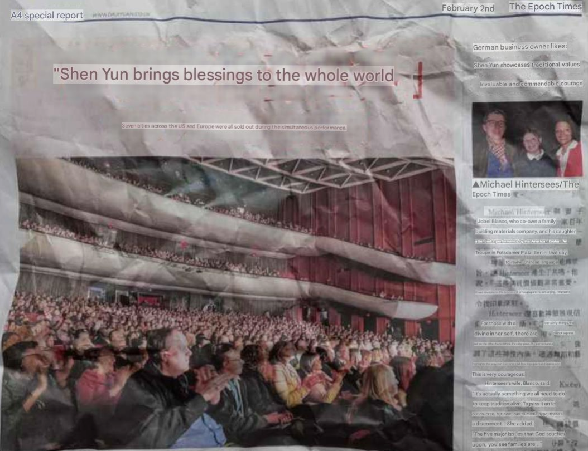
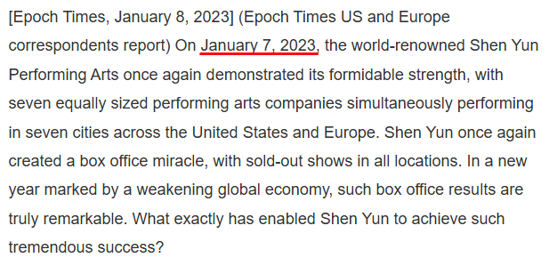
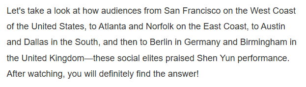
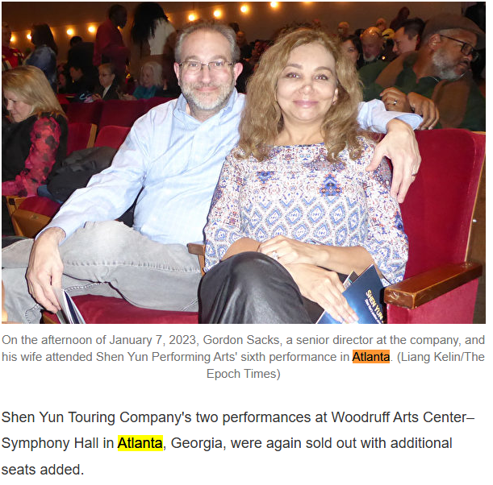
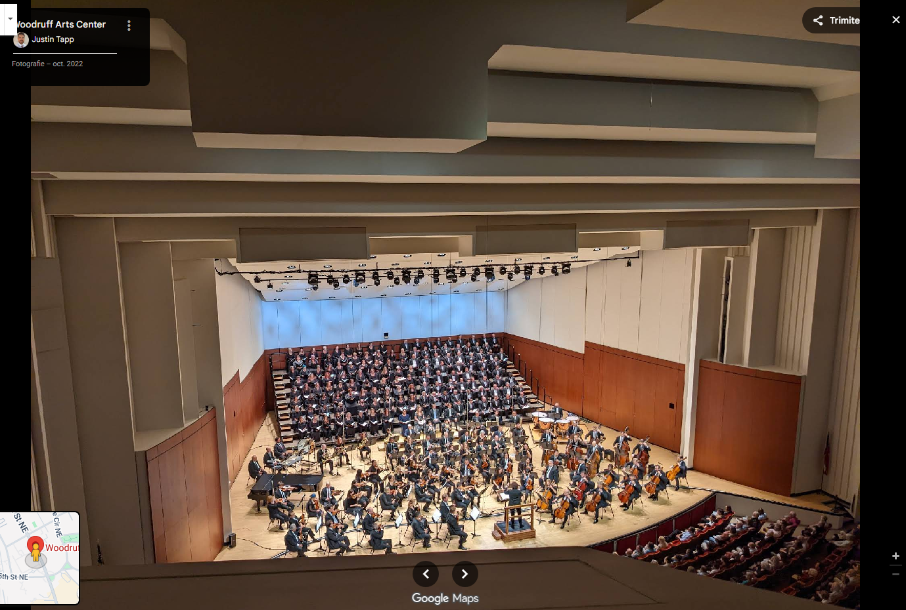
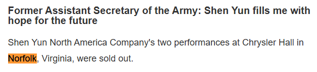
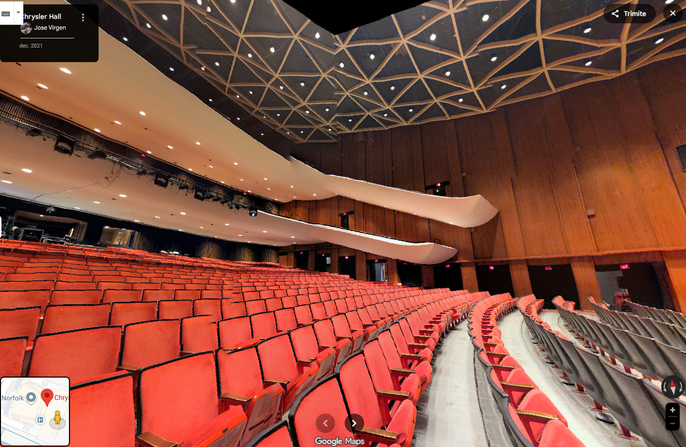

# Execitiul #008

In acest exercitiu, primim o imagine cu o pagina din ziarul chinezesc "Epoch Times" si trebuie sa raspundem la urmatoarele intrebari:

a) Pe cine aplauda audienta?

b) Cand a fost poza facuta?

c) Care este numele locatiei?

# Rezolvare

Pentru inceput, pentru ca din pacate nu stiu chineza, deci prin urmare nu stiu sa traduc, trebuie sa gasesc o metoda prin care sa o fac.

Ce putem observa sunt cuvintele cheie "Shen Yun" si faptul ca eveniment-ul s-a intamplat in 7 orase din Statele Unite si din Europa. Conform textului, am gasit deja raspunsul pentru intrebarea **a)** multimea aplaudand un moment de **Shen Yun**.

---

Pentru raspunsurile urmatoare trebuie totusi sa ma folosesc mai mult de informatiile pe care le am deja. Asadar, am copiat titlul in limba chineza si i-am dat un search.

Ajungand la aceasta pagina:

Am tradus site-ul in limba engleza si am inceput sa caut informatii utile.

Folosind traducerea am ajuns si la raspunsul pentru intrebarea **b)** care este **7 ianuarie 2023**

---

Petrecand mai mult timp pe pagina si citind textele am inceput sa imi dau seama ca imaginile din ziarul fizic nu erau si pe ziarul online incepand sa ma tem ca as fi pierdut timpul si cautasem in sursa gresita. Totusi putin scroll mai jos si am dat de aceasta imagine:

Imagine care se afla si in ziarul fizic, in dreapta sus. Aici putem trage concluzia ca sursa este buna. Totusi, inca un lucru pe care l-am observat cand citeam a fost partea de introducere unde ni se prezinta diferite state din Statele Unite si tarile din Europa unde a avut loc evenimentul.

Neavand alte indici, singura solutie e sa luam manual fiecare stat si tara si sa verificam unde au avut loc si daca sala respectiva seamana cu cea din ziarul fizic.

### I. Atlanta

Putem observa cum ni se comunica faptul ca evenimentul a avut loc in "Woodruff Arts Center-Symphony Hall" in Atlanta. Nestand prea mult pe ganduri am incercat direct sa verific daca aceasta este sala pe Google Maps.

Dupa cum putem vedea nu exista nicio asemanare intre aceasta sala si cea din imaginea din ziar, deci trecem la urmatoarea locatie.

---

### II. Norfolk, Virginia

Analog, am ajuns la Chrysler Hall din Norfolk, Virginia. Am verificat cateva imagini si mi s-a parut o asemanare izbitoare, dar pentru a ma convinge am folosit modul "Street View & 360".

Cum se observa clar asemanarile dintre aceasta sala si cea din poza din ziar, raspunsul pentru intrebarea **c)** este **Chrysler Hall**.

---
