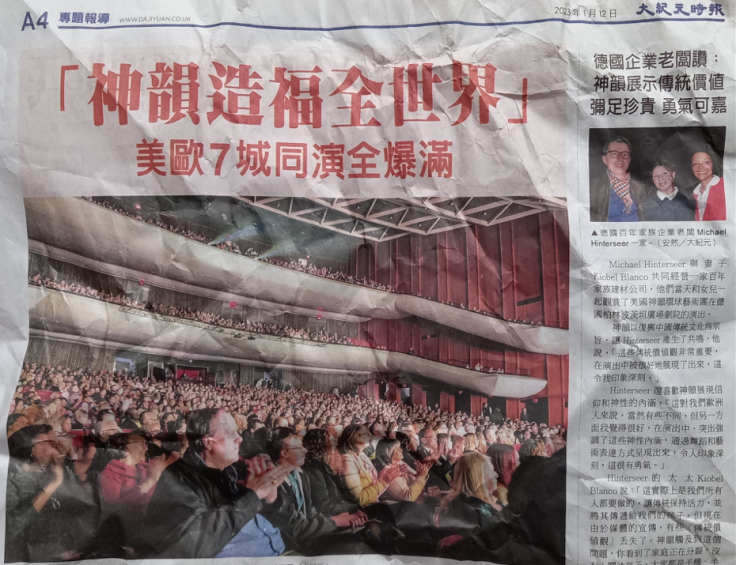
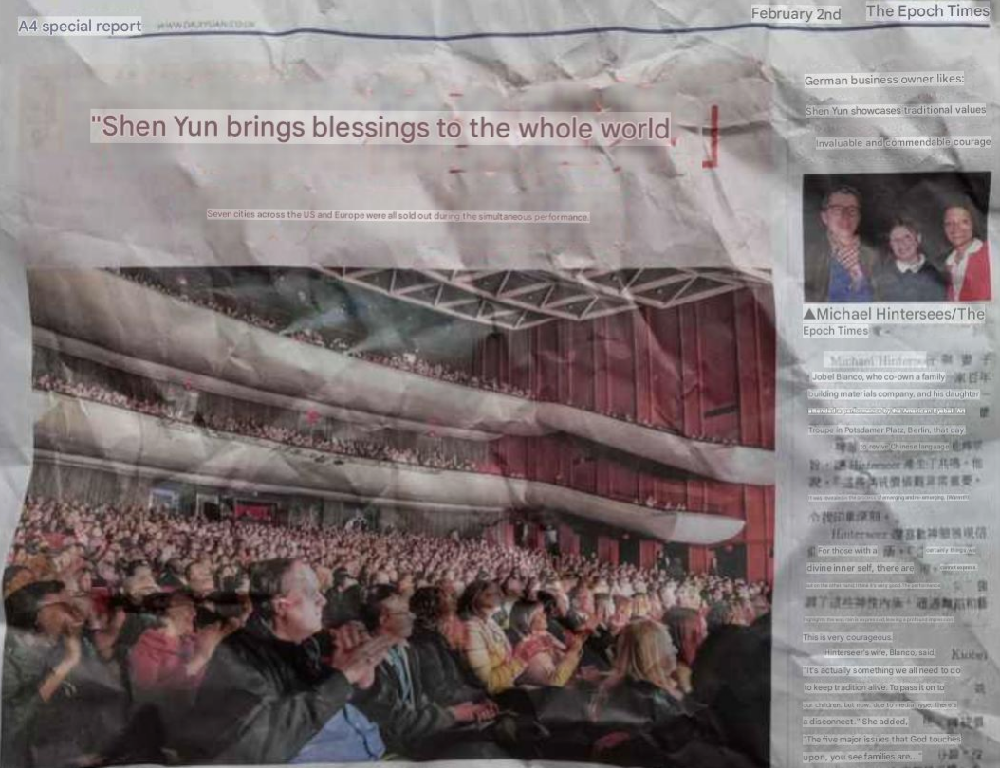
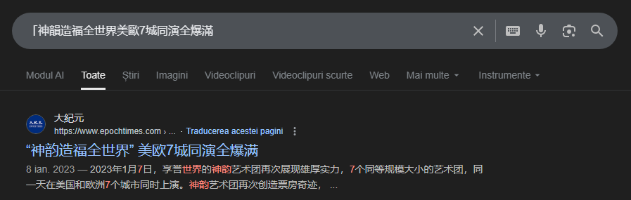
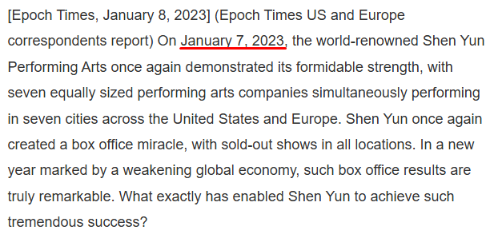
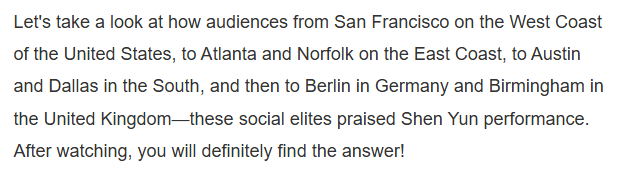
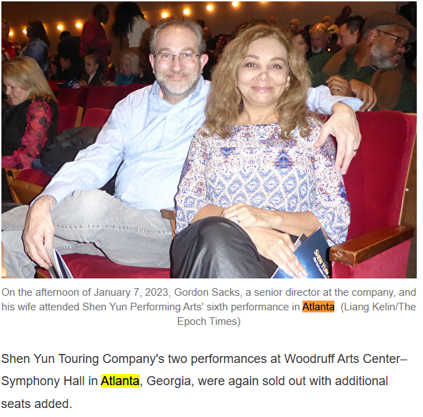
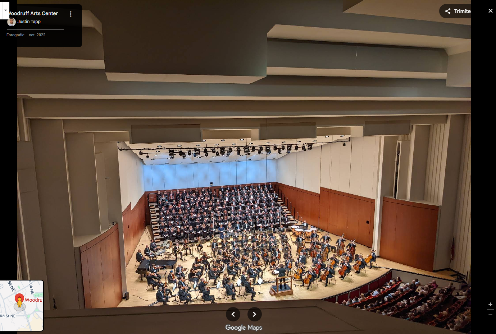
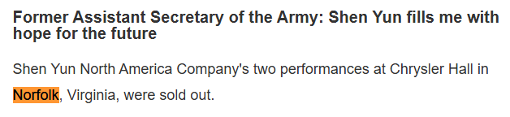
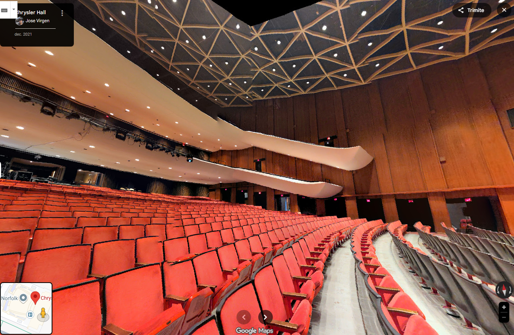

[‹ Back to all exercises](../README.md) · [Versiunea în limba română →](README.ro.md)

---

# Exercise #008

In this exercise, we receive an image of a page from the Chinese newspaper "Epoch Times" and have to answer the following questions:

a) Who is the audience applauding?

b) When was the photo taken?

c) What is the name of the venue?

# Solution

To begin with, since unfortunately I don't know Chinese and therefore can't translate it, I have to find a method to do so.

What we can notice are the keywords "Shen Yun" and the fact that the event took place in 7 cities in the United States and Europe. According to the text, I already found the answer for question **a)**: the crowd applauding a **Shen Yun** performance.

---

For the following answers, however, I have to make more use of the information I already have. So, I copied the title in Chinese and searched for it.

Reaching this page:

I translated the site into English and started looking for useful information.

Using the translation I reached the answer for question **b)**, which is **January 7, 2023**.

---

Spending more time on the page and reading the texts, I began to realize that the images from the physical newspaper were not on the online one, and I started to fear that I had wasted time and searched the wrong source. Still, a little scroll down and I came across this image:

An image that is also in the physical newspaper, in the top right. Here we can conclude that the source is good. Still, another thing I noticed while reading was the introductory part where various US states and European countries where the event took place are presented.

With no other clues, the only solution is to manually take each state and country and check where they took place and whether the respective hall resembles the one in the physical newspaper.

### I. Atlanta

We can see that we are told the event took place at the "Woodruff Arts Center - Symphony Hall" in Atlanta. Without dwelling too long, I tried to directly check whether this is the hall on Google Maps.

As we can see, there is no resemblance between this hall and the one in the newspaper image, so we move on to the next location.

---

### II. Norfolk, Virginia

Analogously, I reached Chrysler Hall in Norfolk, Virginia. I checked a few images and it seemed a striking resemblance, but to convince myself I used the "Street View & 360" mode.

As the similarities between this hall and the one in the newspaper photo are clear, the answer for question **c)** is **Chrysler Hall**.

---
