# Execitiul #009

In acest exercitiu primim o [filmare](https://youtu.be/axC30cE_O-4) postata si pe contul de Twitter "Visit Tirana". Trebuie sa raspundem la intrebarea:

a) La ce ora a fost postat video-ul?

Si task-ul:

b) Gaseste coordonatele unde persoana se plimba in timpul inregistrarii.

# Rezolvare

Pentru inceput am incercat mai intai sa gasesc pe diverse platforme video-ul respectiv.

## Twitter

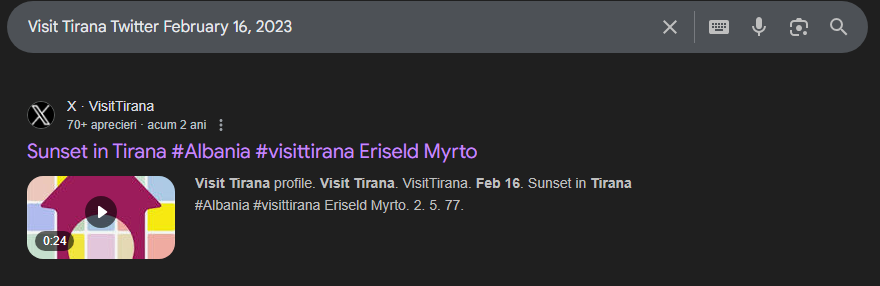

Am incercat sa vad daca pot gasi ceva in pagina de "Elements" dupa ce am dat inspect, dar nu am gasit nimic relevant

## Instagram

Aici am picat intr-un mic trap. Am incercat sa caut pe pagina de instagram cu acelasi nume si poza ca pe Twitter, dar nu am gasit video-ul. Totusi, stiam de la pasul anterior faptul ca video-ul ii apartine lui "Eriseld Myrto" care a fost si creditat in post-ul de pe Twitter de mai sus.

Nici aici nu am mai avut prea mult noroc gasind diferite conturi cu numele "Myrto" dar niciunul util. Am pierdut putin timp prin search-ul cu numele lui si am dat de o postare pe Facebook, unde din nou a fost creditat pentru o poza facuta de el.

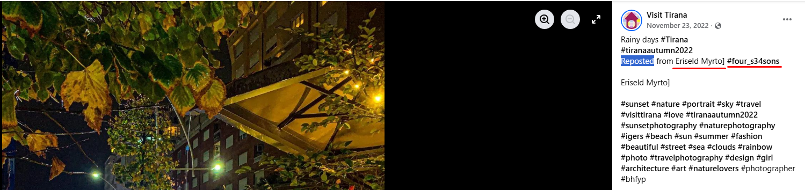

#four_s34sons - acest # fix dupa numele lui, iar restul de hashtag-uri sub. Nu mi s-a parut o coincidenta si am incercat acest username pe Instagram.

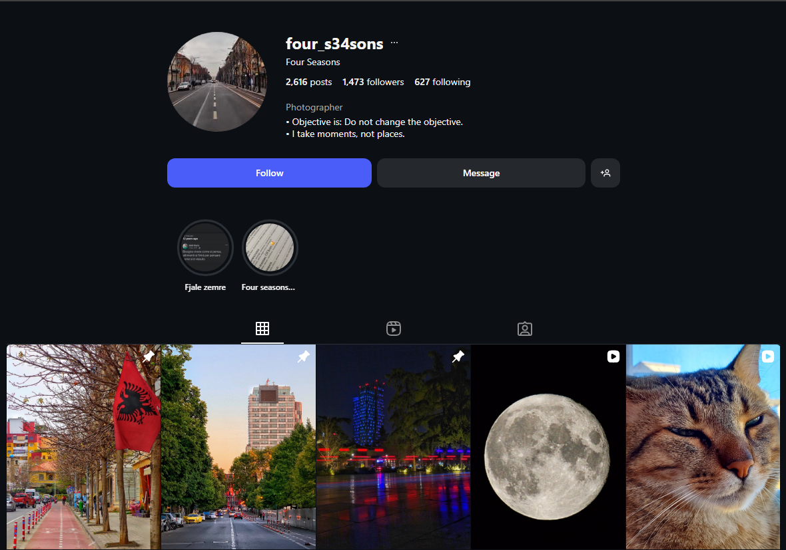

In prima postare este steagul Albaniei, un semn clar ca sunt pe drumul cel bun.

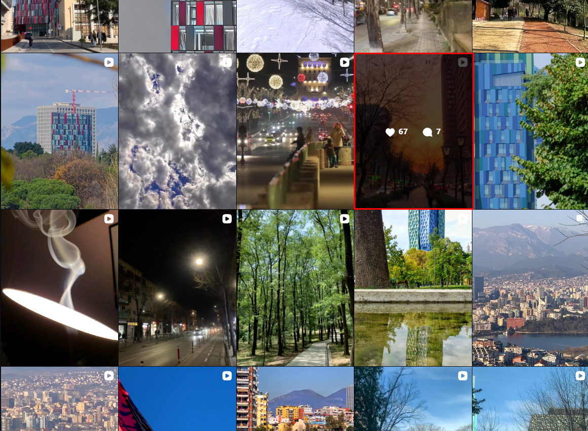

Dupa putin timp am gasit exact postarea si analog, am dat de informatiile necesare:

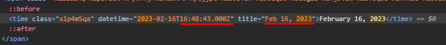

Astfel, pentru intrebarea **a)** raspunsul este: **16:48:43**.

---

Inainte sa ma apuc sa caut pe Google Maps prin toata Tirana strada de unde a fost facuta filmare, am decis ca este mai util sa strang niste informatii ce m-ar putea ajuta sa identific mai usor. Ce se poate observa in video:

- O cladire foarte inalta pe partea dreapta.
- Pe ambele sensuri de mers era trafic.

Ce pot face cu aceste infomatii? In timp ce cautam video-ul pe pagina de Instagram, mi-au atras atentia doua alte postari.

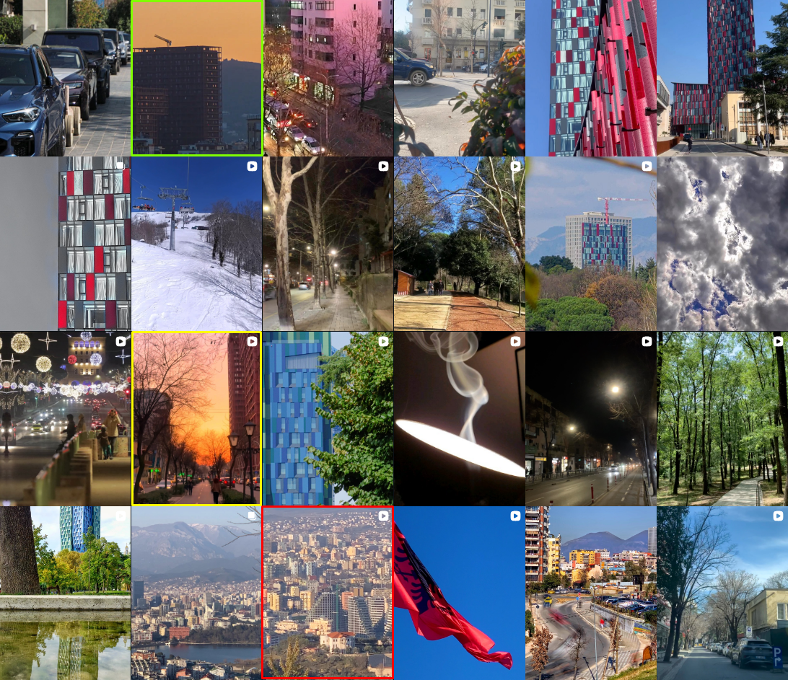

- Dreptunghiul verde: se observa o cladire asemanatoare cu cea de care vorbeam mai sus.
- Dreptunghiul rosu: O filmare de la distanta, din care sper ca voi gasi informatii utile.
- Dreptunghiul galben: Filmarea initiala.

### Postarea din dreptunghiul galben:
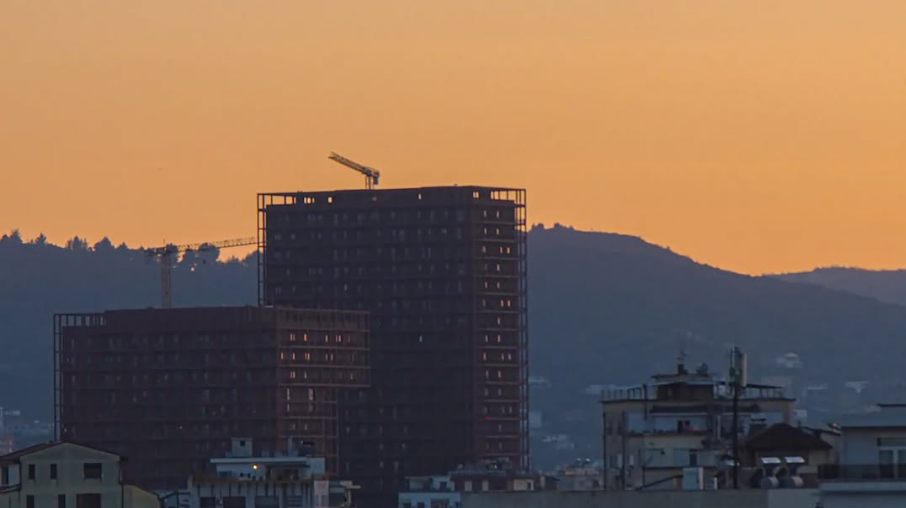

Este extrem de asemanatoare cu acea cladire din filmare. Totusi, ceva de adaugat este peisajul din spate unde se observa niste munti, care pot fi de folos in localizarea cladirii.

### Video-ul din dreptunghiul rosu:

Aici am descoperit mai multe informatii cheie.

> 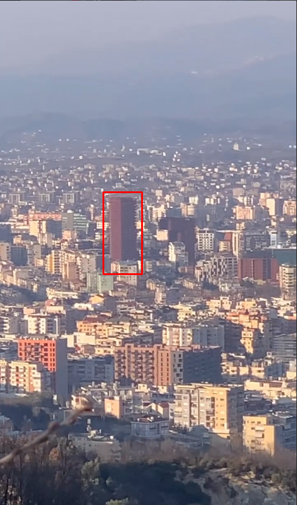

 Pare a fi cladirea din dreptunghiul verde de mai sus.

---

> 

Niste cladiri pe care nu le-am observat pana acum, dar clar vor fi utile fiind usor de observat din satelit datorita formelor triunghiulare.

---

> 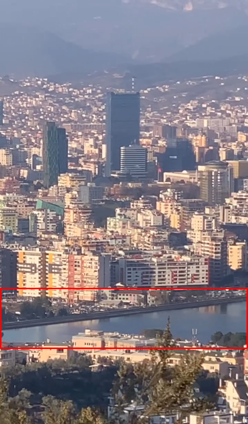

Se observa clar foarte multa apa, iar langa apa un despartitor ce pare a fi facut de mana umana, nu natural.

---

Acum ca am analizat tot foarte concret, e timpul sa trecem in Google Maps, unde voi folosi:

- Modul de teren: pentru a vedea zonele muntoase.
- Informatii din trafic: Unde am setat ziua ca fiind cea de pe data 16 Februarie 2023, adica joi, iar ora in jurul celei gasite la **a)** 16:48:44

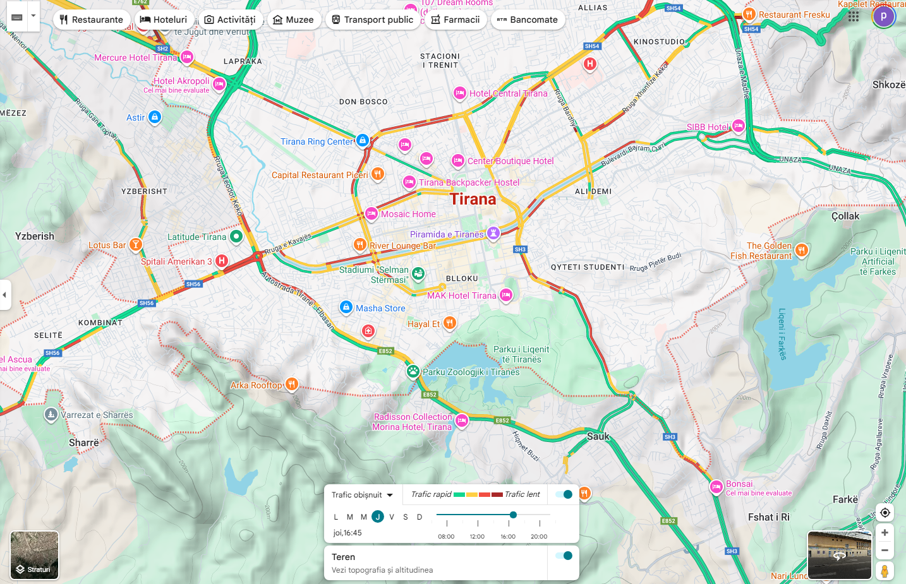

Astfel, avem 2 lacuri de verificat. Am decis sa analizez mai intai lacul din stanga.

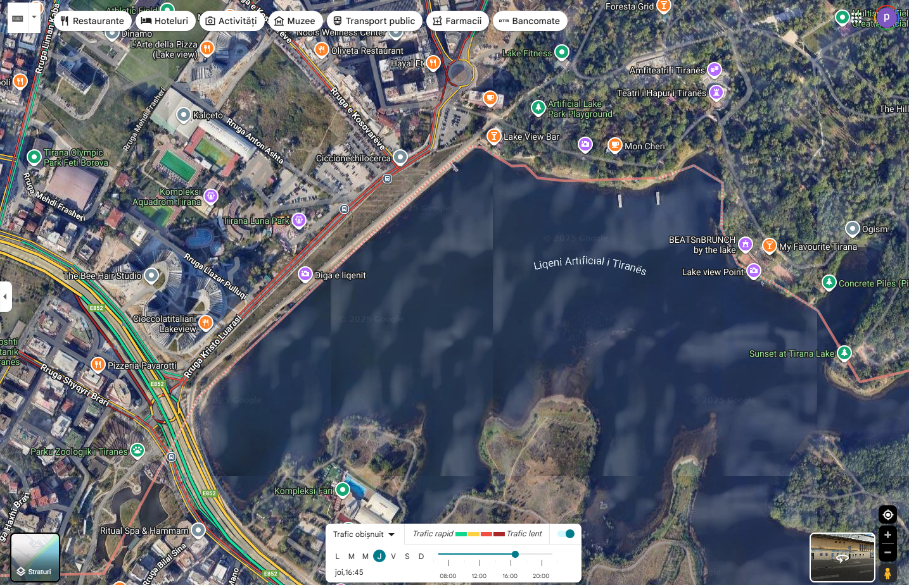

Folosind si modul de satelit, putem observa lacul, iar fix langa cladirile cu forme triunghiulare despre care vorbeam anterior. 

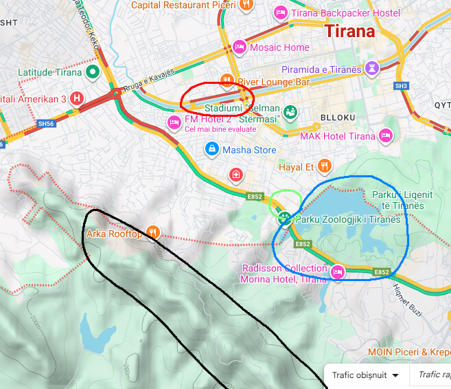

Am incercat sa fac o demonstratie, prin care sper ca se poate intelege ceva. Totusi am sa explic gandirea mea:

- Am incercuit cu negru zona muntoasa.
- Am incercuit cu albastru lacul despre care vorbeam.
- Am incercuit cu verde pozitionarea cladirilor triunghiulare.
- Am incercuit cu rosu o strada aglomerata intr-o zi de joi in Tirana.

Ce am reusit sa gasesc: 

Aceasta cladire, doar urmand indiciile pe care le aveam deja. Cu dorinta de a verifica daca am ajuns la un rezultat am incercat sa verific si am ramas neplacut surprins.

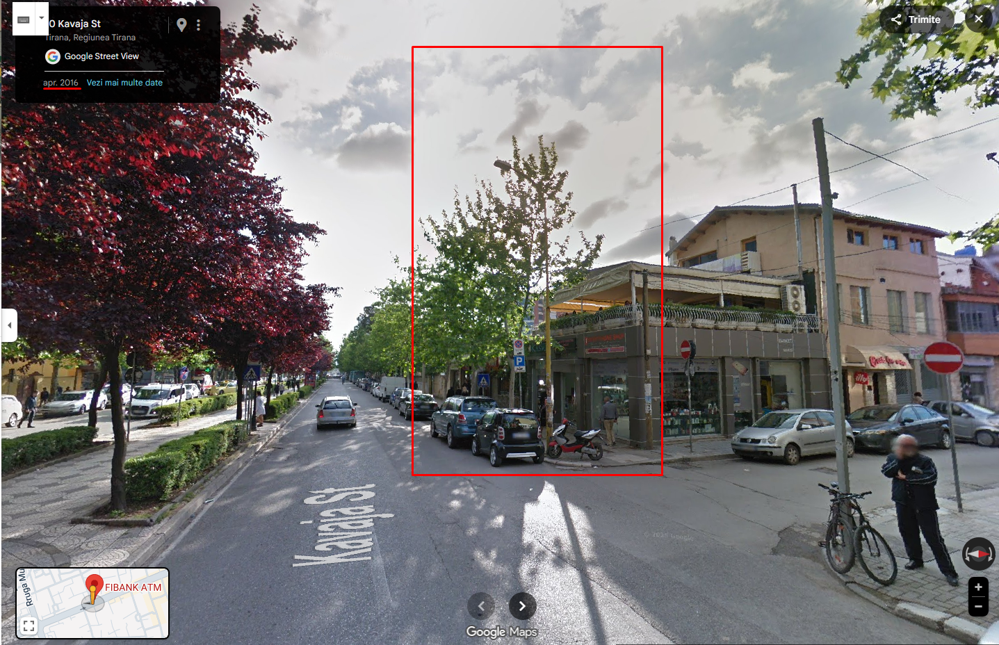

Imaginile dupa cum se poate observa sunt din 2016, iar unde am pus dreptunghiul rosu, acolo ar fi trebuit sa se afle cladirea cautata. Neavand cladirea, trebuie sa gasesc alt reper ce se observa si in filamre si la mine pe Google Maps, ca de exemplu:

Aceasta cladire, care este chiar cladirea: 

Sau, alt exemplu aceasta cladire:

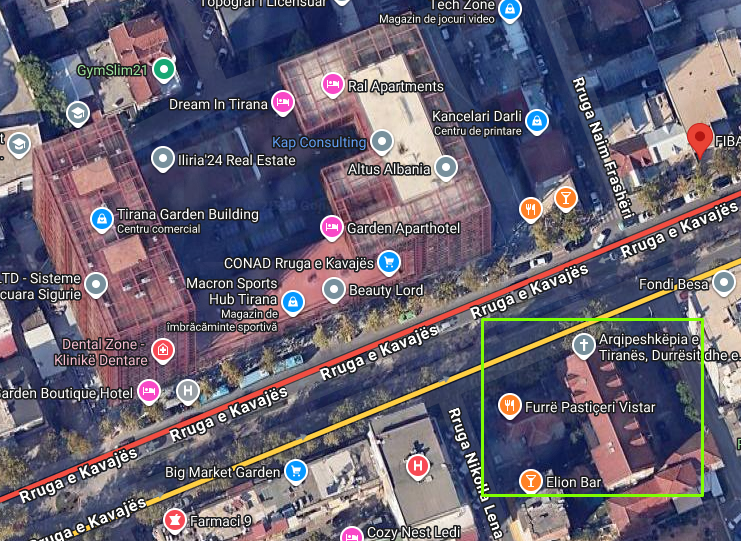

Care este:

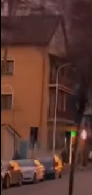

Dupa cum se poate observa dupa acoperisul triunghiular.

Astfel, am ajuns la raspunsul de la task-ul **b)** care este: **41.326881, 19.806880**.

---