[‹ Back to all exercises](../README.md) · [Versiunea în limba română →](README.ro.md)

---

# Exercise #009

In this exercise we receive a [video](https://youtu.be/axC30cE_O-4) also posted on the Twitter account "Visit Tirana". We have to answer the question:

a) At what time was the video posted?

And the task:

b) Find the coordinates where the person is walking during the recording.

# Solution

To begin with, I first tried to find the video on various platforms.

## Twitter

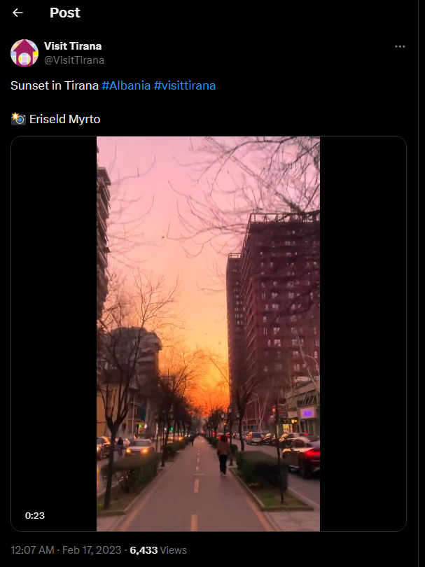

I tried to see whether I could find anything in the "Elements" page after inspecting, but I found nothing relevant.

## Instagram

Here I fell into a small trap. I tried searching on the Instagram page with the same name and photo as on Twitter, but I didn't find the video. Still, I knew from the previous step that the video belongs to "Eriseld Myrto", who was also credited in the Twitter post above.

I didn't have much luck here either, finding various accounts with the name "Myrto" but none useful. I wasted a little time searching for his name and came across a Facebook post, where he was again credited for a photo he took.

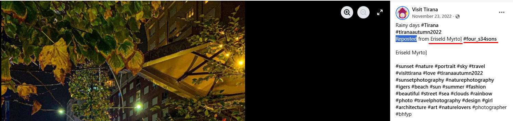

#four_s34sons - this # right after his name, and the rest of the hashtags below. It didn't seem like a coincidence to me and I tried this username on Instagram.

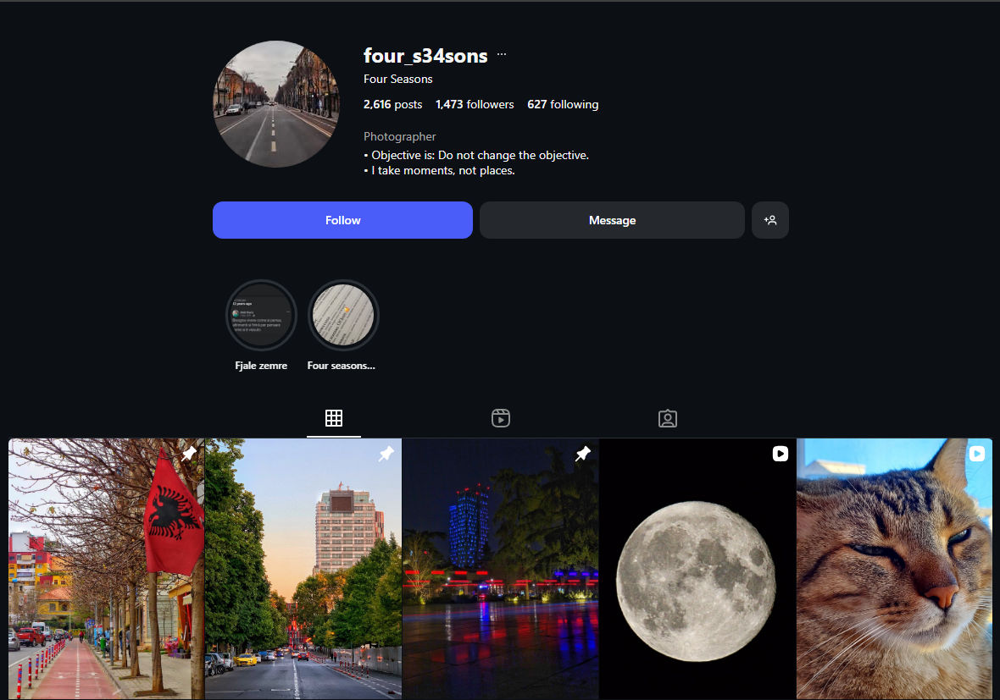

In the first post is the flag of Albania, a clear sign that I'm on the right track.

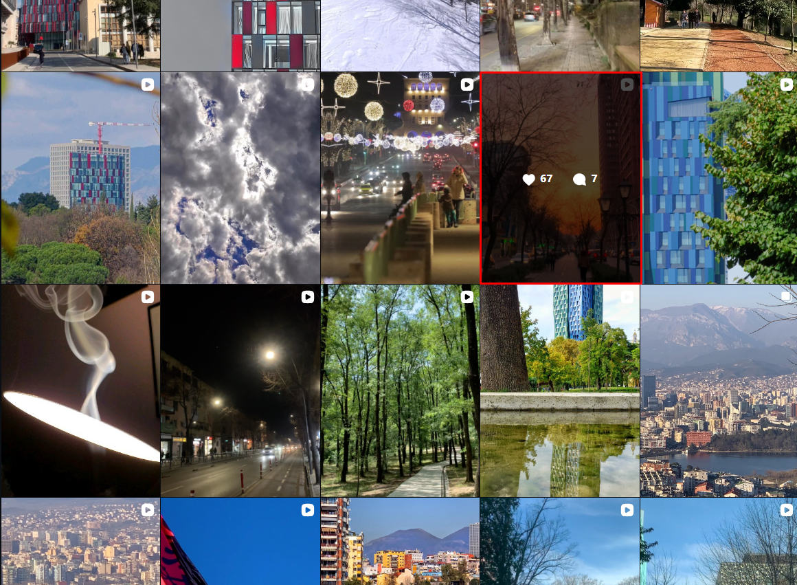

After a little while I found exactly the post and, analogously, I came across the necessary information:

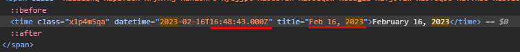

Thus, for question **a)** the answer is: **16:48:43**.

---

Before I set out to search all over Tirana on Google Maps for the street where the footage was taken, I decided it was more useful to gather some information that could help me identify it more easily. What can be seen in the video:

- A very tall building on the right side.
- There was traffic in both directions.

What can I do with this information? While searching for the video on the Instagram page, two other posts caught my attention.

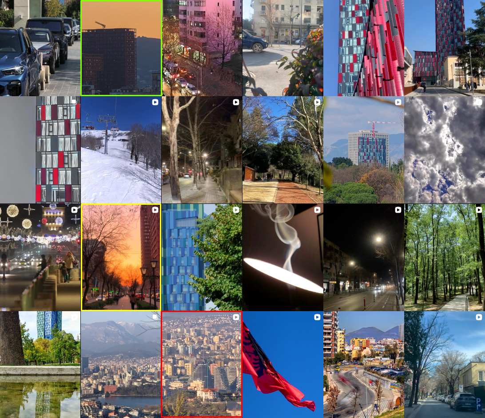

- The green rectangle: you can see a building similar to the one I was talking about above.
- The red rectangle: a shot from a distance, from which I hope I'll find useful information.
- The yellow rectangle: the original footage.

### The post in the yellow rectangle:
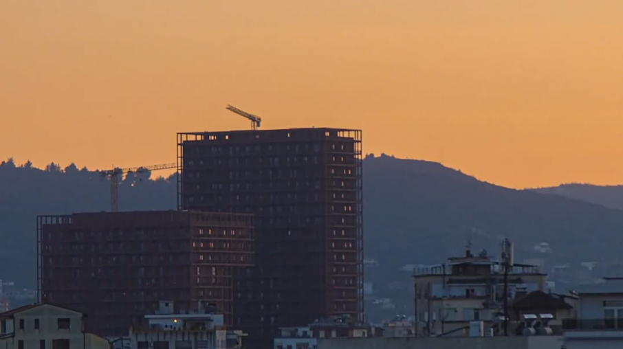

It is extremely similar to that building in the footage. Still, something to add is the background scenery where you can see some mountains, which can be useful in locating the building.

### The video in the red rectangle:

Here I discovered more key information.

> 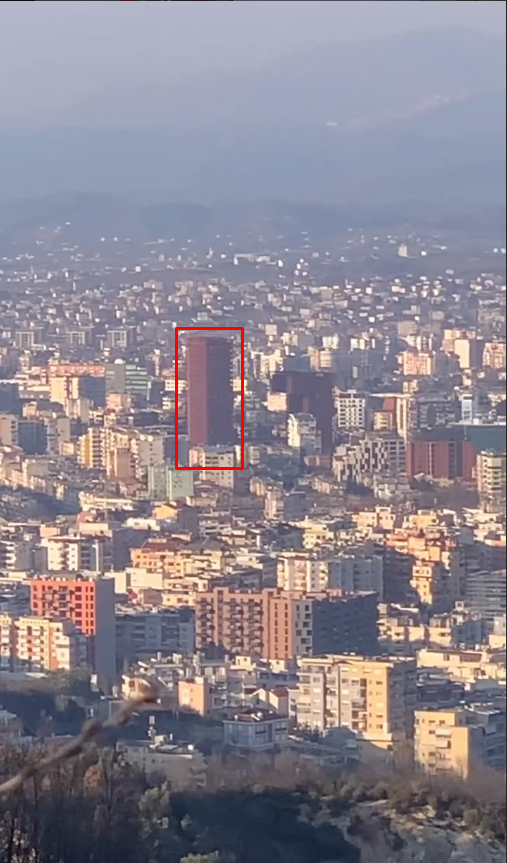

 It seems to be the building in the green rectangle above.

---

> 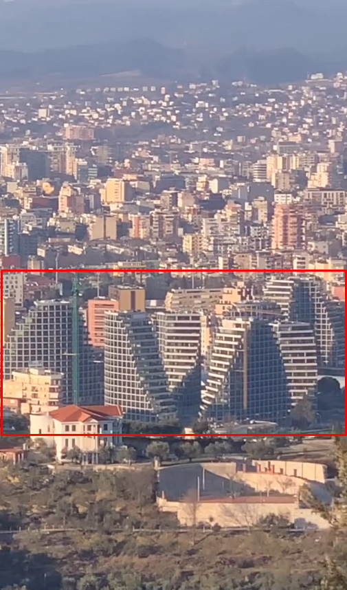

Some buildings I hadn't noticed until now, but they will clearly be useful, being easy to spot from the satellite thanks to their triangular shapes.

---

> 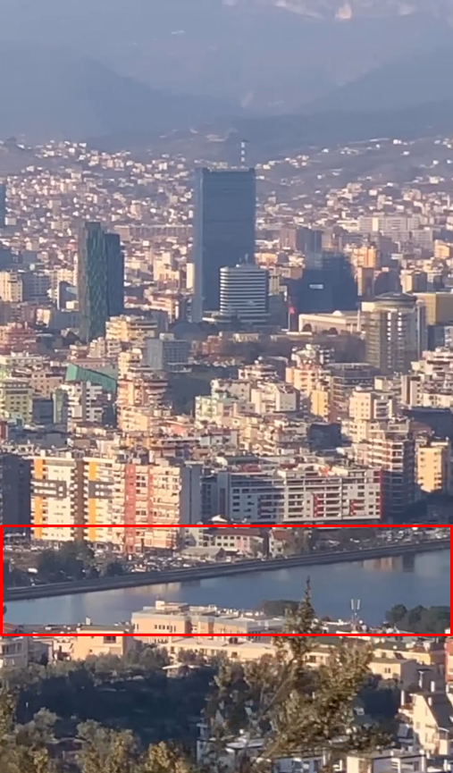

You can clearly see a lot of water, and next to the water a divider that appears to be man-made, not natural.

---

Now that I've analyzed everything very concretely, it's time to move to Google Maps, where I'll use:

- Terrain mode: to see the mountainous areas.
- Traffic information: where I set the day as February 16, 2023, i.e. Thursday, and the time around the one found in **a)**, 16:48:44.

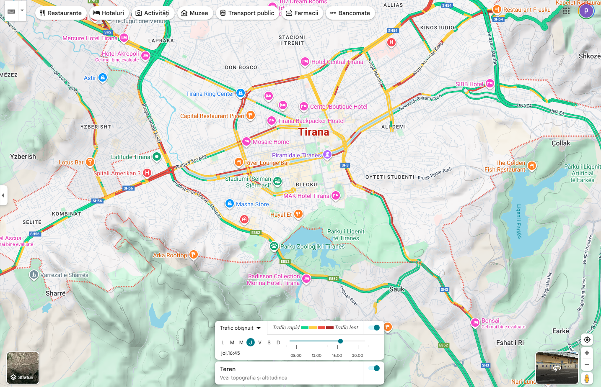

Thus, we have 2 lakes to check. I decided to analyze the lake on the left first.

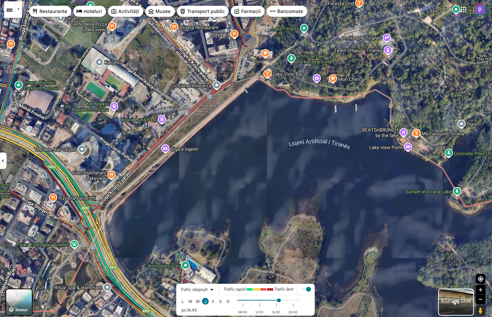

Using satellite mode too, we can see the lake, and right next to it the triangular-shaped buildings I mentioned earlier. 

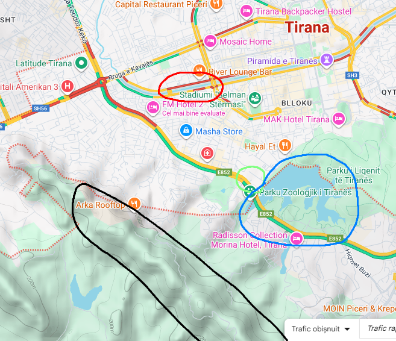

I tried to make a demonstration, through which I hope something can be understood. Still, I'll explain my reasoning:

- I circled the mountainous area in black.
- I circled in blue the lake I was talking about.
- I circled in green the positioning of the triangular buildings.
- I circled in red a busy street on a Thursday in Tirana.

What I managed to find: 

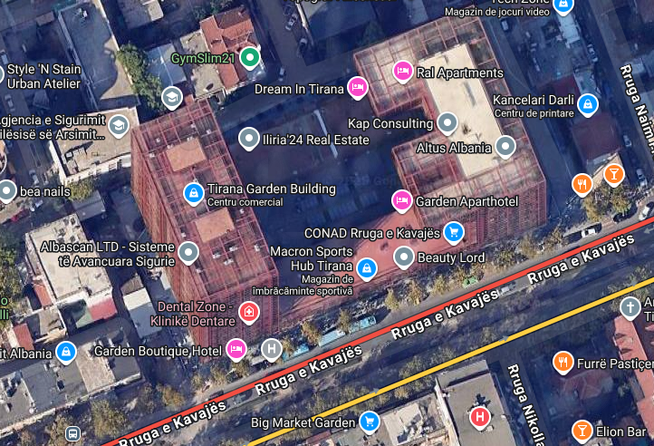

This building, just by following the clues I already had. Wanting to check whether I had reached a result, I tried to verify it and was unpleasantly surprised.

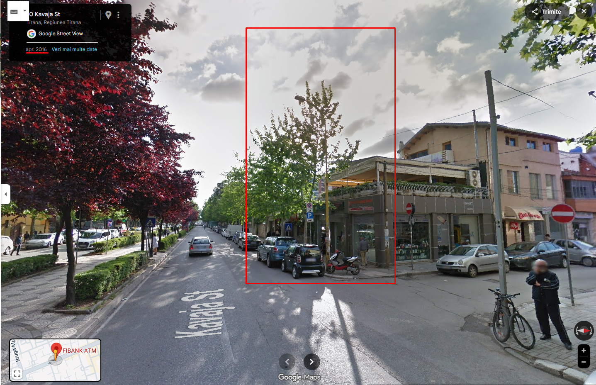

The images, as you can see, are from 2016, and where I placed the red rectangle, that's where the building I was looking for should have been. Without the building, I have to find another landmark that appears both in the footage and on my Google Maps, such as:

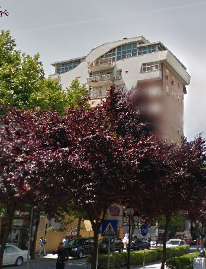

This building, which is exactly the building: 

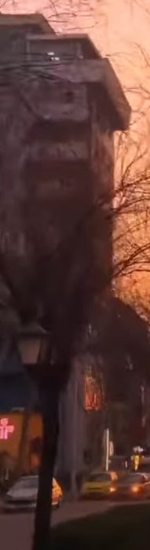

Or, another example, this building:

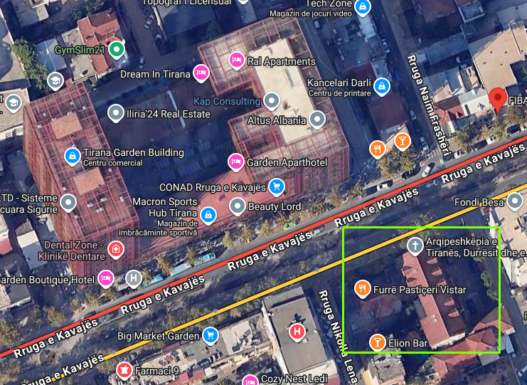

Which is:

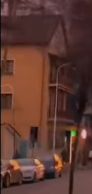

As can be seen from the triangular roof.

Thus, I reached the answer for task **b)**, which is: **41.326881, 19.806880**.

---
