## Execitiul #004

In acest exercitiu, primim un screenshot ce contine un tweet cu usernameul sub anonimat si 3 poze de la un eveniment. Trebuie sa raspundem la urmatoarele intrebari:

a) Ce eveniment era sarbatorit in cele 3 poze?

b) Care doua poze au fost facute de aceeasi persoana?

c) Cele doua poze de la punctul anterior sunt facute in acelasi oras. Anterior, fotograful a fost in alt oras. Care este orasul?

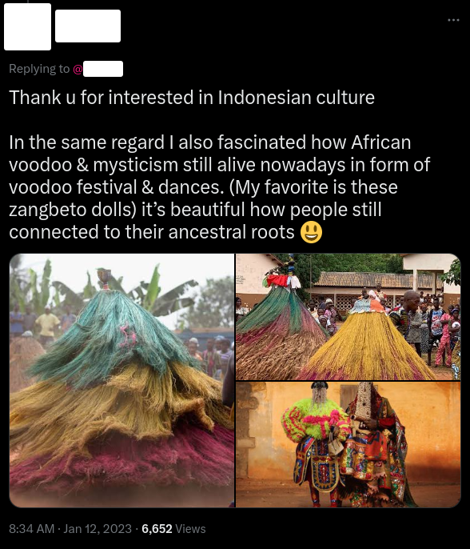

---

## Rezolvare

Pentru inceput am folosit Google Lens pentru cele 3 poze.

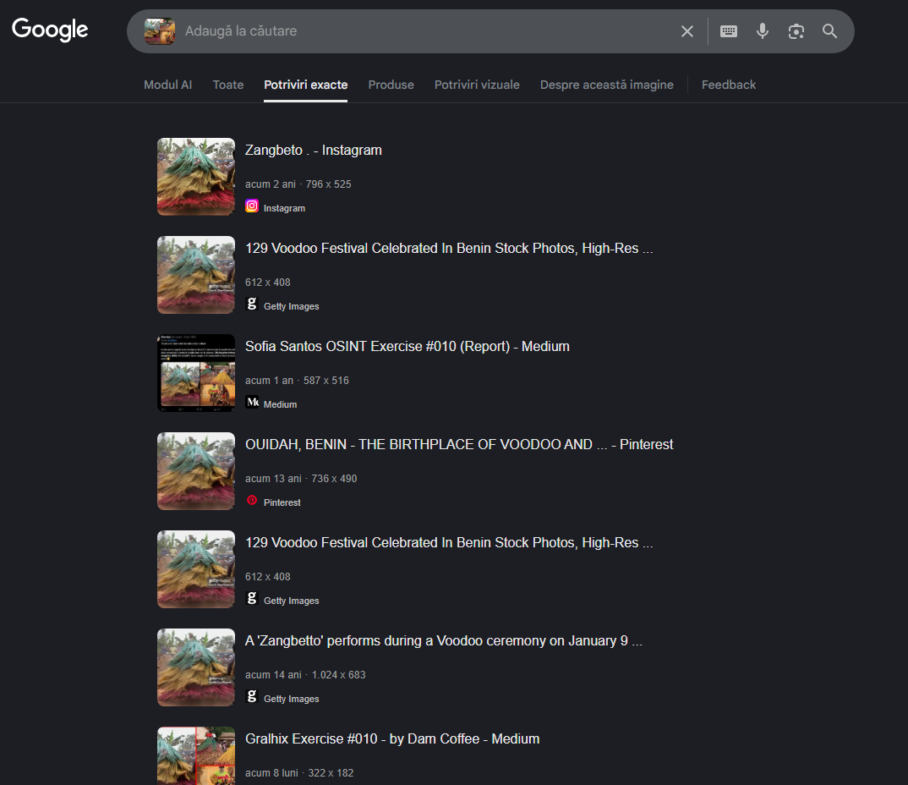

Dupa cautare, am vazut 2 rezultate de Getty Images. Initial nu stiam ce este acest site, dar cum descrie si numele, este o platforma unde poti sa vinzi/cumperi diferite poze.

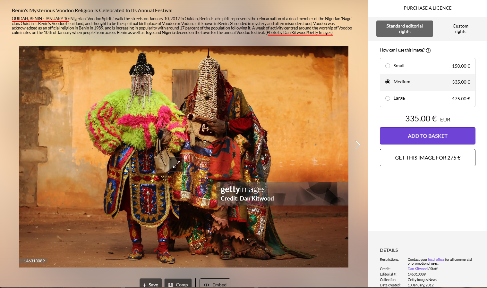

Asadar, am reusit sa ajung direct la autorul primei poze cautate: Dan Kitwood. Pana sa trecem mai departe am verificat informatiile din aceasta poza pentru a afla raspunsul intrebarii de la punctul a).

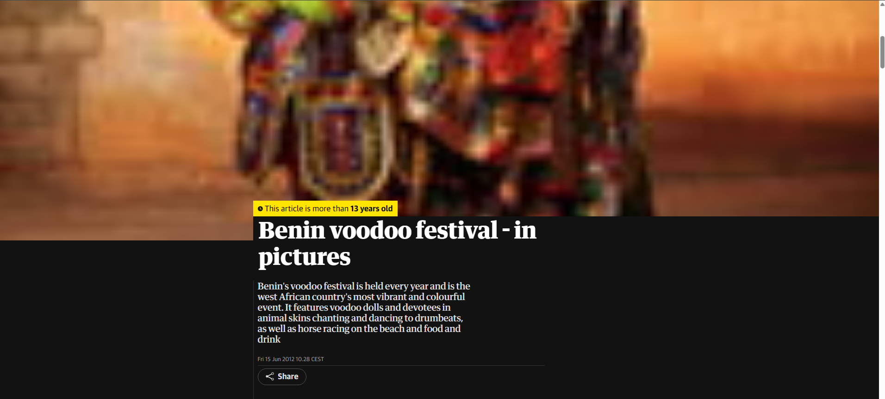

Astfel, raspunsul pentru punctul a) este **Benin’s Voodoo Annual Festival**.

---

In continuare, am folosit Google Lens si la celelalte 2 imagini, iar una dintre ele m-a condus la blogul unei persoane care a participat la acest eveniment:

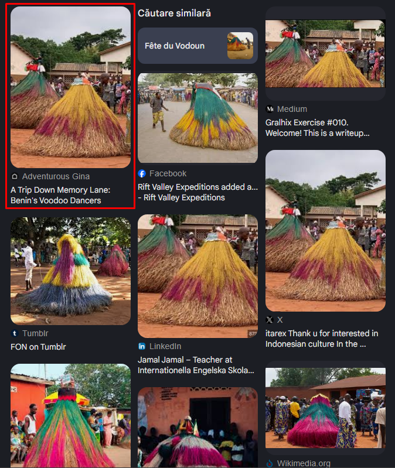
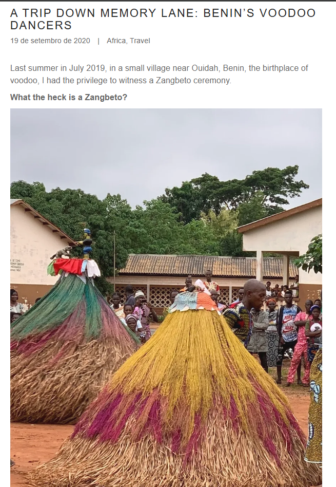

Asadar, am verificat doua din trei fotografii si avem 2 persoane diferite.
Poza ramasa ar trebui sa ne duca direct la raspunsul final.

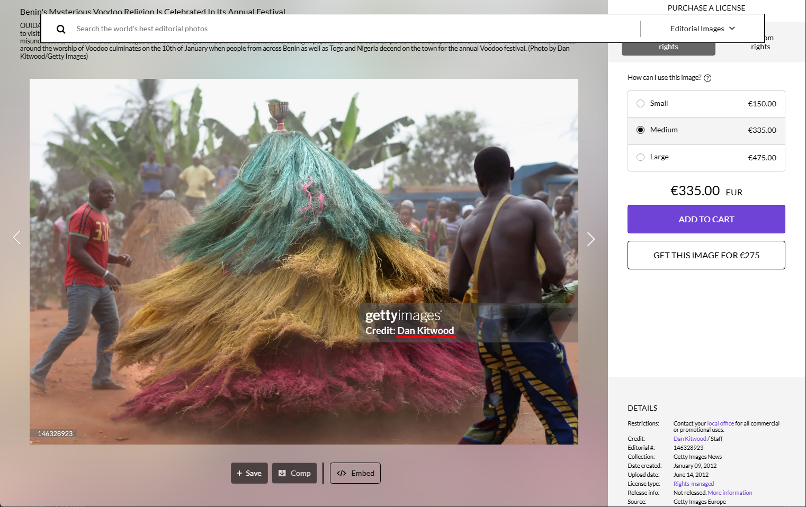

Cum putem observa, am ajuns la raspunsul de la punctul b): imaginea din stanga, respectiv imaginea din dreapta jos, au fost facute de aceeasi persoana.

---

Pentru acest punct am petrecut ceva timp. Prima idee a fost sa ii verific conturile de Social Media, unde avea descrieri asemanatoare.

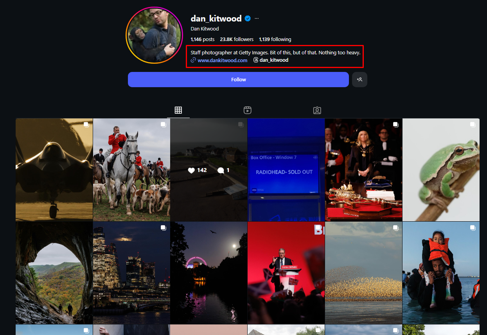

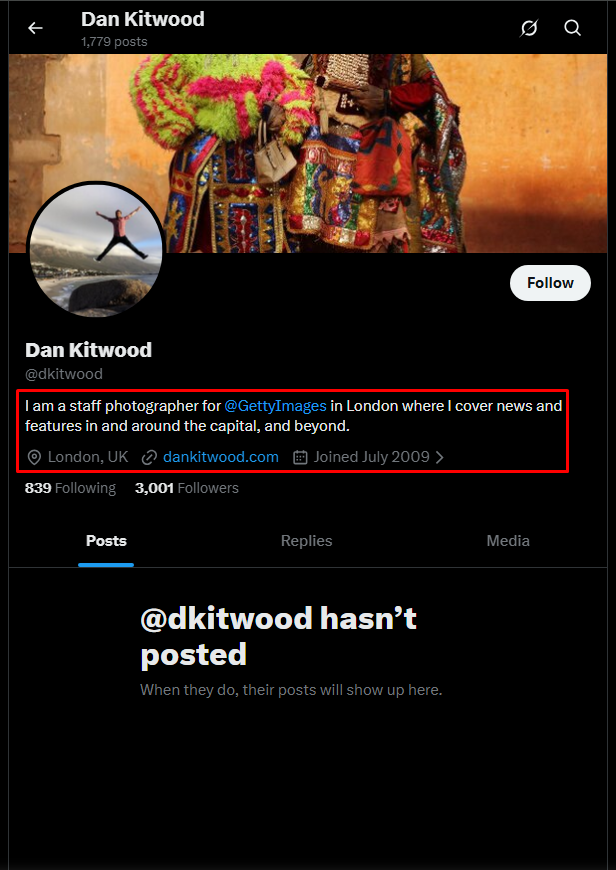

Ce au aceste 2 poze in comun si ma interesa era link-ul atasat in bio.

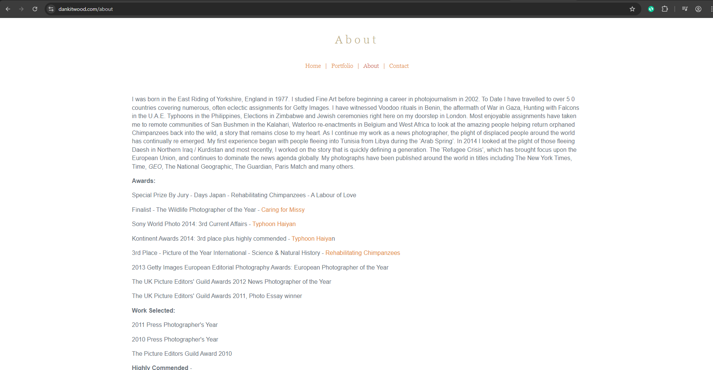

Link catre site-ul personal ce contine si o sectiune de "About", dar nimic util exercitiului. Acum chiar simteam ca ma lovesc de un perete, pentru ca oricat am incercat nu puteam gasi o informatie utila despre locatia unde a avut loc evenimentul. Asadar, am revenit la Google Lens, unde spre norocul meu am dat de un link catre Pinterest.

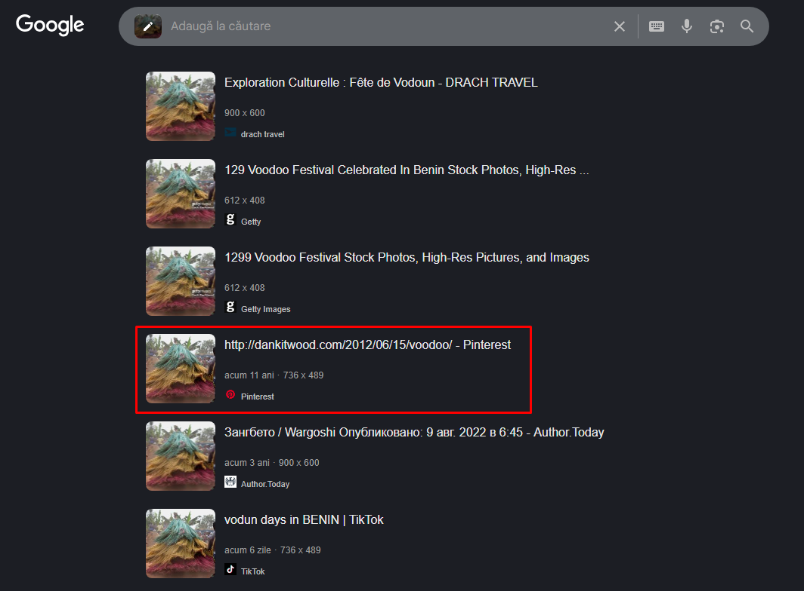

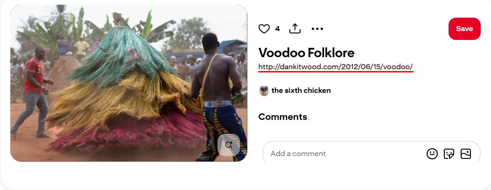

Ce mi-a atras cel mai mult atentia totusi, a fost link-ul din descrierea postarii. Exact site-ul fotografului, dar continand path-ul: 2012/06/15/voodoo/.

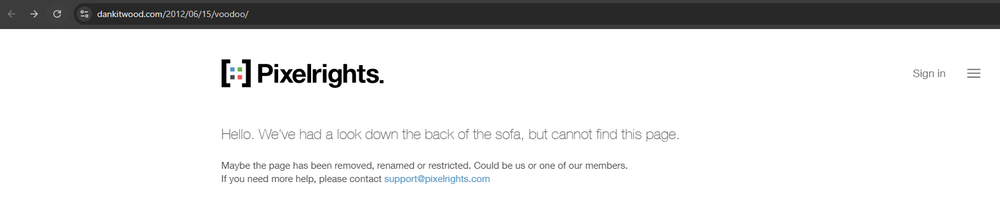

Cum site-ul nu functioneaza in prezent, am folosit WayBackMachine pentru a vedea daca exista vreun snapshot din trecut, lucru care ar putea sa ma duca spre informatii noi si utile.

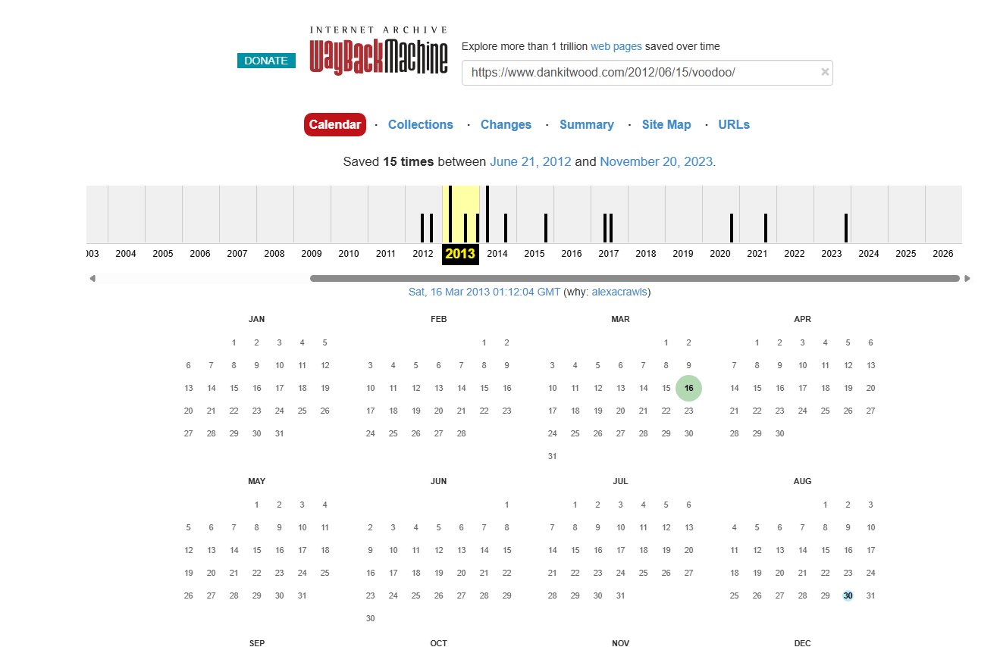

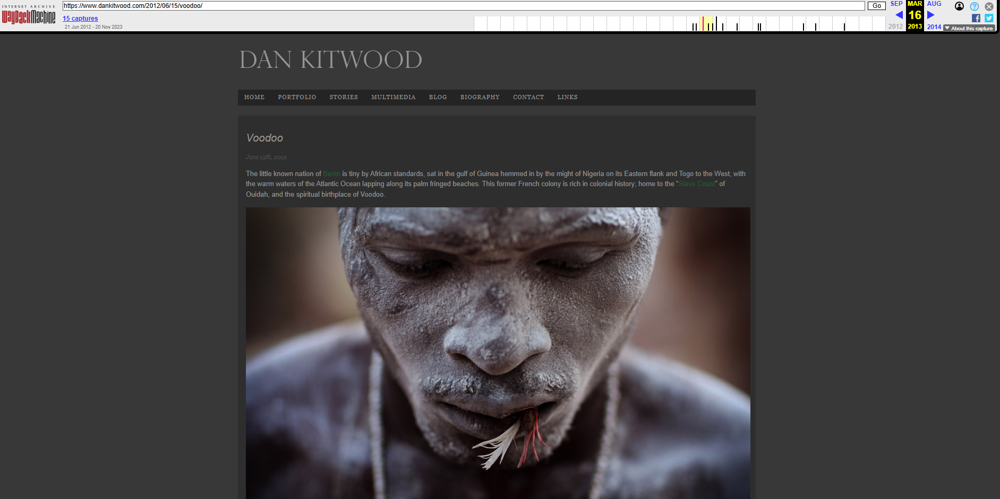

Partea buna este ca sunt pe drumul bun si am aflat numele unuia dintre orase: "Quidah", partea proasta insa este ca in aceasta postare nu apare numele unui alt oras. Totusi, in bara de sus pe care o puteti vedea si in poza anterioara este un buton de "Blog".

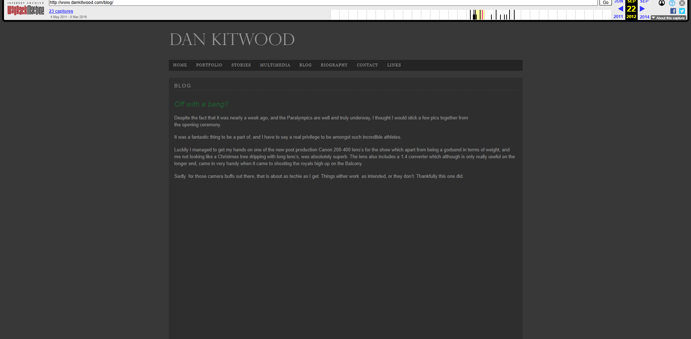

Blog care ma duce pe o pagina separata, iar dupa cateva minute bune de citit am ajuns la urmatoarele informatii:

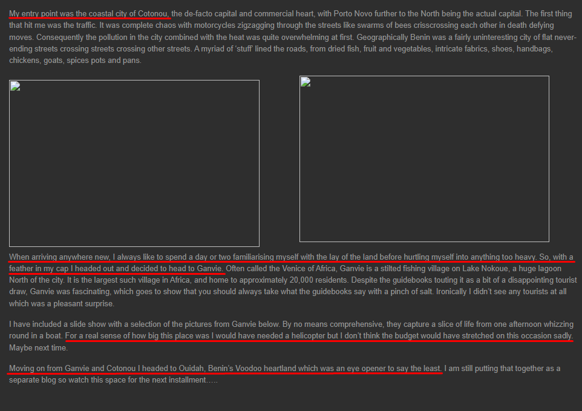

Fotograful spune ca prima locatia in care a fost este Cotonou (fiind si un aeroport langa cum se poate observa in poza de mai jos), iar apoi a avut o calatorie cu barca pentru a se familiariza cu orasul, ulterior mergand si in Ganvie.

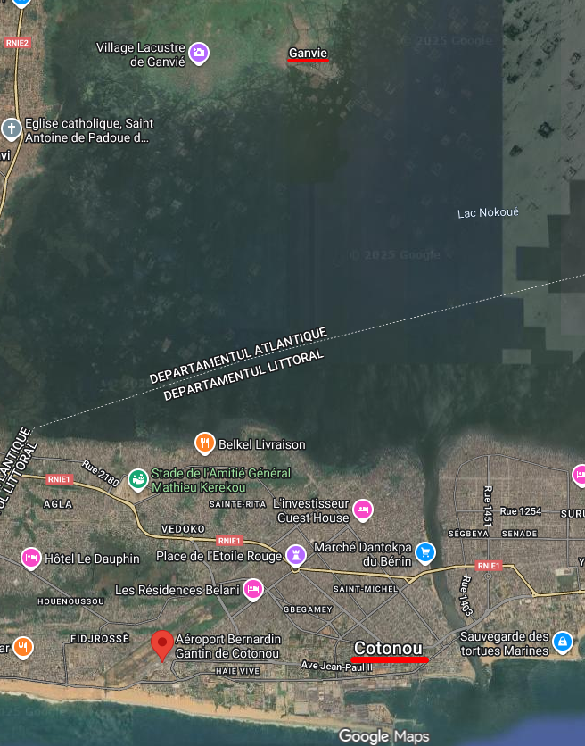

Astfel, raspunsul pentru ultimul punct c) este: **Cotonou**.

---