[‹ Back to all exercises](../README.md) · [Versiunea în limba română →](README.ro.md)

---

## Exercise #010

In this exercise, we receive a screenshot containing a tweet with the username anonymized and 3 photos from an event. We have to answer the following questions:

a) What event was being celebrated in the 3 photos?

b) Which two photos were taken by the same person?

c) The two photos from the previous point were taken in the same city. Before that, the photographer was in a different city. What is that city?

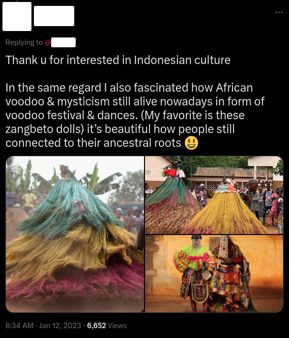

---

## Solution

To begin with, I used Google Lens for the 3 photos.

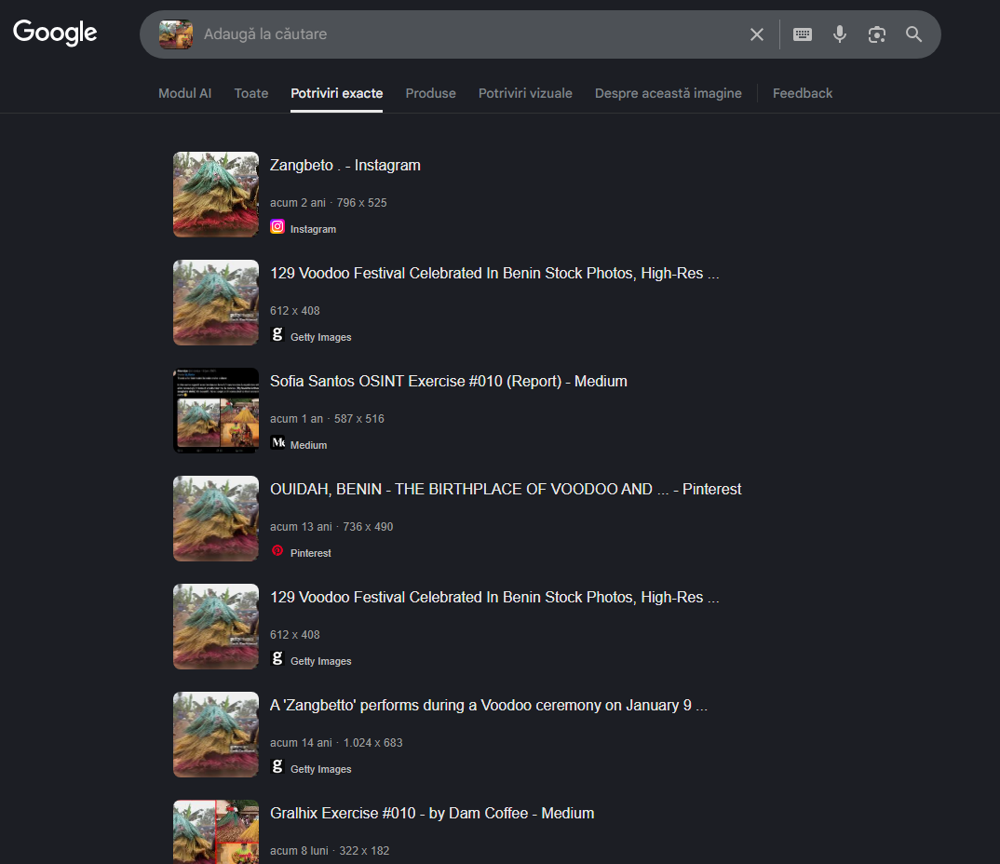

After the search, I saw 2 Getty Images results. At first I didn't know what this site was, but as the name describes, it is a platform where you can sell/buy various photos.

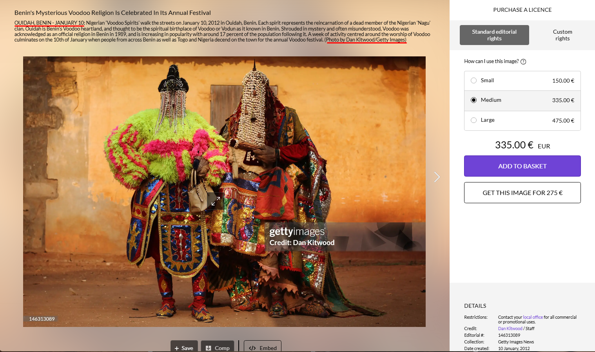

So, I managed to reach the author of the first photo I searched for directly: Dan Kitwood. Before moving on, I checked the information in this photo to find the answer to question a).

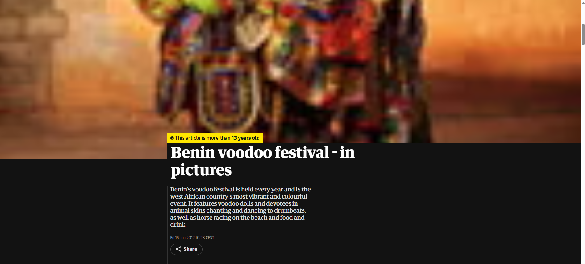

Thus, the answer for point a) is **Benin's Voodoo Annual Festival**.

---

Next, I used Google Lens on the other 2 images as well, and one of them led me to the blog of a person who attended this event:

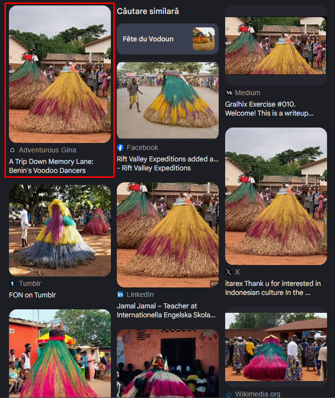
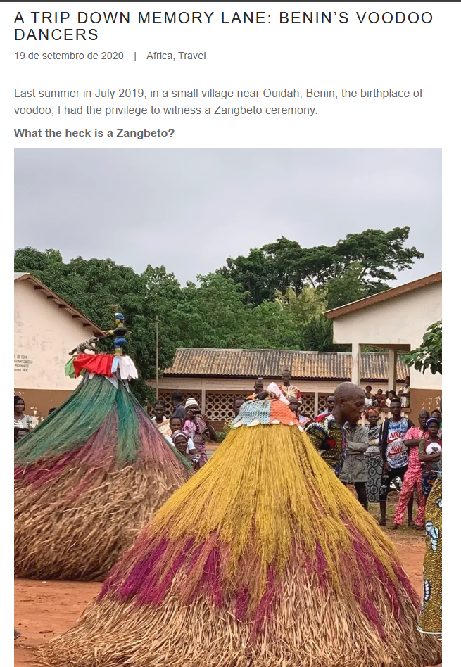

So, I checked two of the three photos and we have 2 different people.
The remaining photo should lead us directly to the final answer.

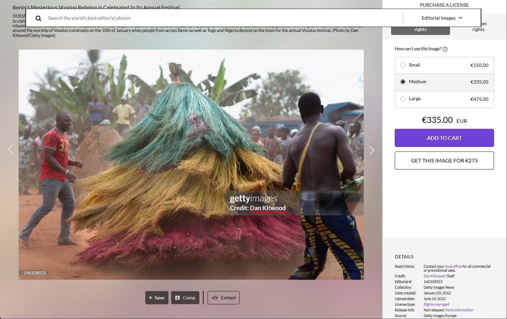

As we can see, I reached the answer for point b): the image on the left and the bottom-right image were taken by the same person.

---

For this point I spent quite a bit of time. The first idea was to check his social media accounts, where he had similar descriptions.

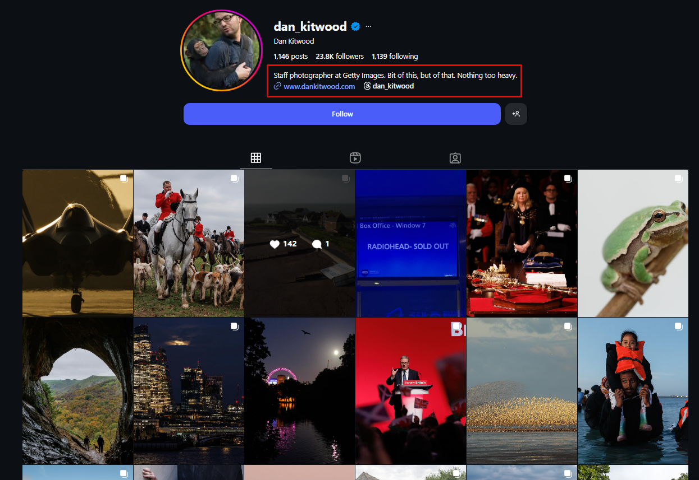

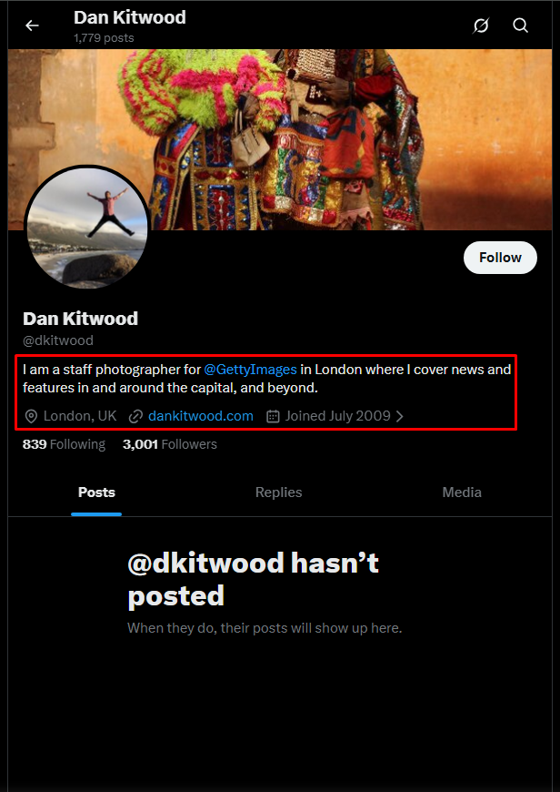

What these 2 photos had in common and what interested me was the link attached in the bio.

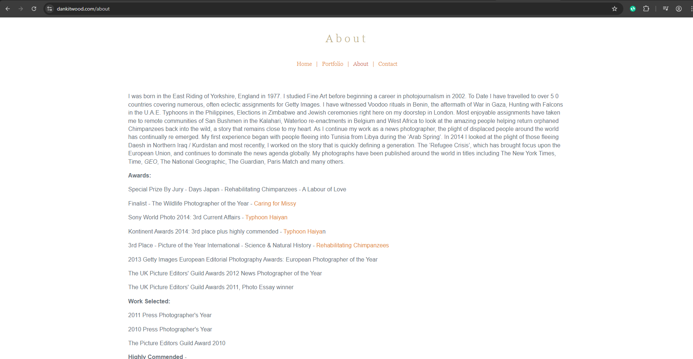

A link to the personal site that also contains an "About" section, but nothing useful for the exercise. Now I really felt like I was hitting a wall, because no matter how much I tried I couldn't find any useful information about the location where the event took place. So, I went back to Google Lens, where luckily I came across a link to Pinterest.

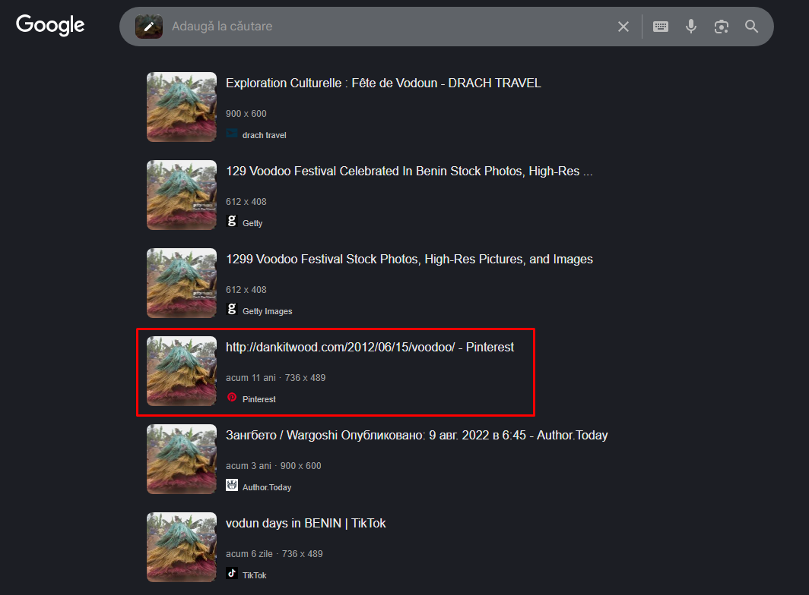

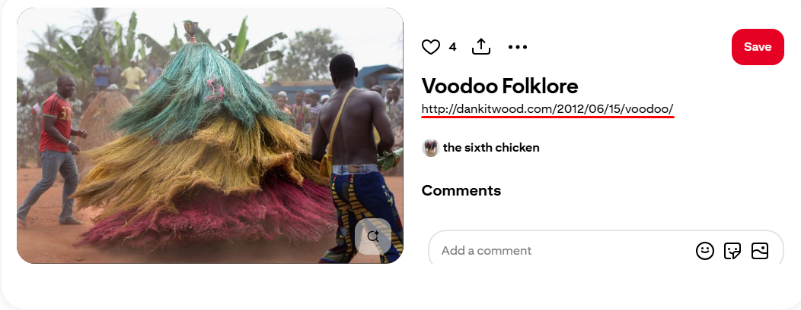

What caught my attention the most, though, was the link in the post's description. Exactly the photographer's site, but containing the path: 2012/06/15/voodoo/.

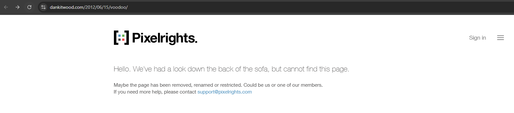

Since the site doesn't currently work, I used the Wayback Machine to see whether there was any snapshot from the past, which could lead me to new and useful information.

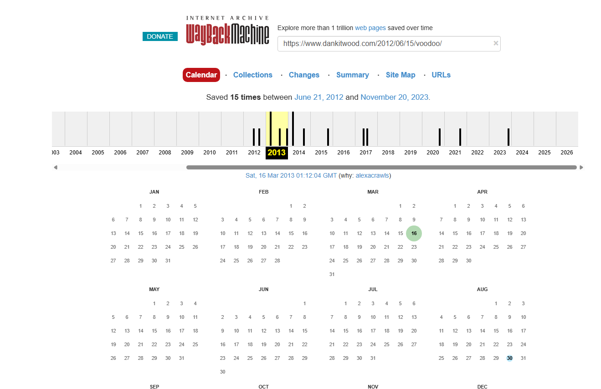

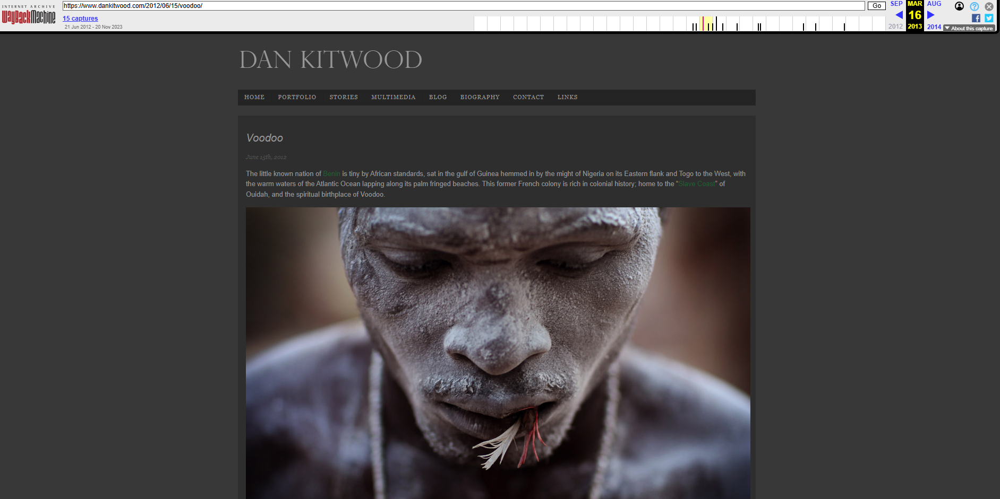

The good part is that I'm on the right track and I found out the name of one of the cities: "Ouidah"; the bad part, however, is that this post doesn't mention the name of another city. Still, in the top bar, which you can also see in the previous photo, there is a "Blog" button.

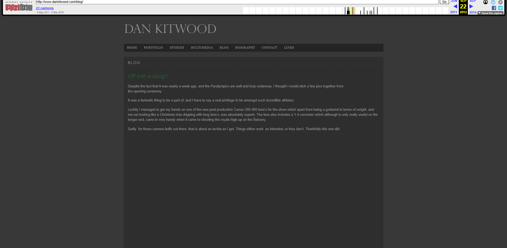

A blog that takes me to a separate page, and after a good few minutes of reading I reached the following information:

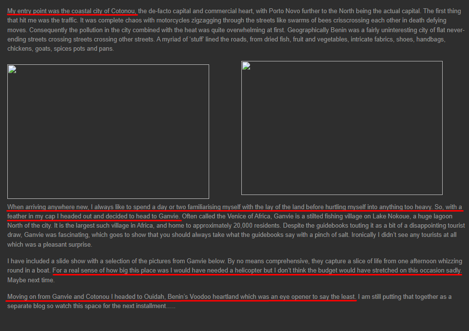

The photographer says the first location he was in is Cotonou (with an airport nearby too, as can be seen in the photo below), and then he took a boat trip to familiarize himself with the region, later going to Ganvie as well.

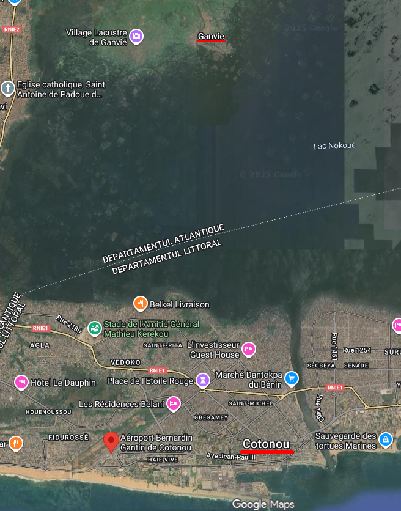

Thus, the answer for the last point c) is: **Cotonou**.

---
